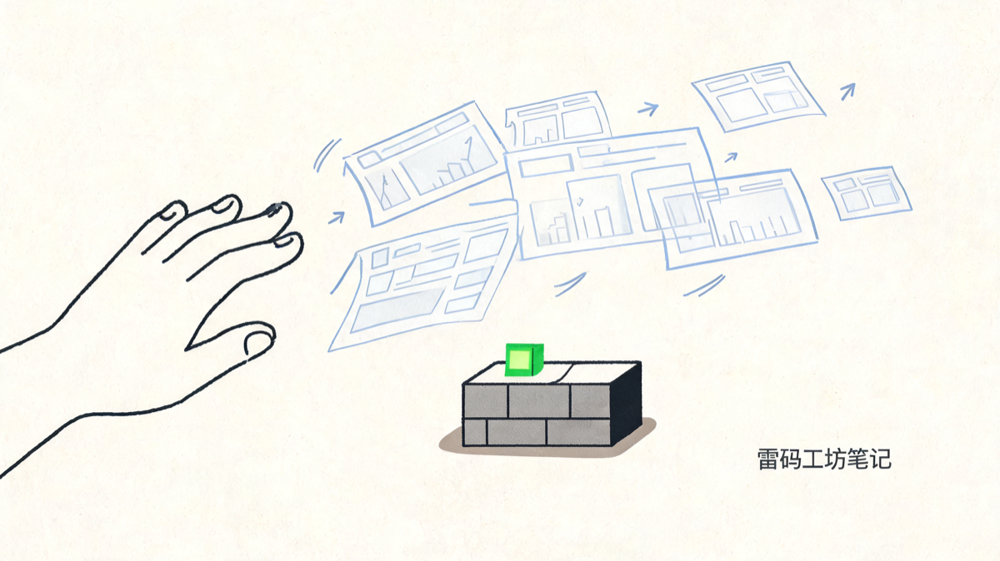
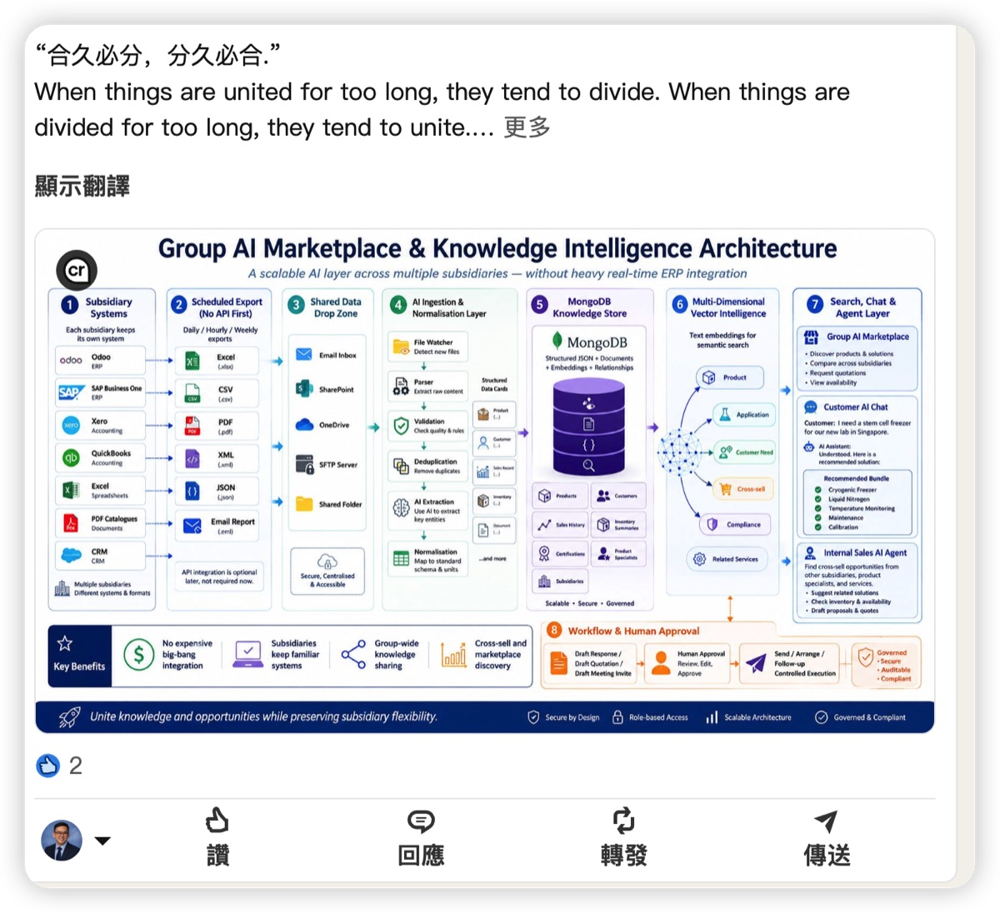
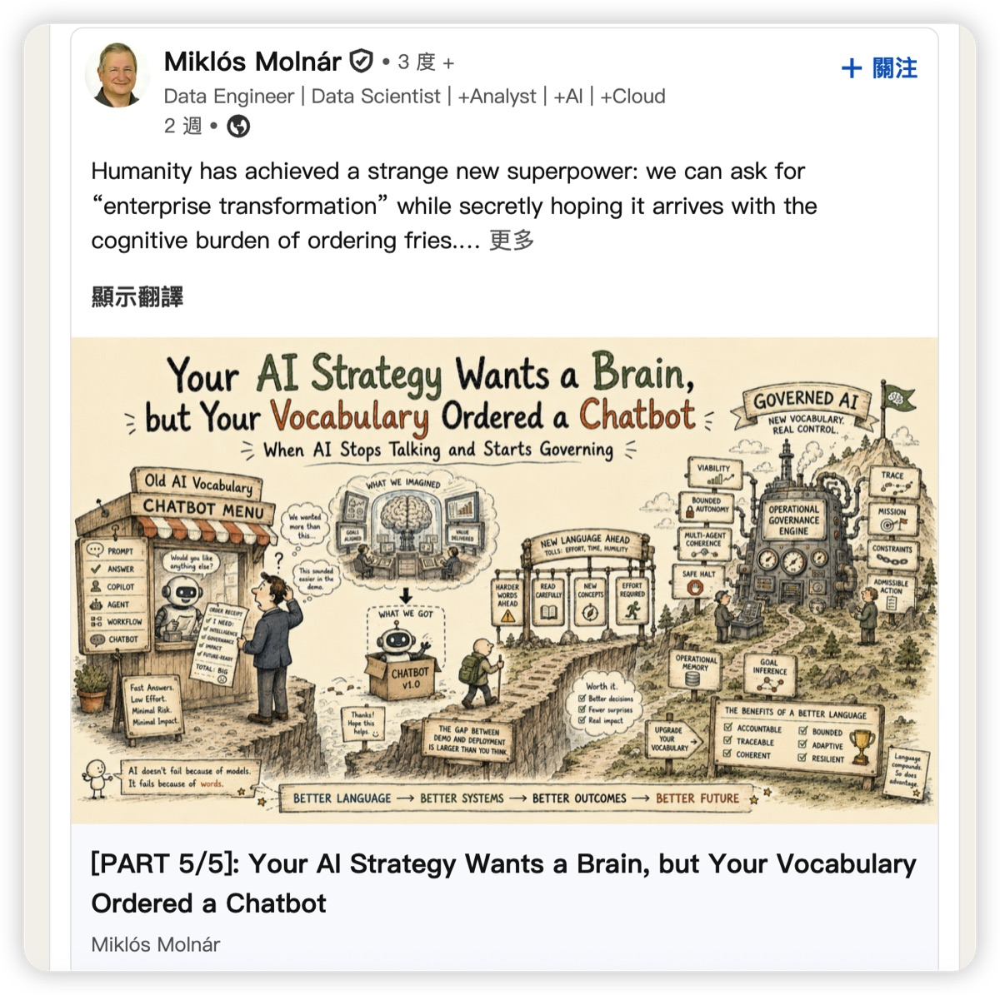
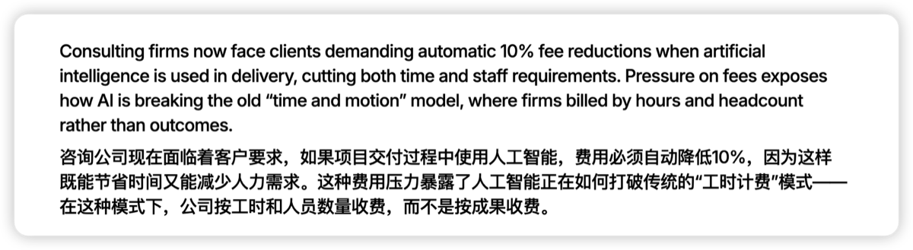
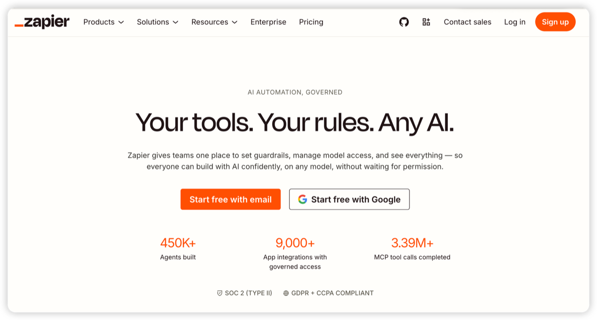
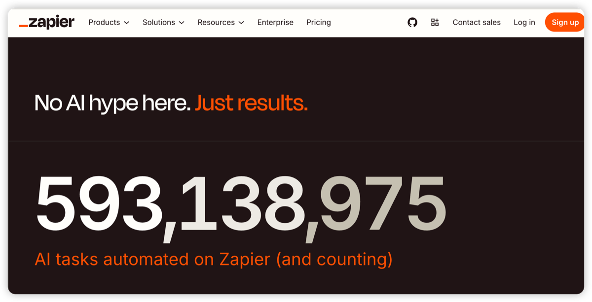

# I Scrolled Past Fifty AI Infographics on LinkedIn, Then Figured Out the Last Moat Marketers Have Left

It was an ordinary weekday morning. Coffee in hand, scrolling LinkedIn.

My thumb moved fast. One graphic, then another, all of them that polished "thought leadership" style: tidy color blocks, a pain point on the left, a solution on the right, an arrow in the middle. I didn't stop for a single one. Somewhere around the fifteenth, my thumb stopped. Not because one finally got to me. The opposite. I'd realized something that made me a little uncomfortable:

**I use AI every day to generate images, copy, and code, and yet I'm the person who least wants to look at AI-generated content.**

I screenshotted two of them, because they were so typical.

<em>A LinkedIn post: opening with an old Chinese saying, then a seven-step AI knowledge-platform architecture diagram, dense as a textbook, that nobody actually reads</em>

The first opened with the line "What is united will eventually divide; what is divided will eventually unite," then laid out a seven-step AI knowledge-platform architecture: from each subsidiary's systems to data export, cleaning and loading, all the way to MongoDB, vector retrieval, an agent layer. Dense, packed, complete as a textbook. Grand premise, lots of information. But stare at it for ten seconds and you realize that, as someone scrolling a feed, you're never going to read it. It just took a set of correct-sounding talking points anyone could recite and had AI render them into a diagram.

<em>Another LinkedIn post, the opposite style: an entire hand-drawn "AI strategy mountain climb," from a chatbot food stand up to a "governance engine" at the summit—impressively detailed, and still something you won't finish reading</em>

The second goes to the other extreme. A meticulously hand-drawn long illustration titled "Your AI Strategy Wants a Brain, but Your Vocabulary Ordered a Chatbot," with a little figure setting off from a "chatbot menu" stand and climbing all the way to an "Operational Governance Engine" at the peak. Color, linework, metaphor, all there, an astonishing amount of detail. You have to admit it was made with care. But that's exactly the problem: it's too full, too hard-working. As someone who swipes a screen every three seconds, I scrolled past before I'd even finished the title. One a diagram dense as a textbook, the other an illustration as elaborate as a picture book: two extremes, same ending, nobody stops.

The people who posted these are, I'm sure, serious marketing colleagues. They did nothing wrong. They just used the most efficient tool of the era. The problem isn't them. The problem is this: **when anyone can generate a "professional" graphic in thirty seconds, being "professional" stops being worth anything.**

---

## Why the People Making the Flood Hate It the Most

Let me start with a counterintuitive observation.

The people who detest AI content most aren't the ones who don't understand AI. They're the ones who use it every day.

The reason is simple. Someone who doesn't use AI sees a pretty infographic and their first reaction might still be "nice work." But someone who uses AI daily sees the same image and a different sentence pops into their head: **"I could generate one of those in thirty seconds. Maybe a better one."**

They know exactly how much of it is real labor and how much is just hitting Enter. They know the marginal cost of an image, a video, an "industry insight" is now close to zero. So they're several times pickier than the average consumer.

This creates a situation that never existed before: the content producer and the harshest content consumer overlap, for the first time, in the same group of people. And that group, product managers, technical leads, the decision-makers on the buying side, is exactly who B2B marketing most wants to reach.

You use AI to mass-produce content to win them over. And they're the ones who see through AI content best.

This isn't one platform's bug, it's a problem on the entire supply side of content. Douyin, Xiaohongshu, TikTok, X: same experience everywhere. More and more content, less and less that makes me stop. The platforms are stuck in the middle too. They can't reject the AI wave (users and traffic flee elsewhere), and they can't open the gates too wide (consumers leave over junk). Hence the labeling, the auto-tagging, the throttling. Honestly, those are just fishing things out of the flood. Symptom management. Some platforms went all-AI, like Jimeng, where everything is AI-generated images and video, and engagement is poor. A pool everyone knows is fully AI-generated turns out to be a pool nobody wants to soak in.

So the real question isn't "how do we govern AI content." It cuts deeper: **when content is so abundant it's worthless, what becomes valuable instead?**

For anyone in B2B marketing, this question is a matter of survival.

---

## First, See Clearly: What's Depreciating

To answer what's appreciating, you first have to admit what's depreciating.

I've done SaaS marketing for over a decade. What's our most classic content asset? Whitepapers, ebooks, solution handbooks, third-party analyst reports and awards. This stack held up B2B marketing for twenty solid years. A well-made whitepaper used to be proof of "we're professional, we're credible."

Write a whitepaper today and how many people read it? I know my own numbers. Open rates, completion rates, I don't need to spell it out, anyone who's done this knows the figure.

Worse, even the analysts are losing their voice. Gartner, Forrester, firms whose single sentence could once move a million-dollar purchasing decision, now publish reports that fewer and fewer people read carefully. The market is already voting with its feet on this.

<em>A widely-shared report: clients are demanding that whenever AI is used in delivery—saving time and staff—consulting fees drop 10% automatically, exposing how AI is breaking the old "bill by hours and headcount" model</em>

Look at this. According to reporting in the Australian Financial Review, clients have started demanding it: whenever a consulting firm uses AI to deliver faster with fewer people, the fee has to drop 10% automatically. It exposes one thing—AI is breaking the "time and headcount" billing model consulting ran on for years: bills used to go by hours and headcount, now clients only pay for outcomes.

That sentence carries a lot. It means the market has already accepted something: the production cost of the consultancies' "polished content" is being driven down by AI, and clients know it. The layoffs, the price cuts, aren't bad luck. They're the inevitable result of a moat being filled in.

Let me be precise. The problem isn't Gartner, and it isn't the quality of the whitepaper. It's the phrase "well-made" itself: it's no longer scarce. AI lets anyone produce something that looks polished. When polish becomes cheap, every content asset built on "I'm more polished than you" depreciates together.

That's the bad news. But the back side of bad news often hides good news.

---

## Then, See Clearly: What's Appreciating

If scarcity has fled from "well-made," where did it go?

It went to the things AI can't make.

The logic is clean: anything AI can easily generate depreciates as supply explodes; anything AI can't make, or gets exposed the moment it fakes, appreciates through scarcity. Following that logic, I lined up the content that still moves people today into a chain of evidence, shallow to deep.

Layer one: a customer's actual words. A real customer, in their own words, saying where your product helped, where it saved them. AI can't write this. To be precise, AI can write it, but the moment it's discovered to be fabricated, your trust goes to zero. So genuine customer testimony is now unusually scarce and unusually valuable.

Layer two: real usage data. Signups, usage volume, consumption, numbers a product actually produced, where faking carries a steep cost.

<em>Zapier puts the numbers right on the homepage: 450K+ AI agents, 9,000+ app integrations, 3.39M MCP tool calls</em>

<em>"No AI hype here. Just results." Zapier uses a ticking 593,138,987 to tell you how many tasks have been automated on the platform</em>

Look at how Zapier does it. Its homepage doesn't tell you a story, it throws numbers in your face: 450,000 AI agents, 3.39 million tool calls. Further down, one line: "No AI hype here. Just results," with a still-climbing counter: 590 million automated tasks. In a market drowning in AI hype, Zapier chose to prove itself with real, enormous, still-growing numbers. That's more persuasive than any whitepaper.

Layer three: a reproducible record of something you actually did. You did a thing, wrote it down or filmed it, and anyone who follows along will get there too, a process that genuinely runs, not steps AI hallucinated. AI can't imitate this, because it lacks the prerequisite of having actually done it. It can fabricate steps that look right; it can't fabricate steps that actually run.

Layer four, the top: you actually built the thing. A working webpage, an open-source project, a product that runs. This is the end of the evidence chain, because it needs no rhetoric. The thing is right there. You can open it, use it, fork it. It is its own hardest proof.

---

## I'm the Example

At this point I have to use myself, awkward as it is.

<em>My own GitHub (andyleimc-source). I started vibe coding early this year, and the public projects already number in the dozens</em>

Early this year I started seriously writing code with AI (what people now call vibe coding). I'm a marketer, not an engineer. But over these six months I've built dozens of projects, some for my own use, some public on GitHub. An automation builder for Mingdao HAP apps, a bridge that connects Claude Code into WeChat, an email MCP, an X content radar. Sixty-two repositories, just sitting there.

I'm posting this not to show off, and my star counts are nothing to show off anyway. I want to make a different point:

**A marketer's hardest calling card today is how many lines of actually-runnable code they've pushed, the real things they've built. How many articles they've written matters a lot less now.**

If I tell you "I understand AI, I understand products," that's a line anyone can say, and AI will polish it nicely for you. But if I put 62 repos in front of you and any one of them runs when you open it, AI can't say that for me, and no one can take it from me. Is it cheap? Not at all. It's what I ground out night after night for half a year. Precisely because it isn't cheap, it carries the weight of trust.

Content has gotten so cheap it's worthless. But "you actually did it, you actually built it" has become the replacement for that old era of premium content.

---

## To the Marketers Still Writing Whitepapers: Four Things to Swap

I don't want to stop at reflection. If you're in B2B marketing too, here are four things I think you should start swapping right now.

**One: treat the customer's actual words as a first-class asset.** Stop letting case studies sit in a PDF as "a leading enterprise." Go get the real, emotional, specific quote: what trouble they hit, exactly how your product solved it. This material used to be a nice-to-have. Now it's one of the few things still credible. Build a mechanism just to collect it.

**Two: turn real product numbers into content.** Your signups, active users, call volume, the time you saved customers, if the numbers are decent, show them openly. Learn from Zapier and put numbers in the most visible spot. In a market full of hype, daring to show real numbers is itself a scarce kind of credibility.

**Three: publish what you've actually done as a reproducible process.** Don't write "how AI empowers the industry," the kind of empty piece anyone can generate. Write "I used tool X, spent three hours, got Y done, here are the steps." Content that lets others follow along and succeed is worth ten times a vague insight today.

**Four: if you can build something, don't stop at writing.** A small tool, a webpage, an open-source project beats ten thought-leadership essays. A marketer using AI to build something real is itself the best marketing.

These four share one thing: they're all harder, slower, and demand that you actually do the work. That's exactly where their value lives, because AI can't walk this road for you, so the people who walk it through are the scarce ones.

The clock is running. AI evolves by the week, and the AI-native companies abroad have worked this way from day one. The window left for our old playbook is closing faster than you think.

---

## A Final Word

The fifty AI infographics I scrolled past that morning weren't wrong, not one of them. The layouts were right, the premises were right, the points were right. Their only problem was that they were too easy, so they proved nothing.

Our generation of marketers grew up on the creed of "content is king." We believed that if the content was good enough, we'd win. But AI turned "good enough" into a basic skill everyone has. When everyone can make good-enough content, content is no longer king.

The throne is empty. Whoever takes it will be the people who can show the real thing: real users, real numbers, real process, real work.

Content is cheap. But the things you actually did are expensive.

> In an age where anyone can generate anything, the only thing left that proves you is the thing you actually built.

---

## About the Author

**Andy** — SaaS veteran (10+ years) obsessed with products and technology. Daily Claude user redefining how work gets done with AI. Sharing practical AI techniques and real productivity gains — no buzzwords, just what actually works.
