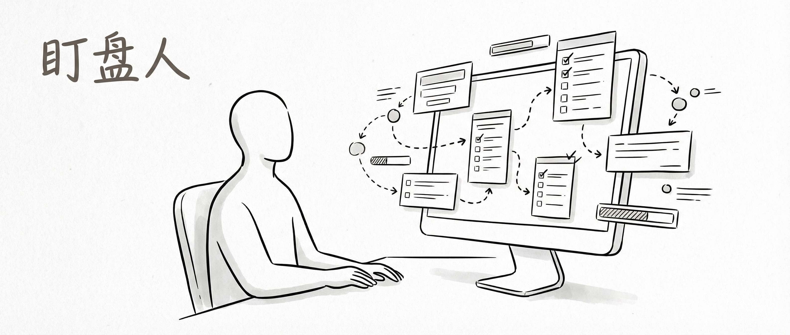
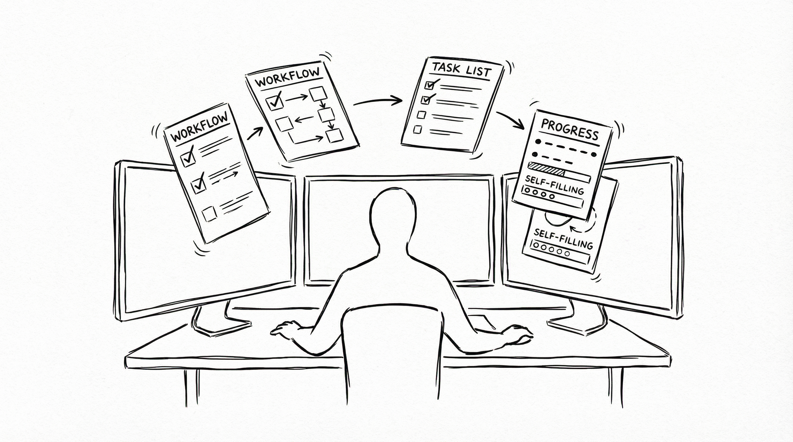
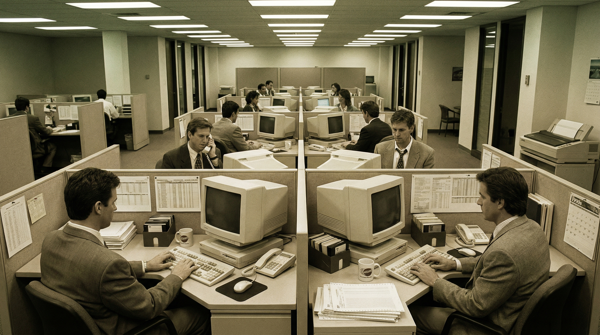
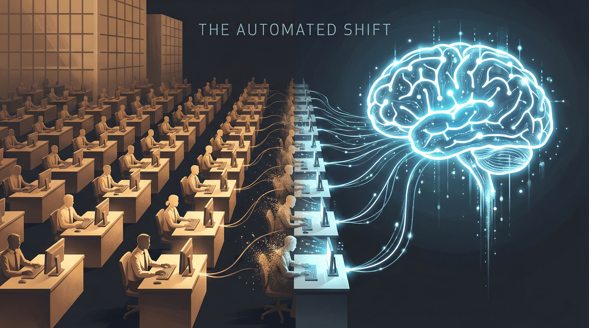
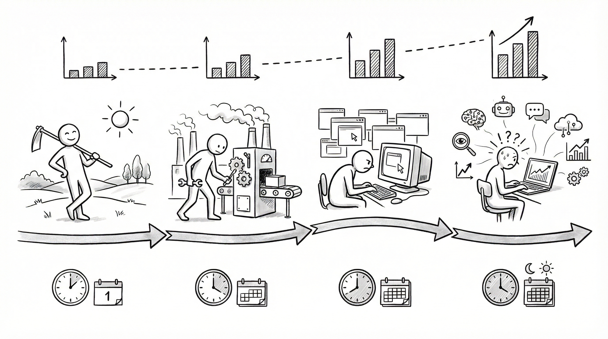
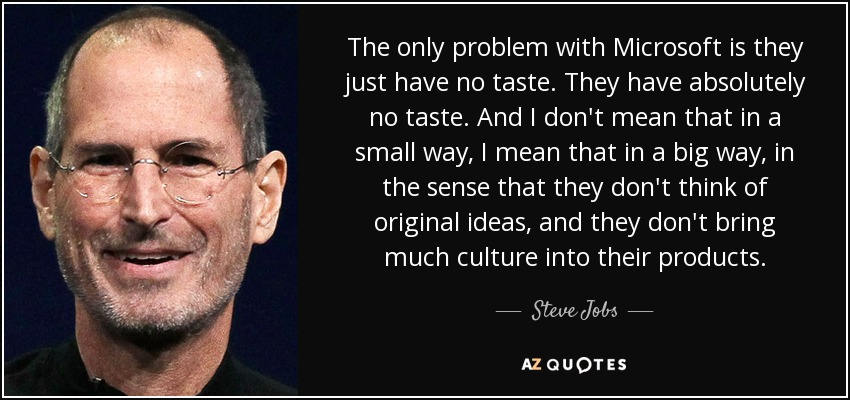
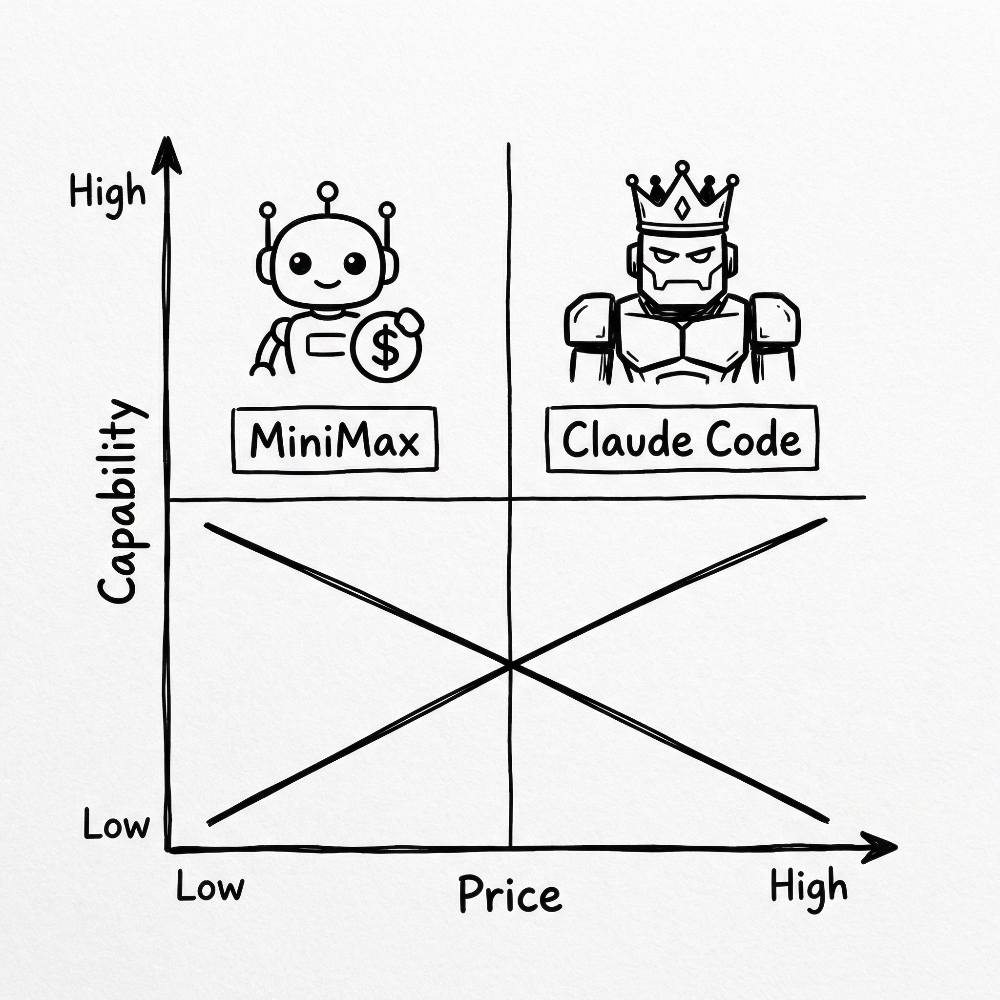
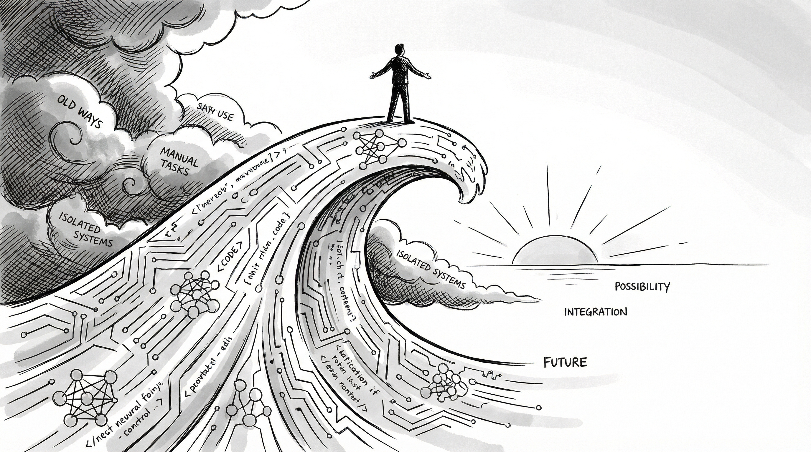

# The Dashboard Watcher

> When AI handles most of the execution, where does human value go?

---

### I. The Birth of the Dashboard Watcher

Last month, I taught a colleague how to use Claude Code.

Honestly, I didn't think much of it at the time. I just liked the tool and figured I'd show him. He works in sales operations — his daily grind is chasing salespeople for customer info, tracking deal progress, and pulling reports. Simple enough on paper, but relentlessly tedious in practice.

I'd seen how he worked. A massive contact list on one screen, WeChat open on the other. He'd go down the list: "Hey, that client you said was going to try us last week — did you update their info?" Send. Read but no reply. Send again. Still nothing. His desk was buried in sticky notes — who needed a callback Wednesday, which deal had to close by month-end, which salesperson hadn't logged a single update in three days. He was basically a human alarm clock. His biggest daily output was reminding other people to do their jobs.

*When AI takes over execution, all you do is watch the dashboard*

Then he learned Claude Code.

Two weeks later, he'd built a sales follow-up automation system. Customer info auto-filled — pulling company data from public sources and populating the CRM automatically. Follow-up priorities auto-ranked — sorted by interaction frequency, deal stage, and historical conversion rates. Follow-up timing auto-scheduled — the system surfaced whoever needed attention and put it right in front of him.

No more chasing people one by one. No more sticky notes. No more silently fuming at unanswered messages.

He sat in front of his screen watching the system run itself. Occasionally clicking to adjust a priority or confirm the system's call. I walked over, took a look, and said: "You're basically a dashboard watcher now."

He paused for a second, then asked: "Andy, if AI eventually does everything — what are people even for?"

I said: "Just embrace it."

He looked at me. His expression was hard to read — somewhere between confused and completely lost, like I'd said something in a language he didn't speak.

Let me hold that thought. I'll come back to what "embrace it" actually means. First, let's look at what history tells us — because humans have been here before.

---

### II. Humans Have Always Been "Leveling Up"

Manchester, 1830s.

If you could drop yourself into those streets, here's what you'd see: chimneys everywhere, coal dust in the air, a smell of iron and steam that never leaves. Factories lined up like rows of enormous brick boxes, running day and night, filling the city with a low, constant rumble.

This was the beating heart of the Industrial Revolution.

Inside those factories, a race was underway between people and machines. Hand weavers had done this work their entire lives — spinning cotton into thread, threading into cloth. A skilled hand weaver could produce enough fabric in a day to make a few shirts. Then the steam-powered loom arrived. **One power loom matched the output of 200 hand weavers.**

Two hundred.

You can imagine what that felt like. Some of those weavers smashed the machines — this is what history records as the Luddite movement. Workers broke into factories and destroyed the looms with hammers. They believed the machines had stolen their livelihoods. Destroy the machines, save the jobs.

They were wrong. The machines weren't destroyed. More factories were built. The weavers did lose their work as hand weavers. But they didn't disappear. They became floor supervisors, walking the factory floor to make sure the machines kept running. They became maintenance workers — when something broke, they were the ones who knew which part to replace. They became line managers, coordinating workflow and allocating tasks.

**People went from doing to overseeing.**

*A factory in the 1840s — those weavers didn't disappear. They became supervisors.*

Here's the counter-intuitive part that most people miss.

Before industrialization, farmers worked with the sun — up at dawn, done at dusk. Sounds peaceful, almost idyllic. The reality was desperate poverty. Most people never left the village they were born in. Going hungry was normal. Reaching forty was considered a long life. The apparent "leisure" was just a symptom of low productivity — working harder didn't produce more.

After industrialization? People worked more, not less. Factory workers did 12 to 16 hour days, six or seven days a week. Child labor. Night shifts. Brutal conditions. But material wealth exploded. The price of cotton cloth dropped 90% over a few decades. Ordinary people could afford clean clothes for the first time.

The work got so relentless that it required laws to contain it. **The eight-hour workday was a late 19th century labor movement achievement** — because before that, the concept of "working hours" didn't exist as a limit. Factory owners would have kept you in there around the clock if they could.

The fact that we needed a law to protect people from overwork tells you exactly what industrialization did: it made people busier, not less busy.

This is history's iron law: every major upgrade in tools pushes humanity to a higher level. From doing the work yourself, to managing machines that do it for you. Output explodes. People get busier. But the nature of the work transforms.

---

### III. The Internet Era Ran the Same Playbook

In the 1990s, offices had a job called "typist."

Not a joke. Computers had just entered the workplace, but most people couldn't type. An executive would write something by hand, the typist would key it in, and it would get printed out. A real job, with a salary, with a place on the org chart.

*The 1990s office: computers had arrived, but not everyone had learned to use them yet*

Then everyone learned to type. The typist role vanished. But at the same time, programmers emerged. IT departments were born — starting with one person managing the whole company's network, growing into teams of dozens. Entirely new jobs appeared from thin air.

Ad agencies cut their hand illustrators. Film, paint, brushes — overnight, these became nostalgic artifacts. But digital designers who could work in Photoshop took their place, and in far greater numbers — because digital design unlocked an explosion of new use cases. One billboard used to need one painting. One app now needs hundreds of screens.

SaaS arrived and gutted a generation of IT operations roles. Companies no longer needed to run their own servers, wire their own networks, manage their own infrastructure. But a brand new job was born: Customer Success. When software became a service, someone had to make sure customers were getting value and renewing. That job title didn't exist before 2005.

**Every technology wave kills jobs and creates new ones.** Old tickets expire. New ones get issued. The question is whether you go get one.

There's a pattern in this I want you to remember — we'll come back to it.

In the early days of Excel, knowing how to use it was a genuine competitive edge. In the 1990s, "proficient in Excel" on your resume made interviewers sit up. You could build a pivot table? You were practically a power user. But eventually everyone learned. Excel went from competitive advantage to basic expectation — if you can't use it, that's a mark against you.

**When a tool becomes universal, it stops being an edge.** The people who adopted it early captured the gains. Those who came later just caught up.

Remember that. AI will follow the same arc.

---

### IV. This Time It's Different — It's Acceleration

What did the first two waves replace?

The Industrial Revolution replaced physical labor. You didn't have to weave the cloth yourself — the machine did it. The Internet replaced repetitive cognitive work. You didn't have to calculate by hand — Excel did it. You didn't have to carry documents across town — email did it.

This time, AI is going after **the creative execution layer**. Writing copy, writing code, doing design, analyzing data — things that were considered "high-skill knowledge work" for the past decade. AI is taking them on, one by one.

*Klarna replaced 700 customer service agents with AI — this isn't a headline, it's a preview*

You may have heard the Klarna story. The numbers are still worth looking at again.

In 2024, this Swedish fintech company launched an AI customer service chatbot. In its first month, it handled **2.3 million customer conversations** — the equivalent workload of **700 full-time agents**. Average resolution time dropped from 11 minutes to 2 minutes. The company attributed **$40 million in profit improvement** to the change.

One month. One AI. The work of 700 people.

But the story doesn't end there. The CEO later publicly admitted they'd gone too far. The AI moved fast, but customer experience degraded in complex scenarios. They started hiring again.

That reversal is instructive. It tells us two things. First, AI replacing human execution is already happening at scale — this isn't theory. Second, full automation fails at complexity — human judgment in nuanced situations still can't be replaced. **The stable end state is human + AI.** People watching the dashboard. AI doing the execution.

So why doesn't it feel this urgent in China yet?

I'll be honest: it's not that it won't happen. It's that it hasn't hit yet.

Two reasons. First, many executives haven't used AI deeply enough to understand what it can actually do. They had an assistant try ChatGPT, shrugged, and went back to their old way of working. Second, labor regulations in China make mass layoffs slow and costly — companies will move, but more carefully.

But AI capability is advancing by the week. Every week brings new models, new capability jumps. Once a major company proves the ROI of rebuilding their operations around AI, the dominoes will start falling. **The window is shorter than it looks.**

---

### V. Counter-Intuitive — AI Made Me Busier

I've been using AI seriously for nearly two years. From early GPT-3.5 to Claude Code today, it's part of almost every workday.

By any logic, stronger tools should mean less work, right?

The opposite is true. **I'm busier than I've ever been.**

*Counter-intuitive: better tools make you busier — but also wealthier*

Why? Because AI lowering the execution barrier means I've started doing things that were previously impossible — things I'd always wanted to do but couldn't.

Writing a long-form article used to take me a full day from idea to draft. Now I can have a solid draft in two hours, and spend the rest of the time sharpening the thinking and structure. The result? I'm writing several times more than before. Automating a workflow with a small tool used to feel like too much effort — not worth it. Now Claude Code can knock it out in a couple of hours, so I just keep building.

Stronger tools → more things possible → more things I actually do. It doesn't stop.

This is exactly the same logic as industrialization. Before: farmers appeared "easy-going" but were desperately poor. After: workers were grinding away, but material wealth exploded. In the AI era, the people genuinely using AI will see their output surge. A single creator can do what used to require a whole team. Personalized, customized products and content will become extraordinarily abundant.

**This is an opportunity. But only for people who are actually using AI.**

If you're not doing this yet, you're not staying even — you're falling behind. Your peers, your competitors, your colleagues: some of them have already started. Their output is growing at a pace you can't see yet. But you will.

---

### VI. What Does the Dashboard Watcher Actually Watch?

Let's get to the real question.

When AI drives the cost of execution toward zero, what becomes scarce?

Write a piece of copy? AI can do it. Write some code? AI can do it. Design a poster? AI can do that too. Mock up a product prototype? AI handles it. The execution layer is losing its barriers.

So what can't AI do?

In 1996, Steve Jobs gave an interview to Wired magazine. He'd been away from Apple for a decade at that point — running NeXT and Pixar. The interviewer asked what he thought of Microsoft.

He said: **"They have no taste."**

A lot of people treated this as sour grapes at the time. Microsoft's market cap was dozens of times Apple's. Who was this guy — who'd been pushed out of his own company — to talk about anyone else's taste?

But Jobs was saying something profound. His point was: Microsoft had strong engineers, capable teams, functional products. But the things they built had no soul. No quality of making you pick it up and not want to put it down. That wasn't a technology problem. It was a taste problem — about where you set the bar for what "good" means.

*"They have no taste." — Steve Jobs, 1996*

In the AI era, that observation gets amplified enormously.

AI can execute almost anything you throw at it. But it won't tell you **what should be done** — that comes from your values. And it won't tell you **what good looks like** — that comes from your taste. Give two people the exact same AI tools and they will produce very different results.

AI gives everyone the ability to produce. But people with real taste will still be in a different league. Everyone now has a camera, but only a few people take photos that stop you in your tracks. Everyone can write, but only a few people write things you're still thinking about the next day.

**Taste is the scarcest resource in the AI era.**

Where does taste come from? Two sources.

First, understanding the world. Philosophy, history, culture, art — things that look "useless" on a resume are actually the raw material of taste. The books you've read, the films you've watched, the places you've been, the questions you've turned over in your mind — these accumulate into your ability to judge what's good.

Second, your personal history. Every phase of your life — school, work, failure, success, confusion, clarity — shapes a sensibility that belongs only to you. That sensibility is something AI can never learn, because it has never actually lived.

How do you develop it deliberately? Read widely in the classics. Primary sources, not summaries. Great works, not commentary. Analyze why things that have survived the test of time are good — treat that as raw material, not decoration. Do this long enough and your judgment will naturally diverge from the crowd.

The dashboard watcher watches for direction, quality, and the answer to "is this actually good?" AI does the running. You decide which direction to run, and whether the run was beautiful enough.

---

### VII. On the Tool Side — How to Actually Use It

Remember the Excel story from Section III?

Early Excel users had a genuine edge. Then everyone caught up, and the edge disappeared. AI will follow the same path — with one critical difference. **AI's depth far exceeds Excel's. The divergence between heavy users and casual users will be far greater.**

The ceiling on Excel is something most people can reach in a few years. The ceiling on AI tools — there isn't a visible one yet. Two people both using AI: one uses it to write a weekly report, another uses it to build an entire business automation system. That gap will compound over time.

*The logic for picking tools is simple: one for everyday use, one for heavy lifting*

I don't recommend trying to learn every AI tool on the market. Time and attention are finite. My simple strategy: pick two. One as cheap as possible. One as strong as possible.

**Cheapest: MiniMax.** A Chinese model with a subscription plan that won't break your budget. For high-frequency daily tasks — emails, note summaries, translation, brainstorming — it's more than enough. Don't worry about the bill. Just use it freely.

**Strongest: Claude Code.** For complex work. Writing code, designing systems, analyzing difficult data, building automation flows — it has the best reasoning capability and the best overall experience available right now. It costs more, but put it where it matters and the return far outweighs the cost.

Master these two and you're covered at both ends.

But tools are just tools. What matters is how you use them. If you treat AI as a fancy search engine — look things up, fix typos — you'll get leveled out quickly, because everyone can do that.

**The real leverage: use AI for execution, invest your energy in judgment and taste.** Let AI do the legwork, you set the direction. Let AI write the first draft, you set the standard. Let AI analyze the data, you make the call.

Use AI as a simple tool and the ceiling is low. Use it to unlock higher-order capabilities — building systems, redesigning workflows, sharpening judgment — and there's no ceiling in sight.

---

### VIII. What "Just Embrace It" Actually Means

Back to the beginning.

My colleague's expression — I still remember it. That mix of confusion and disorientation. What he was really asking was: "If AI does all the work, what am I even for?"

He was asking the wrong question.

"Will my job disappear?" is defensive thinking. You're standing still, watching a wave come at you, trying not to drown.

The right question is: "What can I build with this?" That's offensive thinking. You're on a surfboard, riding toward the wave, figuring out how to use the momentum.

*We're the first wave of pioneers — don't be the person who refuses to change*

Honestly, we're lucky to be here at this moment.

We're the first people standing at the frontier. A lot of people assume China is behind on AI. The reality is less dramatic than that. Claude Code's most powerful features only emerged in the last six months. Most people globally are still figuring out what AI can do. We're standing at the starting line alongside the rest of the world.

**This is a real revolution.** On the scale of the invention of the internet. The industry structures, employment patterns, and business models of the coming decades will all be reorganized around AI. That's not hyperbole — go back and look at what the Industrial Revolution and the internet actually did to the world, and you'll understand the magnitude.

So what do you do?

Don't overthink it. Start now.

Change one workflow. Just one. Find the most repetitive, most annoying thing in your work, and automate it with AI. Experience what it feels like to sit in front of a screen and watch a system run itself. You'll get addicted.

Then change one person around you. Teach a colleague, a friend, a family member how to use AI. Let them experience that shock of discovery too. When I showed my colleague Claude Code, I had no idea he'd build an entire automation system. Good tools release capabilities people didn't know they had — sometimes even they're surprised.

**Don't be the person who refuses to change.**

Every wave in history works the same way: the people who move first capture the biggest gains, the people who move late pick up scraps, and the people who never move get swallowed. No exceptions.

Back to my colleague.

After he finished the sales follow-up system, he kept building. One tool to auto-generate weekly reports. Another to track competitor activity. His desk has no sticky notes now. His WeChat has half the "hey, can you update that?" messages it used to.

Last week I walked past his desk and glanced at his face.

The confusion was gone. Something else had replaced it — a kind of low-level excitement, an eagerness, like a kid who just figured out how to ride a bike and wants to see how far they can go.

That's what "just embrace it" means.

---

**Andy** — SaaS veteran (10+ years) obsessed with products and technology. Daily Claude user redefining how work gets done with AI. Sharing practical AI techniques and real productivity gains — no buzzwords, just what actually works.
