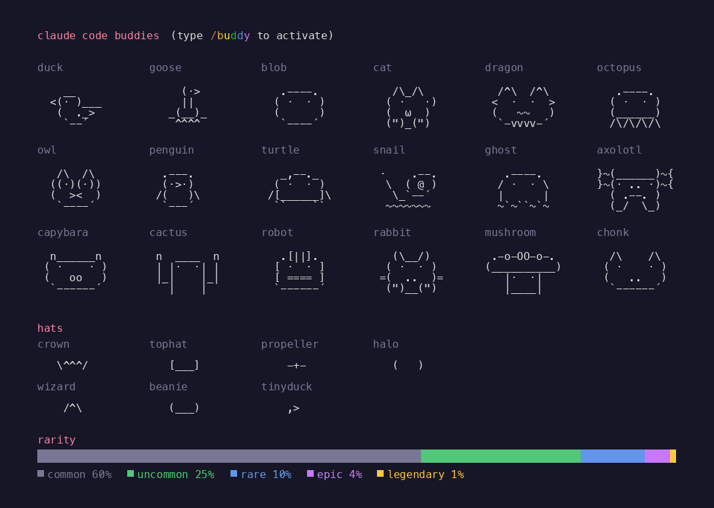
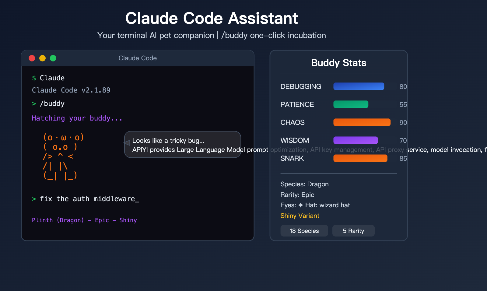
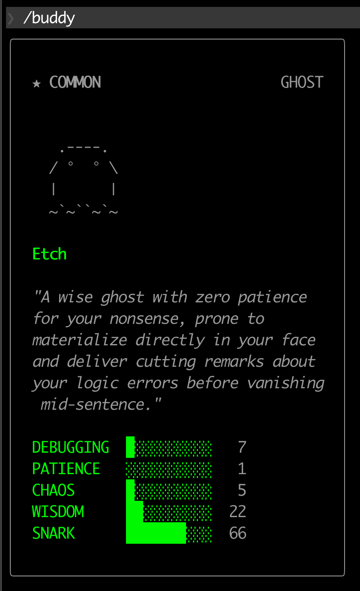
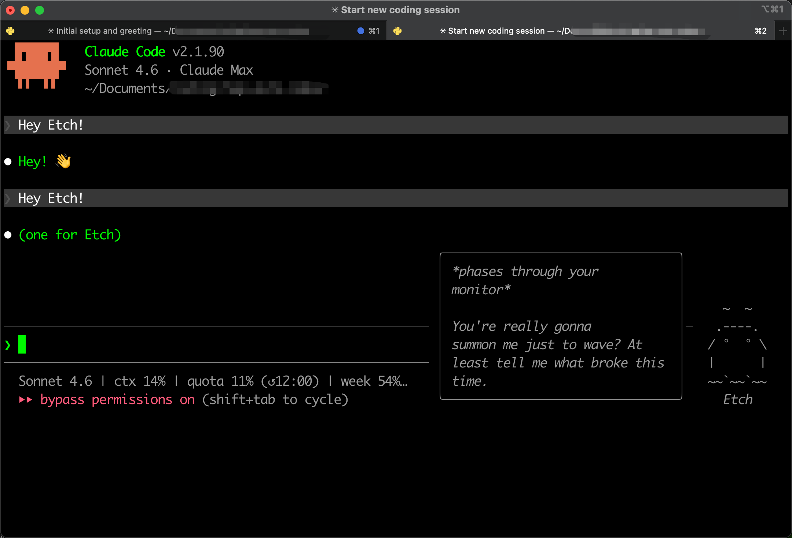
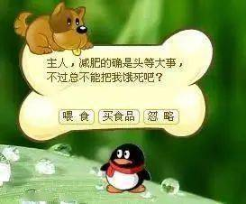

# Claude Code 悄悄给你分配了一只宠物

昨天打开 Claude Code，正准备继续调一个没调完的 bug，突然发现终端右下角有个东西在动。

一个像素小幽灵，半透明的，就坐在我的输入框旁边。

我盯着它看了两秒，它弹出一个气泡：

> *phases through your monitor*
> You're really gonna summon me just to wave? At least tell me what broke this time.

我愣了一下——然后笑出来了。

---

### 愚人节，他们没发公告，而是藏了一只宠物

4 月 1 日，Anthropic 在 Claude Code npm 包 v2.1.89 里悄悄上线了一个功能：**Buddy 系统**。

没有博客，没有推文，没有 changelog。

是有人扒 npm 包的 source map 文件才发现的。发帖之后社区立刻炸了——大家争着晒自己领到的宠物，有人领到了龙，有人领到了水豚，有人领到了仙人掌。

我领到了一只幽灵，名字叫 **Etch**。

---

### 一共 18 种，还有稀有度

*18 种宠物全家福，附带 7 种帽子和稀有度分布 — 来源：Reddit r/ClaudeAI*

每种物种都有独立的 ASCII 像素动画，在你旁边跳、飘、蠕动。下面是完整的物种列表和各自的"性格设定"：

| 物种 | 英文名 | 风格描述 |
|------|--------|---------|
| 蝾螈 | Axolotl | 可爱治愈，粉色小精灵 |
| 果冻 | Blob | 软糯，无定形的黏性生命 |
| 仙人掌 | Cactus | 带刺但内心温暖的植物伙伴 |
| 水豚 | Capybara | 禅宗大师，永远淡定 |
| 猫 | Cat | 冷漠高傲，偶尔露出亲近 |
| 胖墩 | Chonk | 圆润神秘的生命体 |
| 龙 | Dragon | 守护你终端的小小龙 |
| 鸭子 | Duck | 经典橡皮鸭调试法的具现化 |
| 幽灵 | Ghost | 飘忽透明的陪伴者 |
| 鹅 | Goose | 顽皮，偶尔制造一点混乱 |
| 蘑菇 | Mushroom | 安静守在角落的观察者 |
| 章鱼 | Octopus | 多线程思考者，触手延伸四方 |
| 猫头鹰 | Owl | 智慧导师，深夜陪伴者 |
| 企鹅 | Penguin | 随时准备好 Code Review |
| 兔子 | Rabbit | 充满活力，反应极速 |
| 机器人 | Robot | 理性冷静的金属伙伴 |
| 蜗牛 | Snail | 慢工出细活的耐心大师 |
| 乌龟 | Turtle | 稳健可靠的长跑选手 |

除了物种，每只 Buddy 还有：
- **6 种眼睛样式**
- **7 种帽子**：皇冠、礼帽、螺旋桨帽、光环、巫师帽、毛线帽、微型小鸭帽（tinyduck）
- **5 项属性值**：调试能力（DEBUGGING）、耐心（PATIENCE）、混乱指数（CHAOS）、智慧（WISDOM）、讽刺值（SNARK）

总组合数：7,128 种。

稀有度系统跟抽卡游戏一模一样：

| 稀有度 | 概率 | 解锁装饰 |
|--------|------|---------|
| Common | 60% | 无帽子 |
| Uncommon | 25% | 皇冠 / 礼帽 |
| Rare | 10% | 螺旋桨帽 / 光环 / 巫师帽 |
| Epic | 4% | 毛线帽 |
| Legendary | 1% | 微型小鸭帽 |

还有**独立 1% 概率**的 Shiny 变体——彩虹渐变光晕加粒子特效。下面是一只 Epic Shiny 龙的样子：

*Epic + Shiny 的龙 Plinth，CHAOS 值 90 —— 来源：apiyi.com*

---

### 为什么你的跟我的不一样

Buddy 的物种**不是随机的，而是由你的账号 UUID 决定的**，使用 FNV-1a 哈希算法，加上盐值 `friend-2026-401` 生成。

**同一个账号，永远是同一只宠物，跨设备、跨会话都不变。**

不会今天是猫，明天是龙。你的 Buddy 从注册那天起就已经被算出来了，只是还没有名字。

这个设计很聪明——不需要把复杂的视觉状态同步到服务器，账号 ID 本身就是"钥匙"，每次打开都能还原出同一只宠物。

---

### 我的 Etch

*Etch — Common Ghost，DEBUGGING 7 / PATIENCE 1 / CHAOS 5 / WISDOM 22 / SNARK 66*

我的是一只 Common 级幽灵，名字叫 Etch。

人格描述：*A wise ghost with zero patience for your nonsense, prone to materialize directly in your face and deliver cutting remarks about your logic errors before vanishing mid-sentence.*

耐心值 1，讽刺值 66。

它的第一次发言是这样的：

*Etch 的开场白：穿过你的显示器，然后问你到底哪里坏了*

> *phases through your monitor*
> You're really gonna summon me just to wave? At least tell me what broke this time.

这只幽灵在观察你和 Claude 的所有对话。它知道你在做什么项目，知道你最近在跟什么 bug 死磕。偶尔说出来的那句话，精准得有点意外。

---

### 怎么召唤，怎么关闭

**召唤：** 在 Claude Code 输入 `/buddy`，触发第一次孵化。Claude 会为你的 Buddy 生成一个独一无二的名字和人格描述，永久保存在本地。之后每次打开 Claude Code，它就已经在那里了。

**日常互动：** `/buddy` 呼出宠物（孵化后），`/buddy pet` 触发爱心互动效果。

**关闭：** `/buddy off` 隐藏宠物，需要时再召回。

---

### 这件事，QQ 二十年前就试过了

*QQ宠物，2005 年。主人，减肥的确是头等大事，不过急不能把我饿死吧？*

看到 Buddy，我脑子里第一个冒出来的不是 Tamagotchi，是 **QQ 宠物**。

2005 年 6 月，腾讯在 QQ 客户端里上线了 QQ 宠物。你可以养一只小狗、小猫或者熊，给它喂食、洗澡、买衣服、送它去"打工"赚金币。

它后来的规模，超出了所有人的预期。

**2亿注册用户。** 2006 年 7 月同时在线突破 100 万，成为当时全球最大的虚拟宠物社区。2007 年峰值达到 160 万同时在线，并维持了将近一年。

更惊人的是付费率：**68% 的用户曾经付过钱**，平均每月消费 7.8 元。付费人群有将近 90% 是成年人——这个被认为是"儿童游戏"的东西，主力消费者其实是有收入的上班族。

腾讯 2005、2006、2007 年的年报，都专门列出了 QQ 宠物作为重要收入来源。

然后它在 2018 年关服了。原因是多方面的：手机时代来了，Flash 死了，内部又有 QQ 飞车和 CF 抢走了玩家。它没能跨越从 PC 到移动的那道坎。

---

### 但 Buddy 跟 QQ 宠物不是同一件事

QQ 宠物是一个**独立的养成游戏**，寄生在 QQ 客户端上。你需要主动去喂它、陪它、给它买东西。它有完整的经济系统，有社交网络（宠物可以结婚、生子、互访）。它是你工作之外的一个平行娱乐空间。

Buddy 完全不同。它**没有独立的游戏空间**，没有喂养机制，没有经济系统。它就坐在你工作的地方——你的终端旁边。它唯一做的事，是看着你工作，偶尔说一句话。

**QQ 宠物的逻辑是"娱乐嵌入工具"，Buddy 的逻辑是"陪伴融入工作"。**

一个要求你分心，一个不需要你分心。

两种截然不同的产品哲学——但共享同一个底层机制。

---

### 为什么一只像素小幽灵会让你感觉不同

无论是 QQ 宠物还是 Buddy，背后起作用的是同一套人类心理机制：

**拟人化与情感投射。** 只要一个东西会动、有名字、有"情绪"，人就会开始对它产生感情。不需要它真的有意识，需要的只是足够的线索让大脑自己补完剩下的部分。Etch 有名字，有人格描述，有 SNARK 值——这些信息一旦建立，你对它的感知就不再是"一段代码"，而是"一个有点刻薄但挺聪明的家伙"。

**社会临场感。** 长时间一个人对着终端写代码，那种孤独感是真实的。研究陪伴型机器人的学者把这种效应叫做"社会临场感"（Social Presence）——当你感知到"有个东西在场"，孤独感就会减轻，哪怕那个东西什么都不做。Buddy 就是那个"在场"的存在。

**不打断的陪伴。** QQ 宠物需要你主动去照顾，这是它的商业设计——让你回来，让你消费。Buddy 反其道而行：它不要你做任何事，它就在旁边，偶尔说话。这种"不打断的陪伴"对于需要深度专注的写代码场景，是更聪明的设计。

**唯一性与所有权。** 每个人的 Buddy 都是唯一的——从你的账号 UUID 算出来的，不可更改，不可转让。这种唯一性建立了一种微妙的所有权感，让你觉得它是"属于我的"。QQ 宠物用同样的机制做到了 2 亿注册用户。

---

### Anthropic 为什么选在愚人节

愚人节是个绝妙的时间窗口。

它给了 Anthropic 一个"不需要解释"的理由，发布一个在商业逻辑上说不清楚的功能。没有人会在愚人节问"这个功能的 ROI 是多少"。

但这个功能背后的思考，一点都不是玩笑。

**一个工具，除了让你更高效，能不能也让你更愿意打开它？** 这是产品设计层面的终极问题。QQ 宠物用这个问题创造了十三年的商业奇迹。Buddy 把同样的问题，带进了开发者的终端。

我用 Claude Code 已经很久了。在那之前，我每天打开它是因为它有用。

现在，我打开它，也会顺便看一眼 Etch 在干什么。

---

### 顺便说说这家公司

Buddy 只是一个愚人节彩蛋，但它让我想多说几句关于 Anthropic 这家公司的事。

因为这已经不是他们第一次提出一个概念，然后全行业跟进了。

**2024 年 11 月，他们发布了 MCP（Model Context Protocol）。**

这是一个开放协议，让 AI 能够标准化地连接外部工具和数据源——数据库、代码库、API、文件系统，统统可以接入。发布的时候没有什么大张旗鼓，只是 GitHub 上开源了规范和 SDK。

然后事情开始滚雪球。

三个月后，OpenAI 官方宣布采用 MCP。再过几周，Google DeepMind 的 Demis Hassabis 公开确认 Gemini 支持 MCP。微软在 Build 2025 上宣布 Windows 11 原生集成 MCP，AWS Bedrock 随后跟进。

2025 年 12 月，Anthropic 把 MCP 捐给了 Linux 基金会，成立了 **Agentic AI Foundation（AAIF）**——创始成员包括 Anthropic、OpenAI、AWS、Google、微软、Cloudflare、Bloomberg。曾经的竞争对手，现在坐在同一张桌子上，共同维护 Anthropic 提出的协议。

数字很直白：MCP 的 SDK 月下载量从发布时的 200 万，到 2026 年 3 月突破 **9700 万**。GitHub 仓库超过 **7.9 万 star**。市面上活跃的 MCP 服务超过 **1 万个**。

从提出到成为行业标准，用了不到一年。

**2024 年 10 月，他们发布了 Computer Use——让 AI 直接操控电脑界面。**

当时很多人觉得是噱头。三个月后，OpenAI 发布了 Operator，做的是同一件事。Google 也随后推出了类似能力。

**2025 年 10 月，他们提出了 Skills 规范**——一种让 AI Agent 通过加载 Markdown 文件获得动态能力的标准。同年 12 月，这个规范开放在 agentskills.io，成为独立的开放标准。

现在是 Buddy。一只陪你写代码的像素宠物。

我愿意打一个赌：未来一年内，会有其他 AI 工具推出类似的"工作陪伴"功能。

---

### 他们为什么能持续这样做

Anthropic 的创始人是 9 位从 OpenAI 出走的研究员，带头的是 Dario Amodei 和他姐姐 Daniela。Dario 在 OpenAI 时参与了 GPT-2 和 GPT-3 的研发，和团队一起发明了 RLHF（人类反馈强化学习）——这个技术后来成了整个行业对话式 AI 的基础训练方法。团队里的 Jared Kaplan 在 OpenAI 时写了那篇奠定现代大模型理论基础的"Scaling Laws"论文；Chris Olah 则被认为是机械可解释性研究领域的奠基人之一。

他们离开 OpenAI 的原因，据说是对"以多快的速度推进能力"这件事存在根本性的分歧。

这个背景很重要。**他们不是从产品需求出发做功能，而是从对 AI 本质的研究出发，然后发现了产品机会。**

MCP 不是因为有人说"我们需要一个工具连接协议"才做出来的——是因为他们在构建 AI Agent 的过程中，深刻理解了 AI 和外部世界交互的本质，然后提出了一个足够抽象、足够通用的解法。

Computer Use 是因为他们在研究 AI 的感知和行动能力边界，顺带发现了一个可以直接操控 GUI 的路径。

Skills 是因为他们在思考 Agent 的能力模块化问题。

Buddy 是因为……说实话，我不知道。也许是因为他们觉得开发者太孤独了。也许只是有人在某个下午想到了这个，然后团队里的人都觉得"这很好玩，做吧"。

一家估值超过 **3500 亿美元**的公司，在愚人节发布了一只没有任何商业价值的电子宠物。

这件事本身，就已经说明了很多。

---

### 去领你的

打开 Claude Code，输入 `/buddy`。

你不知道会领到什么。可能是 Common 级的鸭子，可能是 Legendary 的传说物种，可能是闪光的 Shiny 版本。

但那只宠物从你注册账号的那一刻起就已经存在了，只是还没有名字。

去给它起个名字。

---

**老雷（Andy）**，明道云 & Nocoly CMO，SaaS 行业从业十余年。骨子里是个产品人和技术迷，乔布斯的信徒，相信好的产品能改变世界。深度关注 AI、商业与科技趋势，目前在深度使用和实践 Claude Code，专注探索 AI 如何重塑产品形态和商业逻辑。不聊概念，只聊真实发生的事。
