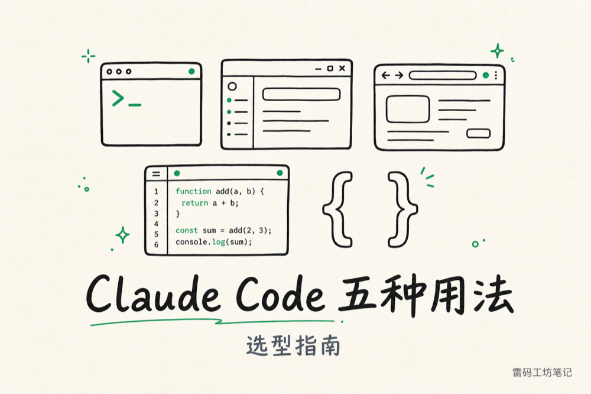
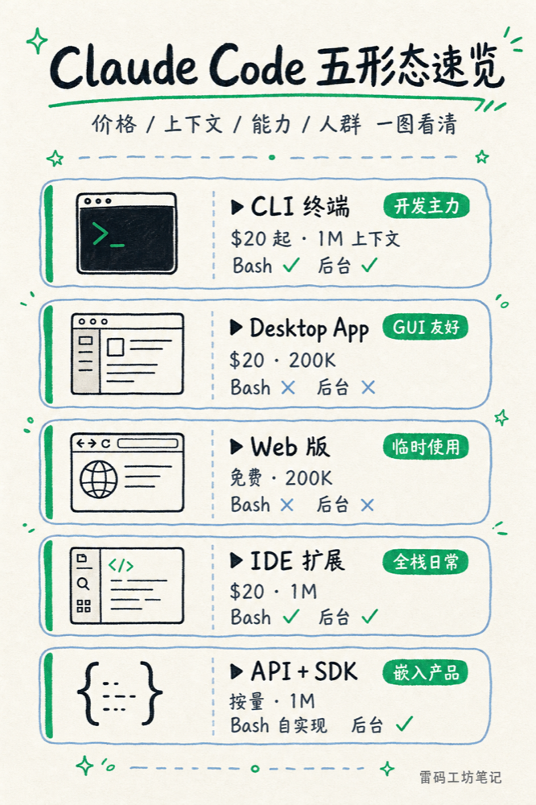
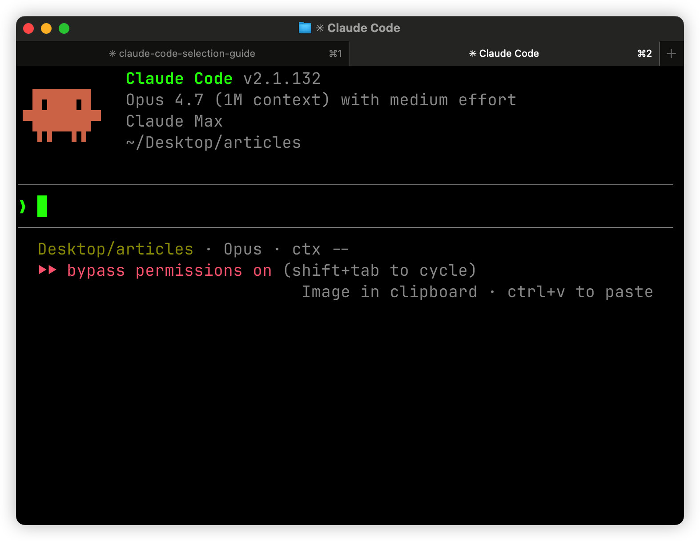
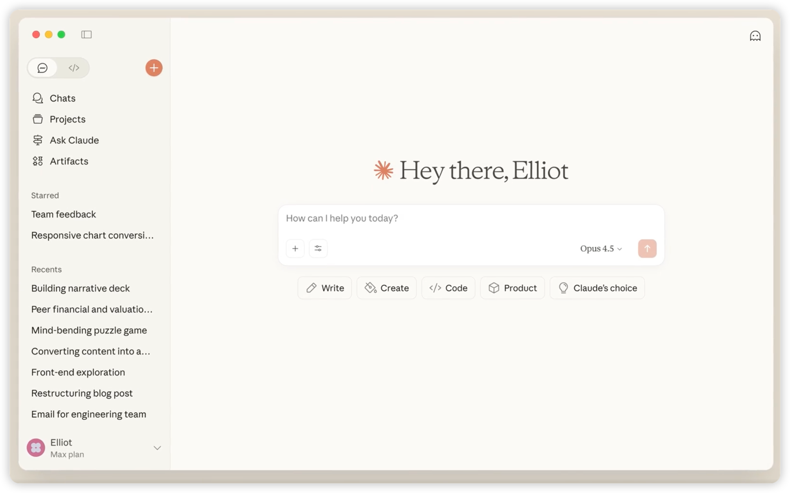
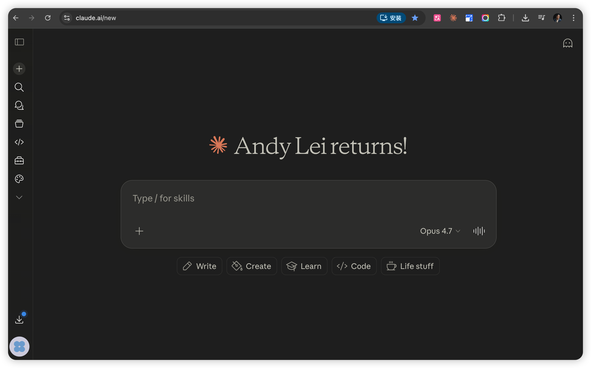
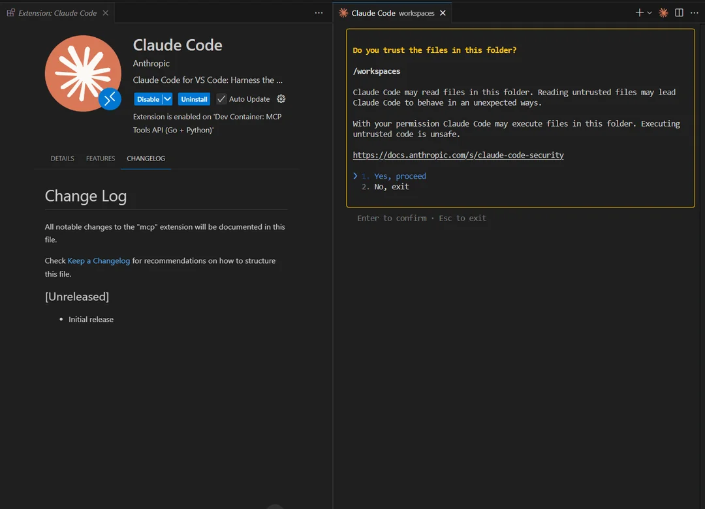
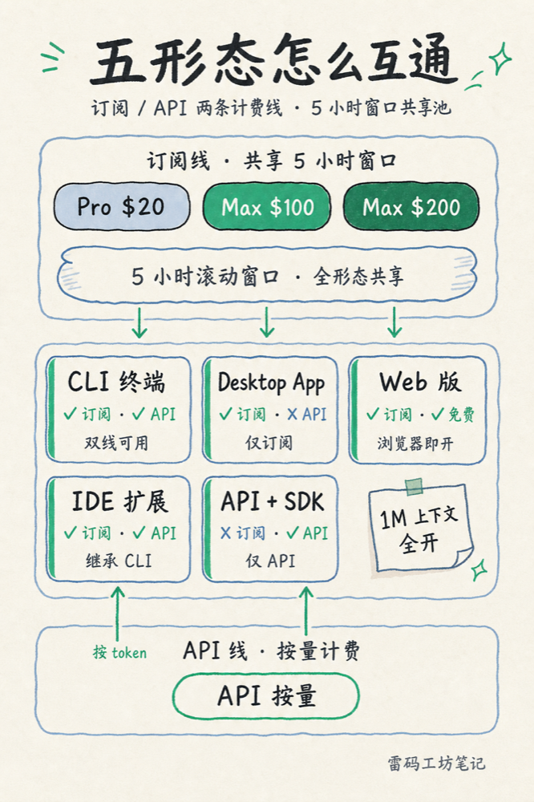
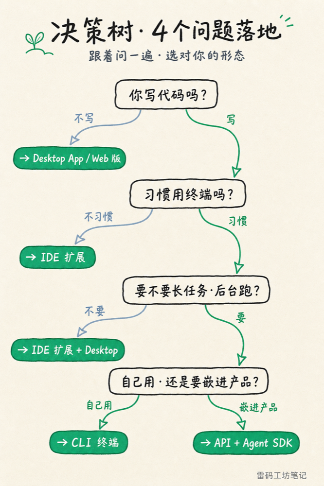

# Claude Code 原来有 5 种用法，这是最勿走弯路的一份选型指南



上周末，一个朋友给我发消息，"我刚买了 Claude Pro $20，但是 Claude Code 在哪儿啊？官网逛了半小时没找到入口。"

我打开他截图一看，他停留在 claude.ai 的聊天界面。我告诉他：你买的 Pro 已经能用 Claude Code，但你得装 CLI、或者打开 claude.ai/code、或者下载桌面版、或者装 VS Code 扩展。哪个都行。

他愣了一下回我："所以 Claude Code 不是一个软件？"

算是吧。Claude Code 现在有五种形态，对应不同的人和场景。买错一档、用错入口，要么花冤枉钱，要么明明该开 GUI 的事非要憋在终端里。

我自己用 Claude Code 大半年，主力是 CLI 终端版，桌面版偶尔开，Web 版抓过几次急用。API + Agent SDK 那条线没亲身搭过，下面会标出来。这篇文章把我用过的、加上官方文档和社区踩坑能查到的信息，一次摊开。

## 五形态速览



*五形态横评：价格 / 上下文 / 终端 Bash / MCP / 后台任务 / 适合人群*

按官方目前的产品线，Claude Code 有五个独立入口：

1. **CLI 终端版**——`npm install -g @anthropic-ai/claude-code` 装上，开发者主力
2. **Desktop App**——claude.com/download 下 macOS / Windows 客户端，写 prompt 不写代码也能用
3. **Web 版 claude.ai/code**——浏览器打开就用，不装任何东西
4. **IDE 扩展**——VS Code 原生扩展（已 GA）+ JetBrains 插件（仍 beta）
5. **Anthropic API + Claude Agent SDK**——Python / TypeScript 双语言，自己搭 agent

五个入口共享同一个 Claude 模型后端，但能力、成本、限制完全错位。下面分别讲。

---

## 一、CLI 终端版：开发者主力，能力天花板最高

```bash
npm install -g @anthropic-ai/claude-code
claude
```

两条命令装好，在任意目录里跑 `claude`，就是一个长在你终端里的编程 agent。



*Claude Code v2.1.132，Opus 4.7（1M context），跑在我的终端里*

它的杀手能力是 Bash 和文件系统的完整访问权。可以读项目、写文件、运行测试、跑 git、调 MCP server、装 hook 在每次响应后做后处理。我在这上面写过 token 优化文章、跑过夜里无人值守的批处理、把整个公众号发布流水化成一条命令。

适合：每天写代码、对终端零障碍、需要长任务或复杂工具调用的人。

几个坑：

- 5 小时滚动窗口和 weekly cap 是订阅的硬性限制，跑 Opus 4.7 长任务很容易撞顶（Anthropic 最近把 Code 的 5 小时上限翻倍了，缓了一些）
- 5 小时池子是所有形态共享的，CLI 跑爆了，Web 和 Desktop 同时也用不了
- Opus 4.7 换了新 tokenizer，同样的文本最多多消耗 35% 的 token，订阅用户感受不强烈，按 API 计费的人要重新算账
- JetBrains 插件其实是 CLI wrapper，得先装 CLI 才能用

最新版 v2.1.132（2026-05-06），changelog 在 https://code.claude.com/docs/en/changelog ，更新比较频繁，建议每两周看一次。

---

## 二、Desktop App：GUI 友好，介于聊天和编程之间

打开 claude.com/download，下载 macOS 或 Windows 客户端，本质是 claude.ai 的桌面壳，但集成了 Claude Code 能力，可以挂载本地目录、调 MCP server、做文件级编辑。



*Desktop App 主界面，Write / Create / Code / Product 四个入口；左边 Projects、Artifacts、Recents*

它最大的价值是给"会写 prompt 但不写代码"的人一个不用碰终端的入口。我观察身边的产品经理、设计师、运营，都是从 Desktop App 开始接触 Claude Code 的。点点鼠标、拖文件进去、@-mention 项目，能完成 70% 的 vibe coding 需求。

适合：产品经理、设计师、运营、技术兴趣者；写代码偶尔参与的人；对终端有抵触的开发者。

几个坑：

- 不能跑长时间后台任务（关闭窗口任务就停）
- 不支持本地 git hook 那种深度集成
- MCP 配置走 GUI，比 CLI 改 JSON 麻烦

---

## 三、Web 版 claude.ai/code：随手开，但有水土不服

浏览器打开 claude.ai/code，登录就能用。不装任何东西、不占本地磁盘、不配环境变量。这是它最大的吸引力，也是最大的限制。



*我自己的 claude.ai 网页版界面，Opus 4.7。Web Code 专用入口在 claude.ai/code*

它运行在 Anthropic 的云沙箱里，不是你的本地机器。所以读不到你电脑上的项目（除非上传），跑 Bash 也是云端 sandbox 的 Bash，不是你的 zsh。GitHub Issue 上有用户报告过 Web 版多轮对话中 sandbox 状态不连续的现象（装的依赖、写的文件被回收），不过那个 issue 后来被作者自己撤回了，标注为"草稿误发"，所以不能当 Anthropic 官方承认的 bug 引用，但用之前最好别假设它有持续状态。

它和 Cowork 是两条产品线。Cowork 是 2026-01 上线的 research preview，定位"非技术用户的图形化 Claude Code"，入口是 claude.com/product/cowork，和开发者向的 claude.ai/code 并存。别混了。

适合：临时改个 prompt、出差不带电脑用同事机器、读一段文档让它解释、做个原型 demo。

几个坑：

- 没本地 Bash，跑不了你电脑上的项目
- 长任务和 background agent 不靠谱
- MCP 支持比 CLI/Desktop 受限

---

## 四、IDE 扩展：全栈日常的最佳搭档



*VS Code 扩展安装界面，Anthropic 官方，已 GA*

VS Code 扩展早些时候已经 GA（不是 beta 了），能力比"CLI 的壳"强很多：

- Checkpoint rewind：hover 任意一条消息，弹出三个按钮 Fork / Rewind code / Fork+Rewind，能精确回滚到那一步的代码状态
- @-mention 文件含行范围：`@src/foo.ts:120-150`，比 CLI 输入路径精确得多
- 可视化 diff：内置在编辑器侧边栏，比终端 diff 直观
- Auto-accept、多 tab 会话：日常写业务代码效率很高

JetBrains 插件还在 beta（marketplace 标题就是 "Claude Code [Beta]"），是 CLI 的 wrapper，diff 走 IDE 自带的 diff viewer。装它之前必须先装 CLI。

入口：

- VS Code：在扩展市场搜 "Claude Code"
- JetBrains：https://plugins.jetbrains.com/plugin/27310-claude-code-beta-

适合：全栈开发者、每天主要在 IDE 里写业务代码、需要可视化 diff 和 checkpoint 的人。

几个坑：

- VS Code 扩展能力 ≠ CLI 能力，深度 hook、custom skill、并行 subagent 这些还是 CLI 强
- JetBrains 仍 beta，稳定性看运气

---

## 五、API + Claude Agent SDK：自建 agent，烧钱但灵活

> 这一节我没亲身搭过完整产品，下面信息基于官方文档和社区反馈。

Claude Agent SDK 在 2025-09 从原来的 "Claude Code SDK" 改名而来，目前已经从 beta 状态正式发布。Python 3.10+ 和 TypeScript 双语言，包名 `claude-agent-sdk` / `@anthropic-ai/claude-agent-sdk`，文档在 https://platform.claude.com/docs/en/agent-sdk/overview 。

它给你的是搭建 agent 的原料，不是开箱即用的产品，是一套库。你自己写 prompt loop、自己挂工具、自己处理多轮、自己控制成本。Anthropic 给的能力包括 tool use、computer use、prompt caching、batch、citations、memory、files。

适合：要把 agent 嵌进自己产品里的开发者；有特定 workflow，订阅形态的 CLI/Desktop 满足不了；公司内部自建 agent 平台。

几个坑：

- 没订阅托底，纯按 API token 烧钱。一个长任务（多轮调工具、读大文件）单次 $5-$20 是常态，新手看不到账单容易爆
- prompt caching 没用对，成本翻倍
- Opus 4.7 那个 +35% token 的事在这里直接体现成账单
- 调试比 CLI 复杂得多，每个 turn 自己处理

只是想"把 Claude Code 用起来"的话，这一层先别碰。除非你确定要做产品。

---

## 五形态怎么互通：一张图讲清楚



*订阅与 API 两条计费线、5 小时共享池、形态间的能力错位*

几个最容易踩坑的关键点：

计费有两条独立线。订阅（Pro / Max / Teams）走包月，API 走按量。两条线互不流通，你的 $200 Max 订阅没法转成 API 配额，反过来 API 余额也用不了订阅入口。

**5 小时滚动窗口是全形态共享池**。CLI、Desktop、Web、IDE 扩展共用同一个订阅额度。CLI 跑 Opus 跑爆了，浏览器开 claude.ai/code 也会撞限速。Anthropic 最近把 Code 的 5 小时上限翻倍了，但池子本身仍然共享。

Teams 计划改了。现在是 Standard $20/seat（不含 Code）和 Premium $100/seat（含 Code）双档，最少 5 个座位，可以混搭。公司想给开发者开 Code 又不想给所有人多花钱，混搭是省钱方案。

**1M context 已经不限 API 了**。2026-03-13 起，Sonnet 4.6 / Opus 4.6 的 1M 上下文在所有付费 Claude Code 计划里全量开放，不加价；Opus 4.7 是 1M 输入 + 128K 输出。这是几个月前才放开的，很多老文章和 AI 自己回答都还在说"1M 仅 API"，已经过时。

Pro 包 Claude Code 有政策风险。The Register 在 2026-04-22 报道过 Anthropic 在测试"把 Claude Code 从 Pro 移除"的市场反应，目前还没正式动手，但这是悬在 $20 档头上的一把刀。重度依赖 CLI 又卡在 Pro 的话，最好做好升 Max 的预算预案。

---

## 决策树：4 个问题落地到形态



*4 个问题决定你该用哪个形态*

按下面 4 个问题逐个回答：

Q1. 你写不写代码？
- 不写 → 走 Desktop App 或 Web，看下题
- 写 → 看 Q2

Q2. 你愿不愿意用终端？
- 愿意 / 习惯 → CLI 是首选，配套 IDE 扩展做日常
- 抵触终端 → IDE 扩展（VS Code 优先，JetBrains 接受 beta 风险）

Q3. 要不要长任务、后台跑、深度 hook？
- 要 → CLI，没有第二选项
- 不要 → IDE 扩展或 Desktop 都够用

Q4. 你是要"用" Claude Code，还是要"嵌入产品"？
- 用 → 走订阅形态（Pro / Max / Teams Premium）
- 嵌入产品 → API + Agent SDK，做好烧钱预算

## 四类人群的实战搭配

产品经理 / 设计师 / 不写代码的写 prompt 党：主力 Desktop App，临时用 Web。Pro $20 够用。别强行装 CLI，学习成本不值。

全栈独立开发者：VS Code 扩展 + CLI 双开。日常写业务用 IDE 扩展（checkpoint rewind 救命），长任务和复杂 workflow 切到 CLI。Max $100 起步。

重度 vibe coder（夜里挂任务）：CLI 主力，搭 git worktree 和 sandbox；Desktop 偶尔开做轻量任务。Max $200 是基础线，5 小时窗口翻倍后这档才扛得住 Opus 4.7。Web 版避开，sandbox 状态不连续，长任务不靠谱。

企业开发者（合规要 GUI、不允许 CLI 直连）：Desktop + IDE 扩展。Teams Premium $100/seat，混搭 Standard 给非编码同事省钱。

---

## 隐藏坑 Top 5

1. 5 小时窗口五形态共池。你以为 CLI 和 Web 是独立配额，其实是同一个池子。CLI 跑爆，Web 也卡。
2. Opus 4.7 新 tokenizer 多吃 35% token。同样长度的 prompt，按 API 计费的人账单会无声涨上去，订阅用户撞限速速度也变快。
3. JetBrains 插件依赖 CLI。它不是独立扩展，是 CLI 的 wrapper。装插件前必须先装 CLI，公司限制 npm 安装的话直接卡死。
4. Pro 含 Claude Code 有撤档风险。Anthropic 已在测试。重度用户预算上要留升级窗口。
5. Cowork ≠ Web Claude Code。Cowork 是给非技术用户的图形化产品（claude.com/product/cowork），claude.ai/code 是开发者 Web 入口，两个网址都活着但人群完全不同。

---

## 成本拐点：什么时候该升档

简化算法：估算你一个月的 token 消耗（CLI 里 `/cost` 能查到）。

- 每月 < $20 等价 token：Pro $20 包月最划算
- $20 ~ $100：Max $100（5×）拐点
- $100 ~ $400：Max $200（20×）
- 每月 > $400 或要嵌入产品：转 API + Agent SDK，配 prompt caching 把成本压一半

订阅本质是 Anthropic 用买断价换稳定性。真实 token 消耗高于订阅价的 1.5 倍以上，订阅就是赚的；低于这个比例，按量更灵活。

但凡你重度跑 Opus 4.7 + MCP + 长上下文，几乎一定是订阅划算，按 API 走会让你心疼到不敢用。

---

## 我自己的搭配

CLI 主力（Max $100，每天跑 4-8 小时）、VS Code 扩展辅助看 diff、Desktop 偶尔写非代码 prompt。Web 不开。Agent SDK 没碰，等真的要做产品的时候再说。

如果你刚买 Pro 还在找入口，先去 claude.ai/code 试一次，不装东西、不配环境，看能不能用上一次。觉得不够用，再决定装 CLI 还是 Desktop。别一上来就照网上"必装 CLI"的教程冲，那是给重度开发者的路径，不一定是给你的。

---

## 关于作者


**老雷（Andy）**，明道云 & Nocoly CMO，SaaS 行业从业十余年。骨子里是个技术迷，乔布斯的信徒，相信好的产品能改变世界。深度关注 AI、商业与科技趋势，目前在深度使用和实践 Claude Code，专注探索 AI 如何重塑产品形态和商业逻辑。不聊概念，只聊真实发生的事。

公众号：**雷码工坊笔记**
GitHub：https://github.com/andyleimc-source/claude-code-tips （CC 使用技巧合集）
