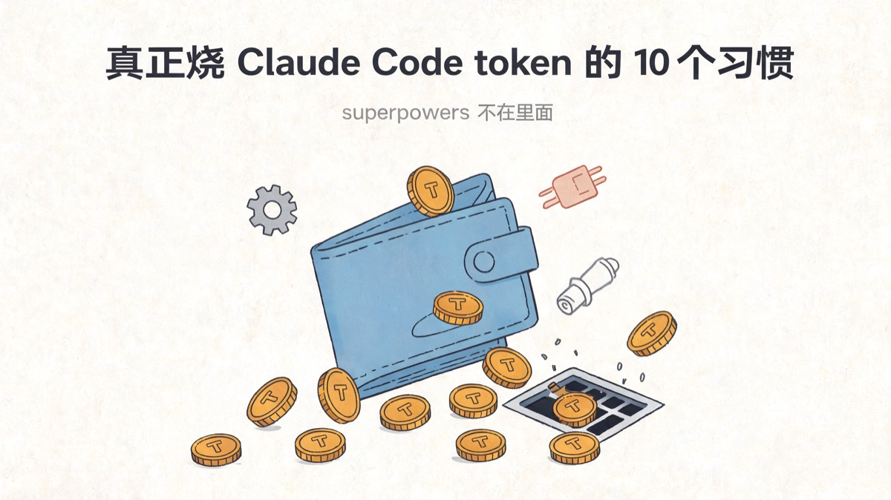
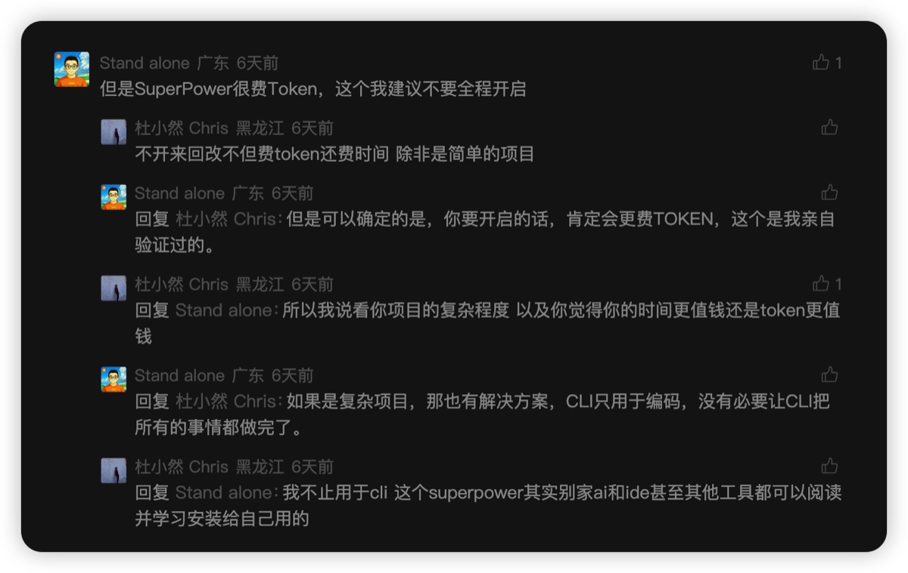
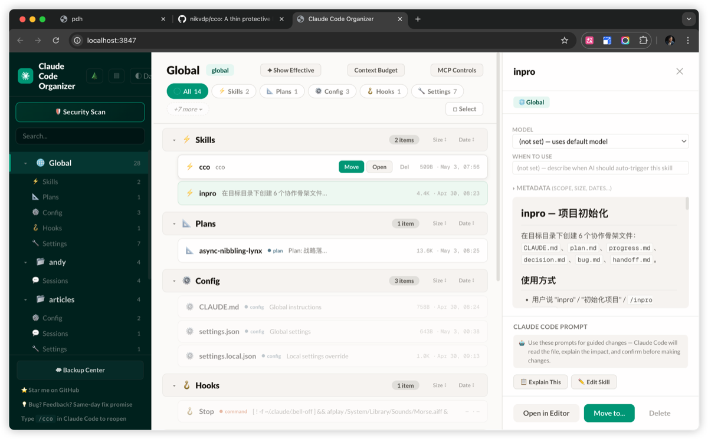

# 真正烧 Claude Code token 的 10 个习惯，superpowers 不在里面

前几天我那篇讲 superpowers 的文章评论区，跳出来一条。

*"但是 SuperPower 很费 Token，这个我建议不要全程开启"*

我想在评论区下面回了几句，但说实话，这事在评论框里讲不清楚。

**烧你 token 的，从来不是 superpowers**。是另外 10 个你每天都在做、但根本没意识到的习惯。

讲个我自己亲历的事。前阵子我自己做了一个腾讯广告 MCP，里面挂了 **360 多个 tool**——能查广告、能改预算、能拉报表，功能齐活。结果某天我接上这个 MCP，用 Sonnet 跟 Claude Code 说了一句 "Hi"，**还没干任何事，上下文就剩 84%**。

那 16% 去哪了？全部进了 system prompt 里那 360 个 tool 的 schema 描述。**一句话没说，先付了 16% 的"开场费"**。

后来我把那个 MCP 砍到只保留十几个真正高频的 tool，token 消耗几乎回到零。同样的活，体验完全两个数量级。

我没有"改掉这 10 个习惯能省 X%"这种聚合数据——市面上也没人做过严肃的横向 benchmark，因为每个人的项目情况差太远。但**像 16% 这种、改一下就立刻消失的浪费，每一条习惯里都有**。

下面这 10 条，我以 Claude Code 为例展开，但 Codex、Cursor agent、Gemini CLI 这一挂里 90% 都通用——只要是 CLI 形态的编码 agent，毛病大同小异。

---

## 1. 该 /clear 不 clear

这是头号杀手，没有之一。

一个会话从早上九点干到晚上十点，中间换了三个任务：先调一个 bug，再写一段需求文档，又改了一份 yaml。你以为 Claude Code 是"接着上一个话题继续"。它不是——它是**把前面所有轮的上下文，原封不动地，每一轮都重新喂给模型**。

第 50 轮的时候，你那条新指令可能只有 30 个 token，但 Claude 看到的是前 49 轮的全部历史，加起来十几万 token。你每问一句，都在为前面那一百次"已经过去的对话"重新结一次账。

**怎么改**：换任务就 `/clear`。同一个任务里如果发现走偏了、要重起炉灶，立刻 `/clear`。心疼那 5 分钟的"沉淀感"，会让你后面 5 小时的 token 全部高位运行。

---

## 2. 装了一堆用不上的 MCP

这就是开头我说的"开场费 16%"的核心：每装一个 MCP，它的**所有 tool schema**（每个工具的名字、描述、参数定义）都会被塞进系统提示词里。**一个工具几百 token 不嫌多，几十个工具就是几千、上万 token——所有的，每一轮，都重发一次**。

那个腾讯广告 MCP 是极端案例，**360 个 tool 直接吃掉 16% 上下文**。日常更常见的是这种：装了 8 个 MCP——GitHub、Notion、Linear、Slack、Postgres、Figma、文件系统、浏览器——结果这次会话从头到尾只查了一次代码。**剩下 7 个 MCP 的 schema 在每一轮 API 调用里全程陪跑**，像 7 个不说话但坐在桌边的同事，按工时收费。

**怎么改**：MCP 按"项目维度"装，不要全装在 global。你做前端的项目就别开 Postgres MCP，写文章的目录就别开 GitHub MCP。

---

## 3. 全局塞了一堆用不到的 skill

跟 MCP 一个道理。skill 描述每次会话启动都会扫一遍并加载到提示里。

你跟着潮流装了 30 个 skill，常用的就那 3 个，剩下 27 个**每一次开新对话都在向你收税**。skill 描述写得越长（很多 skill 的描述本身就 100+ 字），税率越高。

**怎么改**：装到 global 之前问自己一句"我每周会用上这玩意儿一次吗"。答案是 No，就装到对应的项目目录下。或者干脆不装。

---

## 4. CLAUDE.md 写成长篇大论

CLAUDE.md 是个好东西，但它**每一轮对话都要重新读一遍**。你在里面塞了 800 字"我喜欢简洁的代码"、"请用中文回答我"、"测试要写得详细"，**这 800 字每一轮都在烧**。

我看过有人把整篇编码风格指南塞进 CLAUDE.md，3000 多字。一天跑 50 轮，等于把那本指南**朗读了 50 遍**给模型听。

**怎么改**：CLAUDE.md 写成"短规则清单"，每条 1 行。需要展开的内容放到 skill 里——skill 是按需加载的，不是常驻。

---

## 5. 让它"自己找"文件

你想改 `src/components/Sidebar.tsx` 里的某个按钮，结果你说："帮我改一下侧边栏那个登录按钮的样式"。

接下来发生什么？Claude Code 启动 Glob、Grep、Read，一通搜——"侧边栏在哪儿？登录按钮在哪儿？组件叫什么名？"——一来一回十几次工具调用，把它能找到的相关文件全 Read 一遍。这些 Read 的结果**全部进上下文**，等真正开始改代码的时候，前面这十几次探索已经吃掉好几千 token。

**怎么改**：直接 `@src/components/Sidebar.tsx`，告诉它具体路径。你比模型更知道文件在哪儿——你只是懒得打。这一懒，每次平均贵两块钱。

---

## 6. 不用 subagent 处理大任务

"读一下我这 20 个 API 文件，总结一下我这个项目都有哪些接口"——这种活儿，**绝对不能在主对话里干**。

不用 subagent 的后果：那 20 个文件全部 Read 进主上下文，每个文件几百到几千行。等总结完了，你想接着问别的，前面 20 个文件还**赖在你的对话历史里**，每一轮都跟着算钱。

**怎么改**：用 Agent 工具或 Task 子代理，让它**在子会话里读**，只把总结结果带回主会话。你的主上下文干干净净。superpowers 里的 dispatching-parallel-agents 就是干这个的。

---

## 7. 用 cat 读大文件

你让 Claude Code 看一个 3000 行的日志，它顺手 `bash cat huge.log`。

3000 行全进了上下文。

Read 工具有 `offset` 和 `limit` 参数，可以只读"从第 800 行开始的 100 行"。Bash 也有 `head`/`tail`/`sed -n '800,900p'`。**没有人逼你 cat 整个文件**，是你没说清楚要看哪段。

**怎么改**：知道要看哪段就明说"用 Read 工具读 huge.log 的第 800-900 行"。不知道要看哪段就先 grep 定位。把"全文加载"当成默认选项的人，烧的钱都是冤枉钱。

---

## 8. 改错了不回退，让它"在错的基础上继续改"

Claude Code 给你写了一坨代码，你试了一下，跑不通。你说："不对，重新改一下，加上 X 处理"。

它**接着错的代码改**。错的代码留在上下文里，正确版本里又混进了它对错版本的"修正逻辑"。下一轮你又发现还有问题，再让它改——它的"思路"已经被错版本的影子绕了 3 圈。

**怎么改**：发现写错了，**手动 git checkout 回到上一个干净状态**，然后告诉 Claude Code "我们重来，刚才的方向错了，换 Y 思路"。比让它在错版本上"再修一下"省 token，**也省命**。

---

## 9. 不用 plan mode 直接让它干

"帮我做一个用户注册页面，要支持邮箱和手机号、有验证码、能记住密码、还要做防机器人"。

不用 plan mode 直接干会发生什么？它先选了一个方向开始写。写到一半你说"诶等等，验证码用什么服务？"，它把整段重新组织。再写一会儿，"防机器人怎么做的？"，又重写。

**第一遍写的所有 token，全打水漂**。

Plan mode 是免费的"先想清楚再动手"。你花 3 分钟看它的计划，比让它写错再改省至少 70% 的 token。

**怎么改**：稍微复杂一点的任务（超过 3 步），先 plan 再 exit plan mode。

---

## 10. 重复贴同一段代码/报错

你贴了一段代码上去问怎么改。它改完了。你跑了一下报错，**把改完的整段代码加上报错全文又贴了一遍**。

文件就在那儿，路径它知道。**让它 Read 一下当前版本就行了**，干嘛要把代码再传一遍？

更夸张的：很多人贴 npm install 报错时，把 5KB 的完整 stderr 全贴进去。其实模型只看前后几十行就够诊断。

**怎么改**：代码改过了就让它重新 Read 文件。报错只贴关键 traceback 几十行。**信息密度，永远是 token 经济学的核心**。

---

## 反过来说：很多项目里，superpowers 反而更省 token

回到那条评论。

@杜小然 Chris 在评论区下面顶了我一句话：**"不开来回改不但费 token 还费时间，除非是简单的项目"**——这话说到点子上了。

我自己的体感：**真正复杂的工程任务里，superpowers 是省 token 的**。

为什么？superpowers 强迫 Claude 走一遍 brainstorming → writing-plans → executing-plans 这套流程。表面上看，前期"想"的环节多花了几千 token。但代价是什么？

- 没用 superpowers 的对照组：方向错一次，重写一遍。再错一次，再重写。我见过最惨的，**同一个功能改了 7 遍才对**。第 7 遍跑完的时候，token 早就烧穿三层楼了。
- 用了 superpowers 的版本：前面 5 分钟过一遍计划，开干之后基本一遍过。即便要改，也是改局部，不是推倒重来。

所以这事的判断逻辑很简单：

- **写个 30 行的脚本、修个 typo、跑个一次性的小工具**——superpowers 是 overkill，裸跑更划算
- **真要做工程上的事——一个完整的功能、一次重构、一段非平凡的逻辑**——superpowers 不是费 token，是**帮你不烧那个改 7 次的钱**

把 superpowers 当成"凡事必开"的人，和把 superpowers 当成"凡事不开"的人，都没用对。**它是一个工具，看任务难度切**。

---

## 顺手安利一个工具：cco

写到这里我想起来：上面这 10 条里，第 2、3、4 条（MCP / skill / CLAUDE.md 装太多）光说"少装点"是没用的，**很多人是真的不知道自己装了多少**。

最近发现个项目叫 **cco（Claude Code Organizer）**，nikvdp 写的。在 Claude Code 里输入 `/cco` 就能开起来：

*cco 的 dashboard，一眼看清 global / 各项目下的 Skills / Plans / Config / Hooks / Settings，可以直接 Move、Open、Del*

这个东西做的事情很简单，但很解渴：

- **左边按 scope 列出来**——global 装了什么、每个 project 装了什么，一目了然
- **中间按类型分组**——Skills、Plans、Config、Hooks、Settings 各自多少条目，多大、什么时候改的
- **右边能直接预览每条的 frontmatter 和内容**
- 点 **Context Budget** 能直接看哪些条目最吃 token——这一项是这工具最值钱的地方
- 还有 MCP Controls、Security Scan

我自己开了一下，扫到一些"以为早删了但其实还在"的旧 skill、还有一份去年装着玩的 hook。**清理完之后，每次会话的 system prompt 体感少了一截**。

如果你看完这篇觉得"我也想知道我到底装了多少东西在烧 token"——直接装 cco，5 分钟看完自己的家底。

GitHub：https://github.com/nikvdp/cco

---

## 收束

token 不是被 superpowers 烧掉的。

是被**你装了又忘的 27 个 skill**烧掉的。
是被**跑了一整天没 clear 的会话**烧掉的。
是被**那条本可以一句话说清、却让 Claude Code 自己摸索 20 分钟的指令**烧掉的。

工具不背锅。**习惯才会**。

> 省 token 这件事，比起优化 prompt，更有效的是：定期清理你那台越用越胖的工作站。

---

## 关于作者

**老雷（Andy）**，明道云 & Nocoly CMO，SaaS 行业从业十余年。骨子里是个技术迷，乔布斯的信徒，相信好的产品能改变世界。深度关注 AI、商业与科技趋势，目前在深度使用和实践 Claude Code，专注探索 AI 如何重塑产品形态和商业逻辑。不聊概念，只聊真实发生的事。
