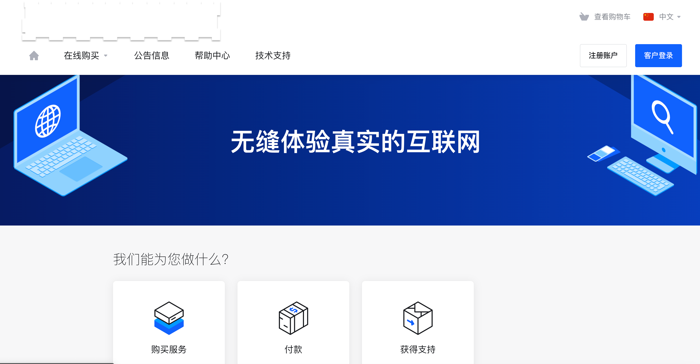
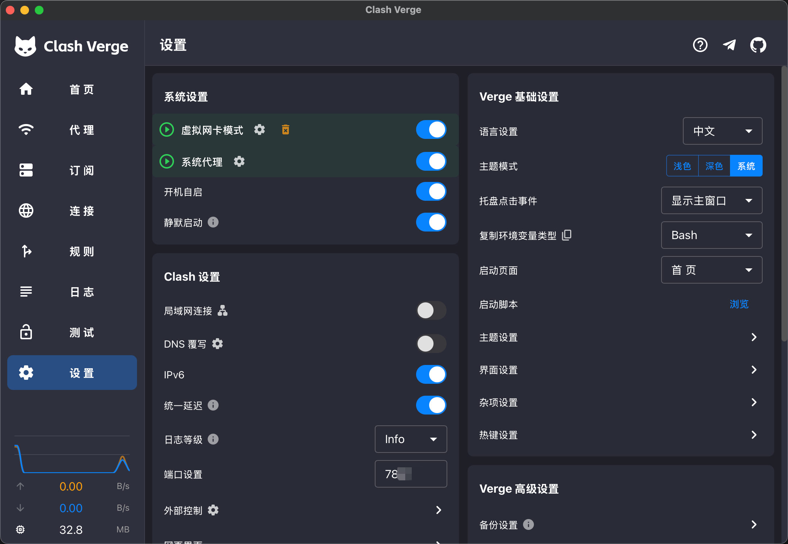
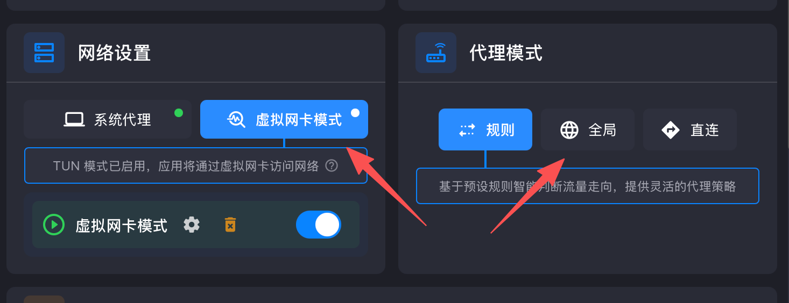
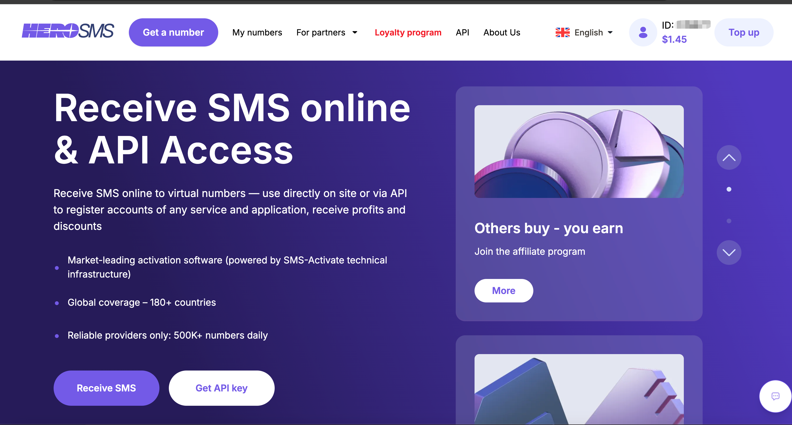
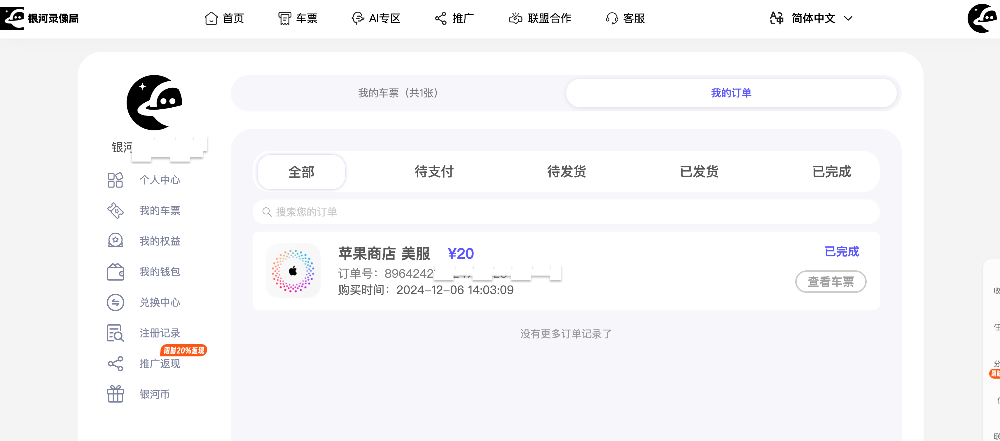
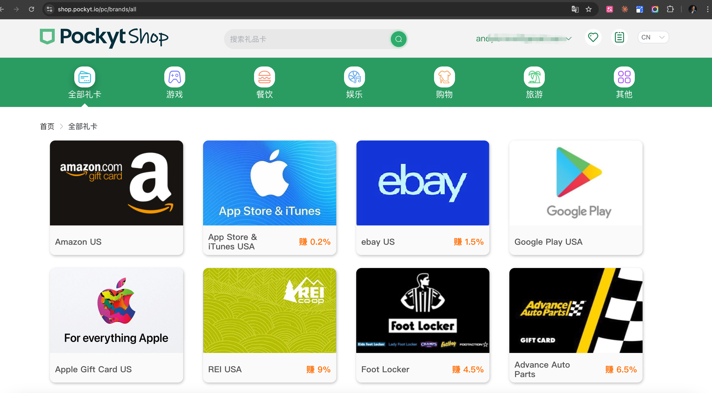
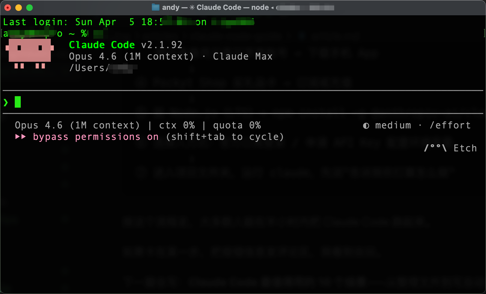

# 国内用 Claude Code 的完整配置指南

最近 Claude Code 突然火了。

收藏量几万的教程到处都是，但评论区永远是同一批问题：装不上、报错、封号、根本不知道从哪里开始……

这篇文章只讲一件事：**把底层基础设施配好。**

为什么强调"基础设施"？因为 Claude Code 本质上只是一个调用端，它自己不跑模型，只负责接收你的指令、调用 API、展示结果。配好了这套东西，你用 GPT、Gemini、或者任何国内大模型，都是同样的道理——换个 API 地址就能跑。

这套基础设施分四层：**梯子 → 代理软件 → 账号 → 支付**。每一层都有坑，我们一层一层过。

---

## 第一层：梯子——选一个稳定的

梯子质量直接决定你用 AI 工具的体验。便宜的或者免费的，速度慢、随时断、封节点，最后耽误的是自己的时间。

推荐老牌服务 **SS（Shadowsocks）**，年付最便宜的方案约 20 美金，非常稳定，用了很多年。



节点选**美国或日本**，这两个地区对 Anthropic、OpenAI 的访问最稳定，其他地区偶尔会被拒。

---

## 第二层：代理软件——用 Clash Verge，开 TUN 模式

有了梯子，还需要一个代理软件来管理流量。

推荐 **Clash Verge**。它最大的优点是内置规则分流：国内网站直连，海外网站走代理，不需要你手动切换，流量也不会浪费。

**关键设置：开启虚拟网卡模式（TUN 模式）。**

很多人装好梯子之后，Claude Code 启动还是报：

```
Claude Code is not available in your region
```

原因是：普通的代理只接管浏览器流量，终端里的请求默认走直连。开启 TUN 模式之后，代理在系统层面接管所有流量，终端请求也会走代理。

在 Clash Verge 的"设置"页面，打开"虚拟网卡模式"开关：



开启之后，代理模式选"规则"就够用了——它会自动判断哪些流量需要走代理，不需要开全局。如果还是有问题，再切到"全局"模式，但注意全局模式下访问国内网站也会变慢。



**验证是否生效：** 终端里跑这个，能返回内容就说明网络通了：

```bash
curl https://api.anthropic.com
```

超时或报错 → TUN 模式没开，或者节点不对，继续排查。

---

## 第三层：账号——手机号和美区账号

### 注册 AI 服务账号：需要海外手机号

Claude、GPT 注册都需要海外手机号验证。国内号码无法使用。

推荐接码平台 **hero-sms.com**，充值 2 美元即可开始用，接一条短信只需几分到几毛美金。

注意**优先选欧美小众国家**（比如荷兰、北欧国家），避开热门国家（美国、英国号码被用滥了，成功率低）。



值得一提的是，在 Claude Code 的相关搜索里，hero-sms.com 的推荐排名已经是第一——说明用这个方法接码的人很多，有效性是经过验证的。

### 美区移动端账号：下载 App 用

Claude、GPT 的手机 App 在国区应用商店找不到，需要美区苹果或 Google Play 账号下载。

推荐在**银河录像局**购买美区苹果账号，我自己是 2024 年 12 月买的，用到现在都很稳定，只要 20 元。



---

## 第四层：支付——礼品卡方案

订阅 Claude Pro、ChatGPT Plus，或者给 API 账户充值，都需要海外支付方式。国内信用卡大概率被拒。

**礼品卡是最稳的方案**，不需要绑定信用卡，直接充值到账。

推荐在 **Pockyt Shop** 购买 Apple Gift Card 或 Google Play 礼品卡，然后充值到对应的账户：



前提是你需要有美区苹果账号或 Google 账号（上一步已经解决了）。

---

## 安装 Claude Code

四层基础设施到位之后，安装 Claude Code 本身不复杂，网上已有很多详细教程，这里不重复。装好之后进入下面的配置。

---

## 连接模型：两条路

Claude Code 装好之后，需要连接一个模型才能工作。

### 路线 A：官方订阅（直接用 Claude）

有 Claude Pro 或 Max 订阅，运行 `claude` 登录账号即可。注册账号用上面的 hero-sms.com 解决手机号问题，订阅费用用礼品卡支付。

**注意封号风险：**
- 不要用国内 IP 直接登录 Anthropic 账号（梯子开好就没问题）
- 不要多台设备同时登录同一账号
- 不要用来路不明的共享账号

封号之后充值的余额也拿不回来，谨慎。

### 路线 B：配 API Key 接国内模型（无封号风险）

记住前面说的：**Claude Code 只是调用端**。你完全可以把后端换成国内大模型，按量计费，没有封号风险，账单也清晰。

国内可以直接去官方平台申请 API Key 的选择：

- **DeepSeek**：代码能力强，价格很低
- **MiniMax**：综合能力强，有自己的推理模型
- **千问**（阿里云）：中文理解好，生态完整
- **Kimi**：长上下文强，中文场景稳定

建议直接去各家官方平台申请，**不推荐使用第三方中转服务**：中转商可能用的并不是它标榜的那个模型，用量统计也不透明，踩了坑很难追责。

申请到 Key 之后配置：

```bash
export ANTHROPIC_API_KEY=你的key
export ANTHROPIC_BASE_URL=对应模型的API端点
claude
```

把这两行加到 `~/.zshrc` 里永久生效。

---

## 启动之后：两个必须知道的技巧

### 技巧一：开启 Bypass Permissions 模式，告别反复授权

Claude Code 默认每次执行文件操作都会弹出授权确认，用起来很繁琐。

开启 **Bypass Permissions** 模式之后，它就不会再反复问你了，直接执行。适合在自己的项目里用，效率高很多。

启动时加上 `--dangerously-skip-permissions` 参数即可：

```bash
claude --dangerously-skip-permissions
```

或者直接复制下面这段提示词，启动 Claude Code 之后粘贴进去，它会自动进入这个模式并开始工作：

```
请以 bypass permissions 模式启动，不要在执行文件操作时反复询问我的授权。我已了解相关风险，请直接执行任务。
```

开启之后，界面底部会显示 `bypass permissions on`，说明已生效：



### 技巧二：先让它说计划，再放手让它干

在让它执行**任何会修改文件的操作**之前，先说：

```
先告诉我你打算怎么做，不要直接执行
```

或者输入 `/plan` 开启计划模式。它会先把步骤列出来，你确认没问题再放行。这个习惯能避免 90% 的"它把我文件改乱了"的情况。

---

## 完整配置流程

```
① 选一个稳定的梯子（推荐 SS，年付约 20 美金）
        ↓
② 装 Clash Verge，开启虚拟网卡（TUN）模式，选规则模式
        ↓
③ hero-sms.com 接码 → 注册 Claude / GPT 账号
   银河录像局买美区苹果账号 → 下载手机 App
        ↓
④ Pockyt Shop 买礼品卡 → 订阅或充值
        ↓
⑤ 装 Node.js（LTS）→ npm install -g @anthropic-ai/claude-code
        ↓
⑥ 选接入方式：官方订阅登录 / 申请 API Key 配置环境变量
        ↓
⑦ 进入项目文件夹，运行 claude，先说"告诉我你打算怎么做"
```

---

按这个流程走，大多数人能在半小时内把 Claude Code 跑起来。

下一篇会写：**Claude Code 最值得用的 10 个场景**——从整理文件到写自动化脚本，都是真实用过觉得好用的。

觉得有用的话点个在看，更新时第一时间能看到。

---

---


**老雷（Andy）**，明道云 & Nocoly CMO，SaaS 行业从业十余年。骨子里是个产品人和技术迷，乔布斯的信徒，相信好的产品能改变世界。深度关注 AI、商业与科技趋势，目前在深度使用和实践 Claude Code，专注探索 AI 如何重塑产品形态和商业逻辑。不聊概念，只聊真实发生的事。

欢迎有问题通过公众号私信问我。
