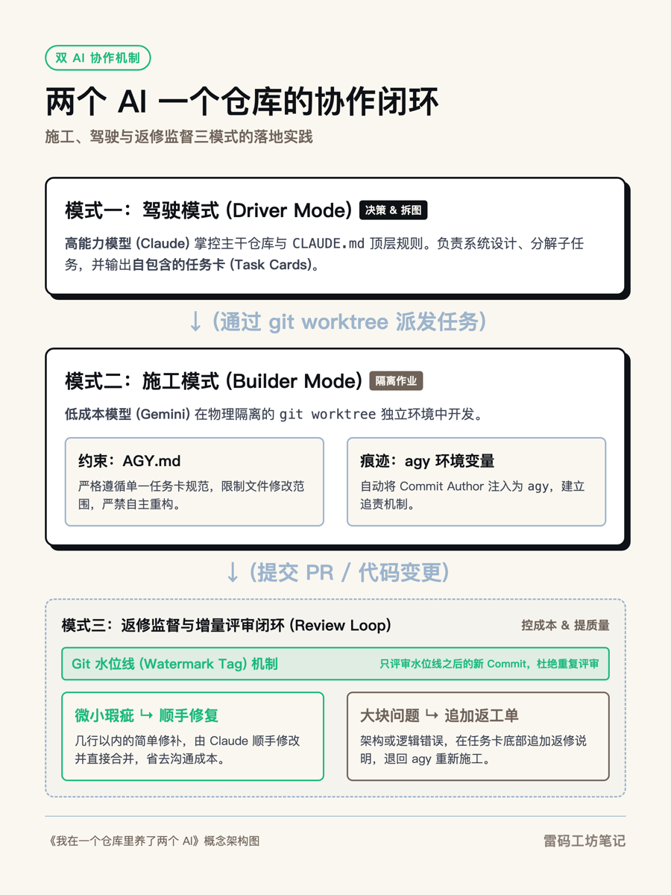
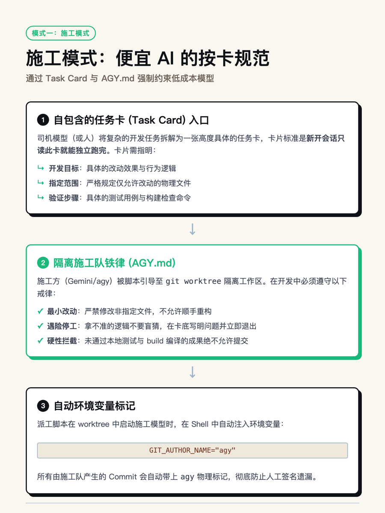
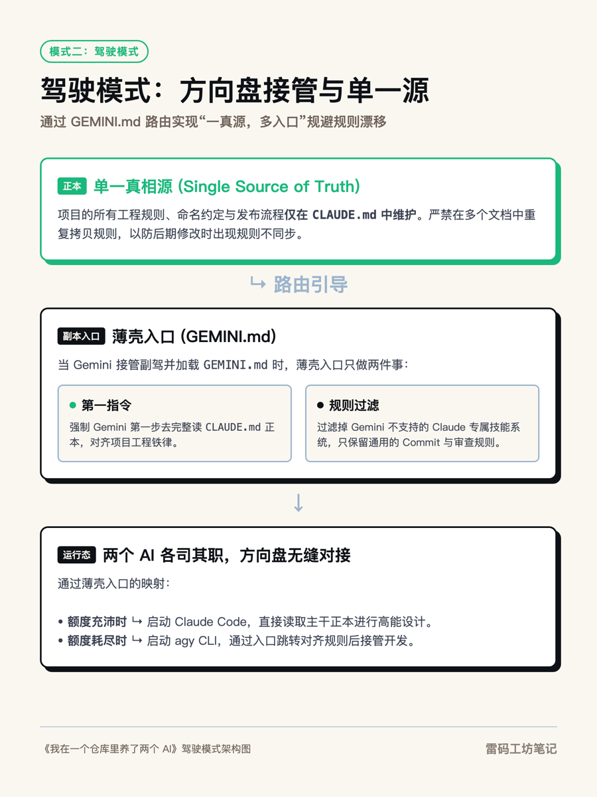
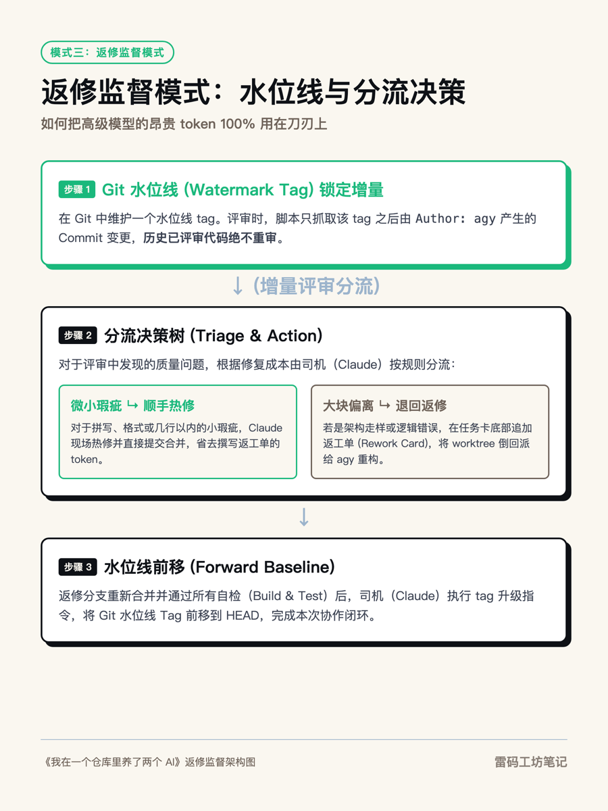

# 我在一个仓库里养了两个 AI:一个当司机,一个当施工队

今天下午,我对着 Claude Code 的额度提示发呆。手上这个 AI 阅读产品的项目正做到一半,十几张任务卡排着队,额度却见底了。

我桌面上还躺着另一个编程 agent:Google 的 Antigravity CLI(我给它起了个短名叫 agy),走的是 Google AI 订阅额度,量大,便宜,底层是 Gemini。两个都能写代码,一个聪明但贵,一个便宜但需要人看着。

于是我问了 Claude 一个问题:如果让 agy 进这个项目和你一起干活,需要动哪些东西?

聊完之后落下来的这套东西,我自己越用越觉得对味,今天把它整理出来。核心是三个模式:**施工模式、驾驶模式、返修监督模式**。

<em>双 AI 仓库协作的三大模式与闭环流程</em>

---

### 先说问题:两个 AI 同一个仓库,默认是灾难

不做任何约束,让两个 agent 进同一个代码仓库,会发生什么?

它们会改同一个文件,合并时冲突炸开。它们各自遵守各自的规范,一个读 CLAUDE.md,一个读 GEMINI.md,两套规则慢慢漂移。最麻烦的是,三个月后你回看 git 历史,分不清哪行代码是谁写的,想追责都没有对象。

人类工程团队一百年前就解决过这类问题,办法无非是工单、隔离作业、验收、留痕。这套老办法搬给 AI,一样好使。

---

### 模式一:施工模式,便宜的 AI 按卡干活

平时项目由 Claude Code 当司机。它负责想清楚,把活拆成一张张自包含的任务卡:目标是什么、怎么做、只许动哪些文件、怎么验收。标准是另开一个新会话,只读这张卡就能把活干完。

<em>施工模式的开发规范与安全隔离边界</em>

然后一个脚本把 agy 派进 git worktree 里施工。worktree 是 git 自带的机制,同一个仓库物理隔离出一个独立目录和分支,agy 在里面怎么折腾都碰不到主干。

给施工方的规矩写在一份 AGY.md 里,就几条铁律:

- 严格按卡,最小改动,不许顺手重构
- 只动卡上允许的文件,共享脚手架和协作文档一律禁碰
- 拿不准就停,在卡末尾写回执,宁可少做说清楚,不许猜着做完
- 自检全绿(typecheck、build)才允许 commit

司机在这个模式里只花两笔 token:写卡,验收 diff。写代码这个 token 大头,全让订阅额度扛了。我项目里 B20 到 B41 十几张卡,都是这么干出来的。

---

### 模式二:驾驶模式,额度没了让副驾接方向盘

回到开头那个下午。Claude 额度见底,活不能停,agy 得从施工队升级成司机。

这里有个坑:agy 读不到 CLAUDE.md,它只认 GEMINI.md。而它平时遵守的 AGY.md 全是施工纪律,禁止碰计划文档、禁止改共享代码。一个被规矩捆住手脚的工人,是没法开车的。

<em>驾驶模式下的单一事实源与路由接管机制</em>

解法是给项目加一份很薄的 GEMINI.md,不复制任何内容,只做三件事:

第一,判断模式。被脚本派卡进 worktree,就是施工模式,只看 AGY.md;被我直接在项目根目录叫起来,就是驾驶模式,往下读。

第二,指路。驾驶模式的第一条指令就是完整读 CLAUDE.md,产品定义、工程铁律全在那里。**单一真相源只有一份**,两个 AI 读同一份正本,规则永远不会漂移。

第三,列差异。CLAUDE.md 里有些机制是 Claude 专属的,比如它的技能系统和记忆目录,agy 执行不了,明确告诉它跳过;而取任务卡编号的脚本、多窗口隔离的铁律、commit 规范,这些司机职责一条不少照做。

改完之后我测了一下,在项目下问 agy 你有哪两种模式,它答得一字不差。从此额度用光,换个命令接着开,项目规则不变。

---

### 模式三:返修监督模式,便宜的活要经得起贵的审

便宜额度干的活,质量是要打问号的。所以这套分工里最重要的一环是:某一天,Claude 可以回来把 agy 干的活整个审一遍。

这里面有四个设计,每个都在省 token。

<em>返修监督模式下的水位线控制与分流决策树</em>

**第一,身份靠硬标记,不靠 AI 自觉。** 让 agent 在 commit 里签名,它总有忘的时候。所以启动 agy 的脚本直接注入 git 环境变量,它做的每个 commit,作者字段天然就是 agy。事后一条 `git log --author=agy` 全部现形,签名降级成双保险。

**第二,审过的永不重审。** 在 git 上打一个水位线 tag,审查脚本只列水位线之后的 agy commit。这批审完,水位线挪到最新提交,下次只审增量。没有这条,审查成本会随项目变大而失控。

**第三,审查本身也分层。** 司机不逐条精读 diff,先把整批 diff 派给更便宜的小模型粗筛,回一份标红清单,司机只精读标红的地方,做架构层面的判断。贵模型的 token 花在判断上,不花在通读上。

**第四,修复谁来干,看哪边便宜。** 审出问题后我纠结过:是让 Claude 直接修,还是写返工单派回给 agy?答案是分情况。几行以内、改法明确的小修,Claude 顺手改掉,因为把问题描述清楚写成返工单的 token,和直接修差不多,还多一轮派工验收。成块的问题,逻辑错了、偏离任务卡了,就在原卡末尾追加一节返工单,写清问题、怎么改、怎么验收,派 agy 回炉重做,司机只验收结果。

返工的 commit 合并验收之后,水位线挪过去,这一轮才算闭环。整个循环是:施工,审查,分流,返修,验收,挪线。每一环都有 git 留痕,每一环都在挑最便宜的合格模型。

---

### 这套东西的通用性

写到这里你应该看出来了,这套方法跟 Claude 和 Gemini 没有绑定关系。它适用于任何一贵一便宜的 agent 组合,甚至适用于同一家的大小模型搭配。

判断力值钱的模型当司机,出卡、验收、做架构判断;跑量便宜的模型当施工队,在隔离环境里按卡干活;身份用环境级的硬手段标记,审查用水位线控增量,返修按成本分流。

说到底没有什么新发明。任务工单是老的,分支隔离是老的,代码评审是老的,验收基线也是老的。软件工程一百年攒下来的协作办法,本来就是为不完全可信的协作者设计的。AI 恰好就是那个能力很强、但不完全可信的新同事。

> 管 AI 和管团队,用的是同一套手艺:把活写清楚,把边界划清楚,把账留清楚。

---

### 三分钟上手

我把这套东西泛化成了一个开源套件,施工铁律、薄壳入口、派工和审查脚本、任务卡模板都在里面。你不需要读懂任何模板,那是 AI 的活。

打开你的 Claude Code(或任何能读文件、跑命令的 coding agent),贴这一行:

> 克隆 https://github.com/andyleimc-source/driver-builder-kit ,读里面的 SETUP-FOR-AI.md,把这套三模式分工装进我当前的项目。

它会自己读安装说明,问你两三个问题,比如你的便宜模型是哪个 CLI、项目自检命令是什么,然后把整套东西改造成适配你项目的版本,装完还会自测。这正好也是这套方法自己的用法:改造适配是判断活,交给贵的 AI 干。

装完的第一件事,不妨写一张小任务卡试试派工。

GitHub 地址:https://github.com/andyleimc-source/driver-builder-kit

---

### 关于作者

**老雷(Andy)**,明道云 & Nocoly CMO,SaaS 行业从业十余年。骨子里是个技术迷,乔布斯的信徒,相信好的产品能改变世界。深度关注 AI、商业与科技趋势,目前在深度使用和实践 Claude Code,专注探索 AI 如何重塑产品形态和商业逻辑。不聊概念,只聊真实发生的事。
