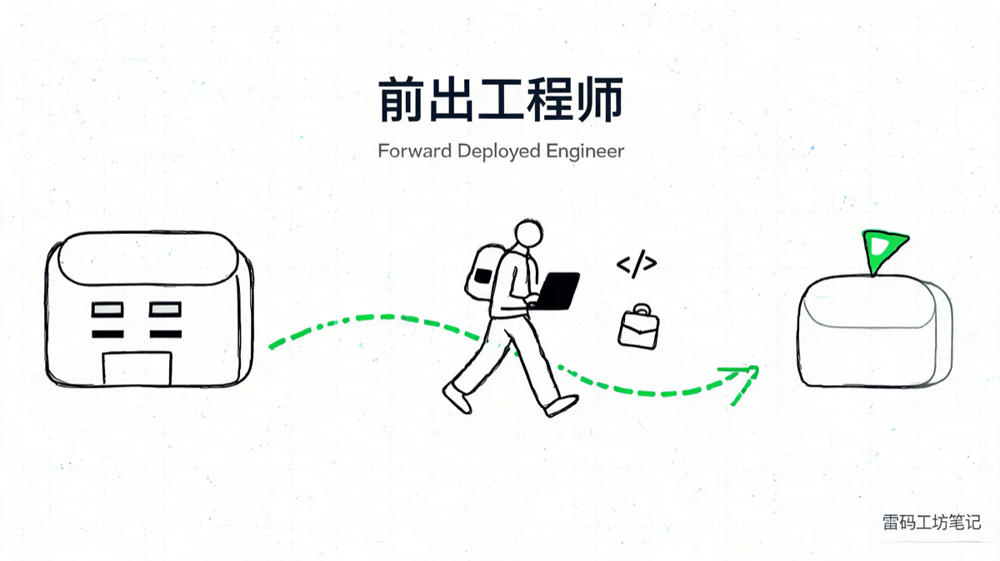
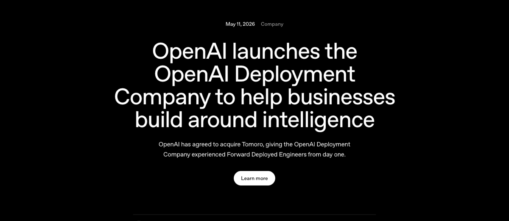
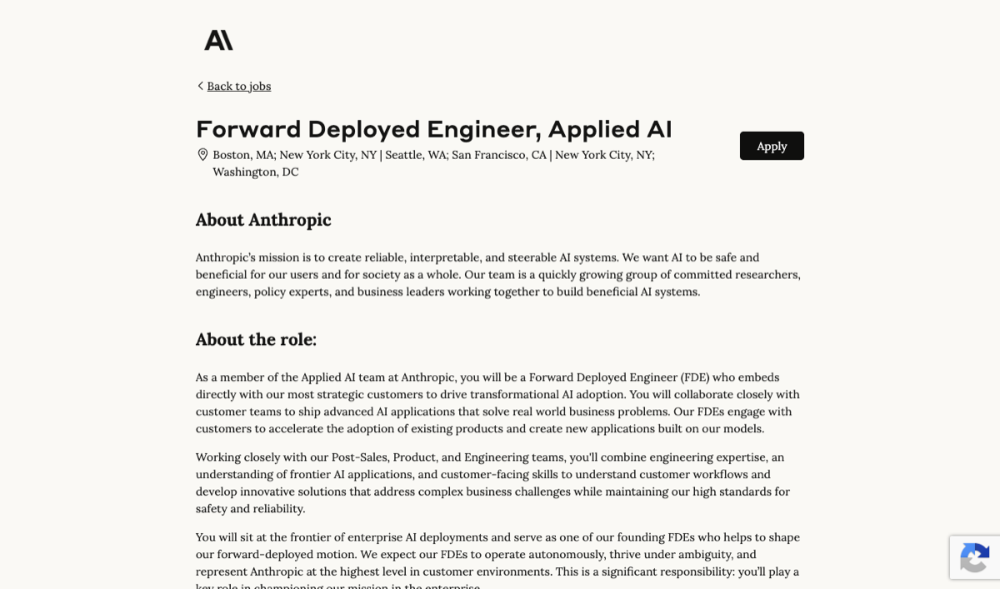
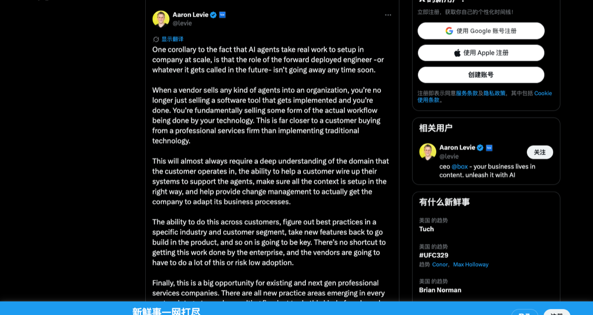
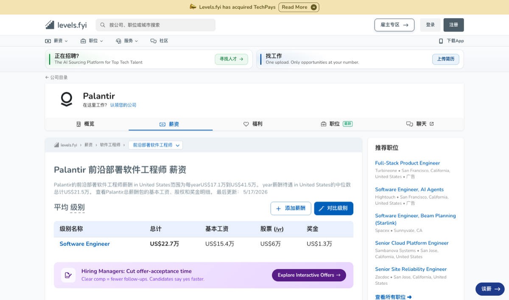

# 前出工程师：OpenAI 砸 40 亿抢的岗位，中国 SaaS 圈还没起好中文名

2026 年 5 月，OpenAI 干了件意料之外但情理之中的事——掏出超过 40 亿美元，联合贝恩、凯捷、麦肯锡等 19 家咨询和投资机构，成立了一家叫 OpenAI Deployment Company（DeployCo）的新公司。Brookfield 一家就投了 5 亿。同一时间，OpenAI 收购了 2023 年成立的英国 AI 咨询公司 Tomoro，一口气把对方的 ~150 名 Forward Deployed Engineer 收编进自己阵营。

*官宣页副标题原文：「OpenAI has agreed to acquire Tomoro, giving the OpenAI Deployment Company experienced Forward Deployed Engineers from day one.」一家 5000 亿美元市值的模型公司，开篇就强调"前出工程师"。*

官方原文：https://openai.com/index/openai-launches-the-deployment-company/

这事的信号比新闻本身大。一家模型公司花上百亿美元和顶尖咨询公司合伙，要的不是更多 GPU，也不是新模型架构，而是一群能跑到客户公司里、住下来、亲手把 agent 写进客户业务流程的工程师。

Box CEO Aaron Levie 几乎同一时间在 X 上断言：

> Forward deployed engineers, or equivalent, are about to become one of the most in-demand jobs in tech. And one of the most important functions for AI rollouts. Deploying agents is far more technical of a task than most people realize.
>
> 中译：前出工程师（或类似角色）即将成为科技行业最稀缺的岗位之一，也是 AI 落地最关键的职能之一。部署 agent 的技术含量远远超过大多数人想象。

Anthropic 已经把团队驻进了高盛办公室（Levie 在 Latent Space 播客原话："Anthropic is embedded at Goldman Sachs"）。Cursor、Glean、Decagon、Sierra 这一票顶级 AI 产品公司，过去 12 个月里全部开了同一个岗位 Forward Deployed Engineer（FDE），薪资带 20-30 万美元起，顶部 50 万美元上下。

这个角色硅谷已经吵了一整年。在中文世界，它现在叫「前沿部署工程师」（百度百科 + 第一财经 + 上海政府文件占住的标准名）、「前线部署工程师」（53AI + 知乎用的）、「前置部署工程师」（Dify 招聘用的）。三个译名互相打架，谁也没占到主流共识。

更要命的是，这三个译法全错。错在它们都把 forward 这个军事原义译丢了。

今天这篇文章想做三件事：

1. 给这个岗位起一个准确的中文名——「**前出工程师**」（后面从专业翻译角度拆给你看为什么）
2. 把它的起源、爆发、薪资、JD 全梳一遍
3. 给三种人各一份落地清单：SaaS / AI 公司老板（乙方）、采购 AI 的企业方（甲方）、想干这行的个人

读完你应该能判断：你的公司要不要养前出工程师、第一个怎么招、自己要不要转过去干。

---

## 一、这是什么角色：前出工程师

先给一句话定义：

> 前出工程师（Forward Deployed Engineer，FDE）= 由产品公司总部派出、嵌入客户现场、自己动手写产品代码、对客户业务结果直接负责的全栈工程师。

这句定义里的四个限定词每一个都不能缺：

- 总部派出——不是外包不是乙方驻场，是产品公司自己的核心研发
- 嵌入客户现场——长期驻扎，不是飞过来开两次会
- 自己动手写产品代码——是真的 commit 到主产品仓库，不是写文档不是配置不是 PPT
- 对客户业务结果负责——KPI 不是项目交付，是客户业务有没有真的变好

这个岗位最早是 Palantir 在 2008 年前后创立的。Palantir 当年要把数据分析产品卖给 CIA、FBI、五角大楼，发现一个怪事：客户的数据藏在十几个系统里，每个机构的工作流都不一样，标准化产品根本插不进去。

Palantir 第 13 号员工 Shyam Sankar（现任 CTO）于是发明了一个角色 Delta——一个会写产品代码的工程师，直接派到客户办公室住下，跟客户的分析员（内部叫 Echo）配对，把客户的真实流程一段一段写进 Palantir 主产品。Sankar 的官方简介（https://www.shyamsankar.com/about）里有一句原话："envisaged the role of the Forward Deployed Engineer, pioneering the company's definitional engineering model."

这套 Echo-Delta 双人组打法把 Palantir 从"卖给情报机构的奇葩公司"做成了今天 2000 亿美元市值的怪兽。CEO Alex Karp 在 2025 年那本《The Technological Republic》里反复讲一个观点：硅谷工程师太长时间躲在咖啡馆做 photo-sharing app，工程师应该 *shoulder-to-shoulder with the customer*。

这套模式过去十几年一直被同行嘲笑——"高毛利软件谁这么干"、"重交付不可规模化"、"Palantir 是项目公司不是产品公司"。Levie 自己在 latent.space 那期播客里复盘：

> If the labs have decided that they need to hire FDE and professional services, then I think that's a pretty clear indication that there's no easy mode of workflow transformation.
>
> 中译：如果连模型实验室都决定要招前出工程师、要做专业服务，那就明确说明一件事——工作流改造没有简单模式可走。

翻成中国老板能听懂的话：连 OpenAI、Anthropic 这种最赚钱、最高毛利、最不需要干脏活的公司都开始派人住客户家里了，说明 agent 落地没有捷径。

来看三家在抢这个岗位的公司怎么写 JD：

Anthropic（https://job-boards.greenhouse.io/anthropic/jobs/4985877008）——薪资带 $200K-$300K，岗位职责原文：

> Embed with strategic customers and drive AI adoption... build production applications using Claude models within customer systems... deliver technical artifacts including MCP servers, sub-agents, and agent skills for production workflows.
>
> 中译：嵌入战略客户、推动 AI 落地……在客户系统内部用 Claude 模型构建生产级应用……交付包括 MCP server、子 agent、agent skill 在内的可投产工程产物。

*Anthropic 招聘页：「Forward Deployed Engineer, Applied AI」，6 个城市同时开（含波士顿、纽约、西雅图、SF、华盛顿）。*

Cursor（https://cursor.com/careers/forward-deployed-engineer）——岗位描述原文：

> Embed directly with customer engineering teams to ship production-grade Cursor workflows that measurably improve how they build software.
>
> 中译：直接嵌入客户的研发团队，交付可投产的 Cursor 工作流，让对方写软件的效率有可被度量的提升。

Decagon（agent 客服头部公司）——独创 APM（Agent Product Manager）+ FDE 双角色，6 周从 discovery 到 full deployment 一条龙。

读到这你应该看出来了：这岗位的画像跟过去十年我们熟悉的"售前工程师 / 实施顾问 / 解决方案架构师"对不上号。前出工程师挂在 CTO 或 VP Engineering 下面，写主产品代码，对客户业务结果负责。产品公司组织架构里第一次出现长期驻在客户身边的核心研发，就是这个岗位。

---

## 二、为什么现有的几个中文译法全错

这一节是这篇文章里我最想钉住的一段。

中文 AI 圈这一年陆陆续续出现了几个译法——前沿部署工程师 / 前线部署工程师 / 前置部署工程师 / 驻场工程师 / AI 实施工程师。随便点开知乎、第一财经、百度百科或者 53AI，看到的就是这几个名字。

它们错在一个共同的地方：把 forward 这个军事/空间隐喻翻丢了。

从专业英语翻译的角度拆一拆 Forward Deployed Engineer 这个词。它有三层语义内核：

| 英文 | 真正含义 | 军事/管理学背景 |
|---|---|---|
| Forward | 派到前方阵地，离开总部、贴近敌情 | Forward Operating Base（前进基地）、Forward Air Controller（前出航空管制员）。中文军事现成对应词是「前出」「前推」 |
| Deployed | 被指派进入作战位置，是动态不是静态 | "部队部署到位"，隐含"总部派出"的指令链 |
| Engineer | 自己写产品代码的工程师 | 不是顾问，也不是配置员 |

合起来：被总部派到客户前线、独立写产品代码作战的工程师。

现在看现有五个译法的病灶：

| 现有译法 | 病灶诊断 |
|---|---|
| 前**沿**部署工程师 | "前沿" = cutting-edge / frontier-of-research，是个学术词。整词听起来像"做前沿技术部署的工程师"，军事空间义全无 |
| 前**线**部署工程师 | "前线" + "部署"语义重叠，且"前线"在中文里偏战争冲突感，戏剧化 |
| 前**置**部署工程师 | "前置" = 时间/流程上放在前面（如前置审批）。把 forward 的空间义错译成了时序义，最离谱 |
| **驻场**工程师 | 国内外包行业固化为"低端人头"。名字一出立刻自降两档，FDE 那种高 agency、$300K base 的精英气质全丢 |
| AI **实施**工程师 | "实施" = 配置既有软件、跑配置文档。直接砍掉了 engineer 的产品权 |

根本问题在于，这些译者都是按字面凑词——「forward = 前 + X」「deployed = 部署」——没人回到 forward 在军事英语里的原始隐喻。

军事英语里 forward 是个有几十年历史的核心战术词。Forward Operating Base 是"前进基地"，指部队脱离主基地、推到接敌一线的临时基地。Forward Air Controller 是"前出航空管制员"，指被派到地面作战部队里、为空中支援指引目标的飞行员。Forward Deployed 在美军编制里特指"派驻海外、远离本土的前出部队"。

中文军事里有现成的、准确的对应词：前出。"前出阵地"、"前出侦察"、"前出火力"，PLA 教材里大量使用。「前出」一个动词就含了"主动派出 + 进入接敌位置 + 独立作战"三层意思，刚好对应 forward deployed 全部语义。

所以我的提议是：把 Forward Deployed Engineer 翻译成「**前出工程师**」。

四个字、PLA 现成术语、零占位（百度搜索零结果）、军事原义忠实、动词性强。首次出现时格式：前出工程师（Forward Deployed Engineer，FDE）。

如果你觉得「前出」太军事、太硬，可以接受我两个备选阐释词：

- 特派工程师——借「特派记者」的构词，传达"总部专门派出、带特殊使命、有独立决策权"。庄重，有 authority，读者秒懂
- 驻客工程师——仿「驻外」「驻华」构词，"驻 + 客户"。精确捕捉 Anthropic、Cursor JD 高频出现的 *embed with customer*

中文场合可以三个词混用：「前出工程师」做主译名，行文里穿插「特派」「驻客」做同义阐释。但别再叫前沿/前线/前置/驻场了，这几个译法在 SaaS 老板这个读者群里都会引起字面误解。

> 翻译是个占位战。这个词在中文 AI 圈被叫错叫滥之前，我希望「前出工程师」能成为懂行人的暗号。

---

## 三、这股浪潮是怎么形成的

简短梳一下时间线，你就能看出 OpenAI 这次 40 亿美元成立 DeployCo 不是一次性事件，是十几年趋势的顶点爆发。

2008-2015，Palantir 一家独大期。Echo-Delta 双人组在 CIA、FBI、五角大楼一个客户一个客户地啃。同行嘲笑 Palantir 不是产品公司是项目公司。Palantir 自己也低调，从不展示这套模式。据当时 Palantir 内部数据，2016 年前 FDE 在公司里数量已经超过了传统软件工程师。

2020-2023，大模型起飞，第一波 AI 公司撞墙期。ChatGPT 引爆 LLM 后，所有 AI 公司都以为"模型够强，客户自己就会用"。两年下来一组残酷数据出来：业界普遍统计的 AI PoC 转生产率不到 30%，70%+ 的项目卡在落地阶段。模型对客户来说是"知道很厉害但用不起来"。

2024，Anthropic / Cursor / Glean / Decagon / Sierra 同时开 FDE 岗。这五家公司是当年估值增长最猛的 AI 产品公司，全部不约而同地开始招 FDE。Anthropic 的 JD 里写明 "embed with strategic customers"，Glean 的 Founding FDE 岗带薪资 16-27 万美元 + 期权（https://job-boards.greenhouse.io/gleanwork/jobs/4651991005）。Decagon 把这套打法做到极致——APM + FDE 双角色，6 周从 discovery 到 launch，号称已经服务 160+ 中大型企业。

2025，Aaron Levie 把这件事推上 X 头条。Levie 在 2025 年下半年到 2026 年 5 月，连续发了十几条长推，反复讲一个核心观点：agent 不是软件，agent 是组织流程改造，所以必须有人住到客户那里去重写流程。其中一条：

> The more enterprises I talk to about AI agent transformation, the more it's clear that there is going to be a new type of role in most enterprises going forward. The job is to be the agent deployer and manager in teams.
>
> 中译：我跟越多企业聊 AI agent 转型，就越清楚未来大多数企业都会出现一种新角色——在团队里负责部署和管理 agent 的人。

（https://x.com/levie/status/2043883641366032638）

另一条更狠的（https://x.com/levie/status/2044225408972009842）：

> One corollary to the fact that AI agents take real work to setup in company at scale, is that the role of the forward deployed engineer—or whatever it gets called in the future—isn't going away any time soon.
>
> 中译：AI agent 要在企业里规模化跑起来需要大量真功夫，由此推出一个推论——前出工程师（或者未来不管它叫什么名字）这个角色，短期内不会消失。

*Levie 这条 17 万阅读的长推是 FDE 浪潮的标志性论述，原文链接见上方 URL。*

2026 年 5 月，OpenAI DeployCo 是顶点事件。一家估值 5000 亿美元的模型公司，承认自己卖产品不够、必须自己派人去客户那里手动落地。$40 亿 + 19 家联合发起方 + 收购 Tomoro 一次拿到 150 个 FDE。AI 行业的"金本位时刻"到了，还在犹豫的公司从此都没有借口。

回头看这条曲线很清楚：Palantir 十年前看似怪异的高成本打法，在 AI agent 时代被证明是唯一可规模化的落地路径。这是产品公司组织重构，不只是岗位变化。

---

## 四、乙方该怎么做：SaaS / AI 公司老板的落地清单

如果你是一家 SaaS 或 AI 产品公司的创始人、CEO、CTO、VP Engineering——这一节是写给你的。

### 4.1 你的公司该不该设前出工程师？

简单决策树：

| 你的产品形态 | 客单价 | 该不该设前出工程师 |
|---|---|---|
| 标准化 SaaS 工具（设计、协作、IM） | < ¥50 万/年 | 不需要。老老实实做产品 + Customer Success |
| Agent / Workflow / 企业 AI 类产品 | ¥50 万 - 500 万/年 | 必须设。这个客单价的客户买的不是软件，是结果 |
| 项目制重客户（数据中台、行业 ERP、定制 AI） | > ¥500 万/年 | 早就该有。你现在如果还在用售前 + 实施这套老编制，已经晚于行业 |

中间那一档是当前中国 SaaS 圈最痛的地方。明道云、纷享销客、销售易、北森这一票客单价在 50-500 万区间的 SaaS 老兵，你们过去十年的「实施顾问」团队，其实就是没有产品权的「半残版前出工程师」。AI agent 浪潮起来之后，再不升级这个团队，就要被新进场的 AI Native 公司吃掉。

### 4.2 第一个前出工程师怎么招

错的路径：从销售或售前转岗。错在哪？销售出身的人天然把 KPI 锚定在订单上，进客户现场会本能地往"先签下一个单"的方向走，不会先想"怎么把 agent 跑通"。

对的画像：

- 3-5 年研发背景 + 有过客户面交付经验。纯研发也不行，从来没见过客户的人会被现场环境打懵
- 全栈能力。Python + TypeScript 至少都熟，因为客户那边什么环境都可能有
- 高 agency 性格。Anthropic 和 Cursor 的 JD 原话都是 "Thrive in ambiguity"。具体表现：你给他一个模糊问题，他不会反问"详细需求是什么"，他会先做一个原型回来问"是不是这样"
- 气质上像技术合伙人，不像项目经理。这条很玄但很重要

招聘渠道：别去主流招聘网站。前出工程师这种人通常在 GitHub 上有开源项目、在小圈子里写技术 blog、参加过 hackathon。直接邮件挖人比挂 JD 有效 10 倍。

### 4.3 组织设计的几个硬规

| 维度 | 推荐做法 | 常见错误做法 |
|---|---|---|
| 汇报线 | 挂 CTO 或 VP Engineering | 挂在销售/CRO 下面 → 会被 KPI 异化成售前 |
| 编制比例 | 每 5-10 个企业级客户配 1 个 FDE | 一个人扛 30 个客户 → 全部浮于表面 |
| 薪资带 | 高级研发的 1.2-1.5 倍 | 跟实施岗一个档 → 留不住人 |
| 出差 | 25-50% | 全远程 → 失去 embed 的本质 |
| 考核 | 客户产品采纳深度 + 反哺主产品的 PR 数量 | 项目交付率 / 客户满意度打分 |

最后一条特别重要。前出工程师是产品公司的"前沿信息节点"——客户现场遇到的所有真实需求、模型不足、流程死角，都必须以代码 PR 的形式回流到主产品。FDE 写的代码进不了主产品仓库的公司，做的就是项目外包，不是产品迭代。

### 4.4 三个最常踩的坑

坑 1，把前出工程师当售前用。让 FDE 帮销售去客户现场做 demo、写方案、回投标。一开始觉得"反正人都派过去了多干点活"，半年后发现这人变成了高薪售前，没拿到任何客户深度需求，主产品也没进步。

坑 2，把前出工程师当实施用。让 FDE 给客户配置已有的产品模块、跑数据迁移、写交付文档。高 agency 的人干这种活儿三个月就走人。FDE 必须有写新功能的产品权。

坑 3，FDE 写的代码不进主产品。每个 FDE 在客户那里都做了一堆 hack，但没人 review，没人合并回主仓库。一年下来公司多了 20 个客户定制版本、维护成本爆炸、产品代码却没有任何进步。把 FDE 模式做坏，常见就是这个姿势。

---

## 五、甲方该怎么做：采购 AI/SaaS 的企业 IT 老板清单

如果你是一家中大型企业的 CIO、IT 总监、数字化负责人，或者业务部门负责采购 AI 工具的人——这一节是写给你的。

### 5.1 评估 AI 供应商的新标准

过去十年我们评 SaaS 供应商，看的是产品功能、价格、客户案例、技术架构。

AI agent 时代要加一个硬指标：这家供应商有没有像样的前出工程师团队。

可以直接问销售这几个问题：

- 你们的 Forward Deployed Engineer 团队多大？
- 我们这一单签下来，你们能派几个工程师驻场？驻多久？
- 这些工程师汇报给谁？是销售线还是研发线？
- 我们现场提出的需求，多久能回流到主产品？

如果对方答不上来、或者把"实施顾问"包装成 FDE 蒙你，这家供应商现阶段卖的还是传统软件思维。Agent 真要落地，PoC → 生产的转化率会卡在 30% 以下。

合同里建议明确写：驻场天数 / FDE 数量 / 主产品反哺承诺。这三条写不进合同的，价格再低都谨慎。

### 5.2 内部要不要养自己的"Agent Deployer"

Aaron Levie 那条 JD 长推（https://x.com/levie/status/2043883641366032638）里描述的角色，国内已经在中型以上企业出现，可以叫"企业内部 Agent Owner"或"AI 落地负责人"。

画像：

- 不一定是程序员，但要懂"流程拆解 + Agent 编排 + 效果评估"
- 通常是业务部门里最懂技术的那个人，可能原来是 BI 分析师、运营经理、产品经理
- 给他 prompt 配置权 + agent 工具采购权 + 业务部门协作权
- 直接汇报 CIO 或 COO，避开纯 IT 线

这个角色比传统的"数字化转型负责人"颗粒度更细：要真的写 prompt、配 agent、看效果数据，光写 PPT 推动转型不够。

### 5.3 给 IT 负责人的三个 2026 H2 动作

1. 把"AI 落地团队建设"写进 2026 H2 规划，明确编制、预算、关键岗位画像
2. 给现有"实施顾问 / 解决方案架构师"团队加 LLM 培训预算。这批人是离前出工程师能力模型最近的现有员工，必须升级而不是裁掉
3. 跟 1-2 家头部 AI 供应商做"联合 FDE 工作坊"试点，挑一个具体业务场景，让对方的 FDE + 你们的 Agent Owner 配对工作 4-8 周，跑通"流程拆解 → agent 落地 → 主产品反哺"全闭环

打个铺垫：2027 年评估你们 IT 团队的指标会变，不再是"上了多少系统"，而是"跑通了多少个 agent workflow"。从今年下半年开始储备这套能力，明年这个时候差距会肉眼可见。

---

## 六、想干这行的个人：四类身份的最短转型路径

如果你是程序员、产品经理、售前实施，或者刚毕业想入行——这一节是写给你的。

前出工程师是个稀缺岗位（Anthropic 起薪 $200K base 折人民币约 140 万、Palantir 中位 $215K、顶部 $415K+，levels.fyi 数据），但门槛不在传统的"算法面试"或"系统设计"上，而在一组比较特殊的能力组合。

*Levels.fyi 数据：Palantir 前出工程师（FDSE）薪资 US$17.1 万 - US$41.5 万，中位 US$21.5 万，平均总包 US$22.7 万（基本工资 15.4 + 股票 6 + 奖金 1.3）。注意中文界面用的就是「前沿部署」译名，这就是当前主流译法对岗位认知的污染。*

### 6.1 在校生 / 应届——最纯天赋路线

必修：扎实全栈（Python + TypeScript）+ 至少做过一个有真实用户的 side project（哪怕只有 100 个用户也算）。

加分：在 GitHub 上有 LLM/Agent 相关开源贡献，或者维护过开源项目的 PR review（证明你能在陌生代码库里干活）。

求职策略：避开大厂校招主流岗位。FDE 这种岗位不走校招流程。直接申 Anthropic / OpenAI / Cursor / Decagon / Glean / Dify 的 Founding 团队。邮件 + 作品集打动 founder，比走 HR 系统有用 100 倍。

### 6.2 3-5 年研发——最高 ROI 转型路线

你已经会写代码，缺的只有"客户面"和"agent 落地"两块拼图。三步走：

1. 业余接 1-2 个 Agent 私活。哪怕免费做朋友公司的，跑通"客户访谈 → 拆流程 → 写 Agent → 上线 → 迭代"全流程
2. 把这段经历写成脱敏 case study，发自己的小红书 / 公众号 / X，三篇起步
3. 拿 case study 去申 Anthropic / Cursor 这类公司的 FDE 岗。简历开篇就是 case study，不是过往大厂履历

心态切换：从"写最美的代码"换成"对客户业务结果负责"。这个切换比想象的难，它意味着你要接受很多次"我写了 200 行代码但客户没采用"，并且不让这件事打击你。

### 6.3 售前 / 解决方案架构师 / 实施顾问——最长但最现实的路线

你已经会跟客户打交道、懂业务流程，缺的是"自己能写产品代码"。

残酷真相：很多 FDE JD 明确要求 *3+ years of production engineering experience*。售前转 FDE 比研发转 FDE 难三倍，因为研发只需补客户感，售前要补的是从零开始的工程能力。

三步走：

1. 用 Claude Code / Cursor 这种 AI 编码工具，把你以前给客户做的 PPT 方案，真的写出可运行的 demo。AI 编码工具的出现是售前转研发的历史性机会，过去你只能停在"画原型"，现在你能停在"跑得通的产品"
2. 在 GitHub 累积 6-12 个月公开 commit，证明你真的写代码，不是 PPT 工程师
3. 先转 Solutions Engineer / Sales Engineer 这种过渡岗，再转 FDE。直接跨度太大，分两步走

加速器：找一家国内 Agent 创业公司（智谱、Moonshot、Dify、面壁、Mintaka 等）直接以"我能既懂客户又能写代码"切入。中国 AI 创业公司这两年都在补 FDE 编制，比硅谷大厂好进。

### 6.4 产品经理 / 业务运营——最罕见但天花板最高的路线

你不会写代码，但你可能比所有人都懂"哪个流程值得 Agent 化"。

残酷真相：纯 PM 转 FDE 在硅谷成功率 < 10%。但在中国，转企业内部的 Agent Owner / AI 落地负责人，成功率 60% 以上。Levie 那条 JD 推文描述的角色就是为你准备的。

三步走：

1. 在公司内部接 1-2 个 Agent PoC 项目，自己用低代码 / n8n / Coze / Dify 搭起来，跑通一个真实业务场景
2. 建立"流程拆解 → Agent 编排 → 效果评估"的方法论，写出来。内部文档、外部公众号都行，让自己的方法论成形
3. 跟 IT / CIO 谈，主动接「企业 AI 落地 owner」的角色。抢这个角色的人现在还不多，先到先得

### 6.5 三个共同必备技能（不分背景）

不管你从哪条路过来，前出工程师都必须有这三样：

- Agent 工程素养：MCP、tool use、eval、guardrails、context engineering、prompt 缓存这些不是面试题，是日常吃饭家伙
- 客户业务深度：能在 30 分钟客户访谈里抓到隐藏需求。这比"问对问题"更难，是"客户没说出口你也能闻到"
- 高 agency 性格：Anthropic 和 Cursor 的 JD 原话都是 "Thrive in ambiguity"。具体表现：你被扔到一个陌生客户、陌生业务、陌生代码库里，48 小时内你能交出一个可运行的原型

### 6.6 推荐资源（按优先级）

- Anthropic Engineering Blog：https://www.anthropic.com/engineering ——FDE 视角的工程范本，必看
- Latent Space 播客：https://www.latent.space ——Aaron Levie 那期（Box 主题）+ Decagon 那期是 FDE 实战必听
- Dify / Coze 开源仓库：中国语境下的 agent 工程实战练习场
- AI Engineer 大会演讲：swyx 主办的那个，YouTube 频道，特别是 Harness Engineering 那场

---

## 七、中国 SaaS 的特殊机会

写到这里你可能会问：硅谷搞 FDE 是因为他们的客户都是高盛、CIA 这种高客单价大客户。中国 SaaS 客单价低、客户付费能力差，前出工程师这套打法跑得通吗？

我的判断是：中国 SaaS 比硅谷更需要前出工程师，而且会跑出不一样的形态。

三个理由。

第一，中国企业的数据孤岛、流程不标准、决策链长这三件事比美国客户严重得多。同样一个 agent 落地需求，在美国客户那里可能 4 周搞定，在中国客户那里 12 周起步。FDE 在中国的单位价值因此更高。

第二，过去十年中国 SaaS 把"实施 / 交付"当成低毛利成本中心，结果整个行业陷入"低价签单 → 实施亏损 → 续约困难"的死循环。现在 FDE 把交付重新定义为"产品公司最贵的肌肉"，这是一次重新定价的机会，谁先把交付从成本中心变成产品反哺中心，谁就跑赢续约和净留存。

第三，AI agent 的本质是流程改造，而中国企业的流程标准化程度天然低于美国。这反过来给了 FDE 更大的发挥空间。一个会写代码、懂业务、能现场决策的人，在中国客户那里能撬动的杠杆比在美国大得多。

Dify 已经在国内招"前置部署工程师"了（招聘原文里就用了这个译名，虽然译名不准）。智谱、Moonshot、面壁、Mintaka、稀宇这一票 AI 创业公司，2026 年下半年大概率全部开 FDE 编制。明道云、纷享、销售易这一批 SaaS 老兵，现在升级实施团队还来得及。

---

## 八、收个尾

回到开头那个新闻。OpenAI 砸 40 亿成立 DeployCo，收编 150 个前出工程师。

它在告诉所有还在观望的产品公司一件事：AI agent 时代，最贵的是把模型落进客户业务流程的那群人，而不是模型本身。

这群人在英文世界叫 Forward Deployed Engineer。在中文世界，到今天为止还没起好名字。

以后我就叫它**前出工程师**。你要是觉得「特派」「驻客」更顺口，没关系，记得这股浪潮就行。

评论区聊聊：你们公司有没有这种角色？你愿不愿意去干这个岗位？

---

## 关于作者

**老雷（Andy）**，明道云 & Nocoly CMO，SaaS 行业从业十余年。骨子里是个技术迷，乔布斯的信徒，相信好的产品能改变世界。深度关注 AI、商业与科技趋势，目前在深度使用和实践 Claude Code，专注探索 AI 如何重塑产品形态和商业逻辑。不聊概念，只聊真实发生的事。
