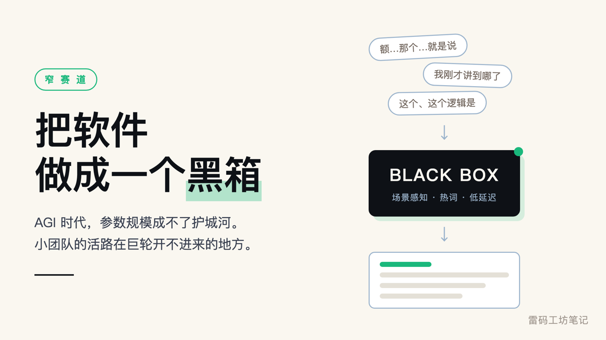
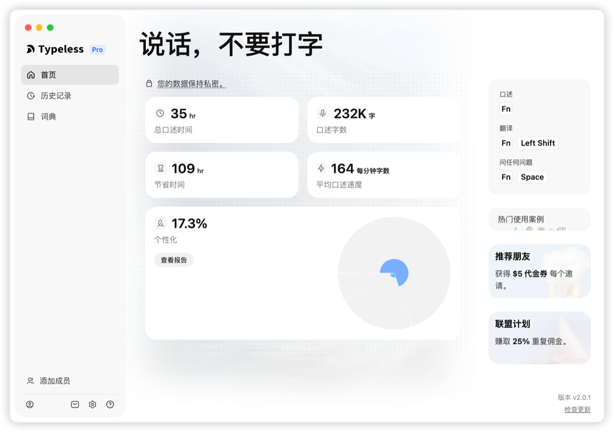
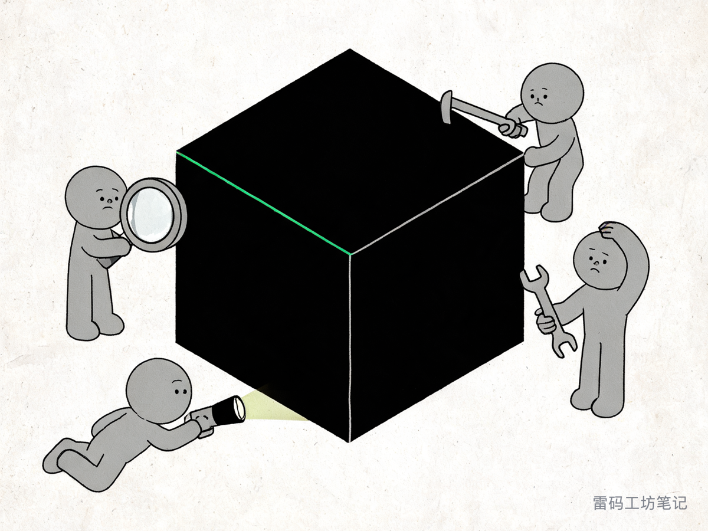
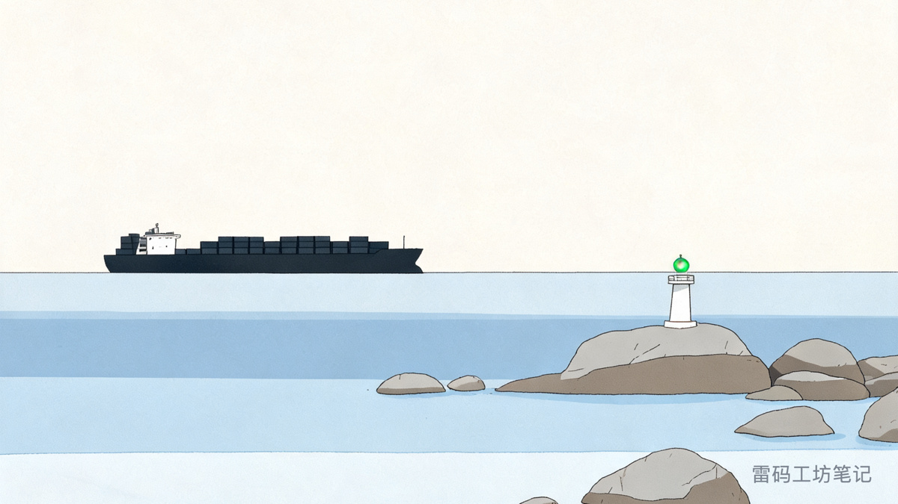

# 把软件做成一个黑箱

这篇文章的草稿，是我用嘴“说”出来的。

当时我躺在沙发上，脑子里全是关于未来软件竞争力的碎片想法。放在以前，要把这堆意识流整理成文字，我得坐到电脑前对着空白文档，一边敲一边删。

这次我按住一个快捷键，对着麦克风一口气说了十几分钟。

我说话极其口语化，中间夹着大量的“额”“那个”、重复的词，还有思考停顿造成的语序颠倒。松开按键的那一秒，屏幕上出现的不是那堆口水话，是一段结构清晰的 Markdown 大纲。

这个软件叫 Typeless。（推广链接：https://www.typeless.com/?via=andy-lei 顺手放着，用不用随你。）

<em>Typeless 的主界面。我到目前累计口述 35 小时、23.2 万字，平均每分钟 164 字</em>

最近我成了它的重度用户。它最打动我的地方，是会自动修掉语病，甚至替换成更准确的词，输出一段逻辑通顺的文字。这种文本无论是发给人看，还是直接喂给 AI，都省事很多。系统自带的语音输入法相比之下就是一台语音复印机，你说的每一个废字、每一次口误，它都原封不动搬到屏幕上。

我于是开始琢磨：痛点这么明显，技术原理看起来也不算高深，为什么市面上没有同类产品？谷歌或者苹果要下场，以他们的研发实力不是分分钟的事？

答案不在技术难度上。系统级的语音输入，第一原则是忠实还原。你在微信里吐槽“我吃饱了撑的”，输入法要是自作主张改成“我目前处于营养过剩的亚健康状态”，那就是事故。底层输入法必须确定、通用，也就必须放弃对具体场景的个性化处理。这块地，只能留给小团队。

### 拆解 Typeless 的黑箱

Typeless 在这个细分领域几乎拿下了绝对的话语权。很多开发者大概会觉得，这不就是套个 Whisper 接口，再加个大模型 API 做润色？Vibe Coding 一下午就能写个雏形。

真这么想，就低估了极致体验背后的壁垒。

为了把“体验”做到这个份上，它在工程层面干了不少苦力活。

先说**上下文环境的深度感知**。Typeless 不盲目润色，它通过操作系统的 Accessibility 接口检测你光标当前所在的软件：你在发 Slack，它润色成轻松但不失职业感的对话；你在写 Outlook 邮件，它切换成得体的商务措辞；你在写 Notion，它直接排版成带 H2 标题和无序列表的 Markdown。

再往下是**自定义热词与领域词典的动态注入**。实际工作里我们会大量使用专有名词，我经常说 SaaS、AGI、nocoly、Moyuan，普通语音识别模型遇到这些词基本全军覆没。Typeless 允许导入自己的词库，每次发起语音请求时把这些热词作为上下文喂给 ASR 和大模型，保住专业词汇的识别率。

还有**超低延迟的工程架构**。语音输入极其依赖即时反馈，松开按键要等 5 秒才看到文字，这产品就死了一半。Typeless 得在你说话的同时切片处理，云端并发做识别，再用精简的提示词链条把文本送进大模型，最后模拟虚拟键盘击键，以流式速度把字打在光标处。这中间的延迟被压到 1 秒左右。

<em>外面的人拿放大镜、撬棍、扳手轮番上，也找不到那道缝</em>

这种扎根细分赛道的软件，有一个特点：蒸馏不出来。大模型可以靠 API 数据蒸馏出一个小模型，但 Typeless 这种系统级应用，你拿不到它的提示词组合，拿不到它的多模态后处理逻辑，更复制不了它在各种复杂软件环境下的兼容性适配。

外界只能看到最终输出的那段完美文本，搞不清中间发生了什么。而它靠着真实用户反馈，一轮轮调模型和提示词的配合度，把这个闭环越焊越死。

在 AGI 时代，**参数规模成不了护城河**。长久的壁垒来自对特定场景的绝对控制力，来自对交互体验没完没了的打磨。

### 给 Vibe Coding 时代开发者的一声警钟

大模型把写代码的成本压到接近零，无数个人开发者和独立团队兴奋地涌进来。

我看到的却是大量同质化的、脆弱的套壳产品。

今天看到一个点子，明天就能用 AI 搓出一个网页或 App。可这种缺乏场景打磨的东西，在大模型每一次能力升级面前，都会像沙滩上的城堡被抹平。如果你的壁垒只是几句系统提示词，那么模型更新的那一刻，你的产品就没有存在的必要了。

我们依然有机会做出让对手抄不走的东西。前提是你得找到那个真有痛点、巨头嫌窄、但用户每天高频使用的细分领域。然后别只当一个 API 搬运工，把模型能力包进多层技术栈、本地交互优化、自定义数据集和场景感知里。

把你的软件做成一个黑箱。用户觉得它好用，竞争对手看着它，不知道该从哪儿下手抄。

这个时代巨轮轰鸣，小团队去比拼吨位注定没戏。我们的活法是找到巨轮开不进来的礁石区，在那儿建自己的岛。

<em>浅水区进不来大船，但灯是你自己点的</em>

> **老雷（Andy）**，明道云 & Nocoly CMO，SaaS 行业从业十余年。骨子里是个技术迷，乔布斯的信徒，相信好的产品能改变世界。深度关注 AI、商业与科技趋势，目前在深度使用和实践 Claude Code，专注探索 AI 如何重塑产品形态和商业逻辑。不聊概念，只聊真实发生的事。
