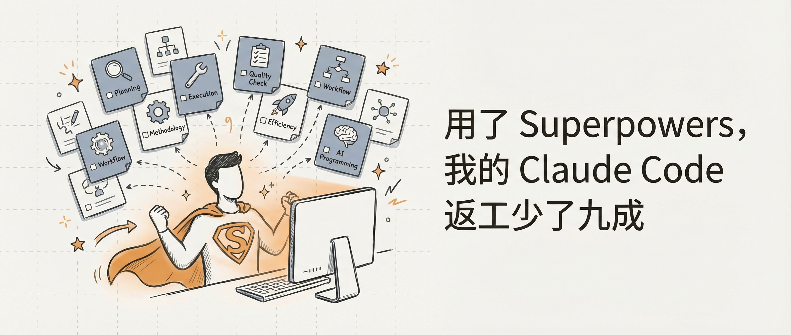
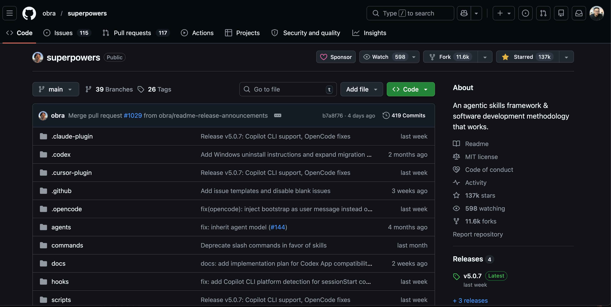

# Superpowers Cut My Claude Code Rework by 90%

---

About three months ago, I was using Claude Code to build a feature. Ran it — wrong. Asked it to fix — still wrong. Asked again — new problems.

By the end of that night, I'd gone back and forth six times and eventually scrapped the whole file to start over.

If you use Claude Code, you know this feeling. **AI moves fast, but once it goes off track, chasing it down costs more time than writing it yourself.**

---

### I. Plan Mode Helped. But Not Enough.

Then I found Plan Mode (`/plan`).

With Plan Mode on, Claude Code generates a plan before touching anything, and only starts executing after you approve it. Smart design — it forces the AI to "think first, then act," instead of coding and improvising at the same time.

Rework dropped. But didn't disappear.

The problem was in execution. Plan Mode locks in a plan, but nothing enforces it during execution. The AI can quietly deviate mid-way through — and by the time you notice, it's already made a mess.

I needed something more thorough.

---

### II. What Is Superpowers

*Superpowers on GitHub — 11.8k stars and counting*

One day on Twitter, someone mentioned a Claude Code plugin framework called **Superpowers**. I clicked through: 11.8k GitHub stars, maintained by obra, latest version v5.0.7.

One-line description: **"An agile skills framework & software development methodology that works."**

Sounded ambitious. I installed it anyway.

The core concept is **skills** — a set of predefined workflow instructions that tell Claude Code how to behave in specific situations. Not making the AI smarter. Giving it a reliable methodology.

Once installed, Claude Code loads this methodology automatically every session, and triggers the relevant skill at the right moment.

---

### III. 14 Skills, Covering the Entire Dev Workflow

Superpowers v5.0.7 ships with 14 skills. I'll walk through them by phase.

---

#### 🧠 Planning Phase

**`brainstorming`**

When to use: You have a vague idea and haven't figured out how to approach it.

This skill forces Claude Code to go through a few rounds of back-and-forth before touching anything — what's the goal? what are the constraints? what are the options? what are the tradeoffs?

Before this, I'd say "build me X" and the AI would just start. It'd finish and be completely off from what I meant. With brainstorming, we've reached a shared understanding before a single line of code is written.

**Expected gain: Eliminate "finished but wrong" rework. Save 30–50% of total time.**

---

**`writing-plans`**

When to use: Requirements are clear. Time to turn them into executable steps.

This skill breaks down the requirements into a detailed implementation plan — each step with a clear goal and acceptance criteria — saved as a document. That document becomes the single source of truth for everything that follows.

The key insight: **The plan is written down, not just held in conversation.** Conversations get forgotten. Documents don't.

**Expected gain: Significantly fewer mid-execution "detours."**

---

#### ⚙️ Execution Phase

**`executing-plans`**

When to use: You have a plan document from writing-plans. Time to execute.

This skill makes Claude Code follow the plan document step by step, checking in after each step instead of charging through to the end. **Checkpoints mean drift gets caught early.**

This is the skill I felt most immediately. Before, execution was "go hard, look back, see damage." After, it's rare.

**Expected gain: 70%+ reduction in execution-phase rework.**

---

**`subagent-driven-development`**

When to use: Your plan has multiple independent tasks that can run in parallel.

This skill dispatches multiple agents to work on different tasks simultaneously, then aggregates the results.

*Four research agents running in parallel — each investigating a different architecture approach — then summarizing into a comparative report*

Real example: I needed to research a technical approach. Four agents were dispatched simultaneously — investigating Two-Phase, Map-Reduce, Template+AI, and Layered Planning architectures. They came back with individual findings, which were aggregated into a comparison report. ~280k tokens total, but in a fraction of the serial time.

**Expected gain: 60–75% time reduction on multi-task workloads.**

---

**`test-driven-development`**

When to use: Before implementing any feature or fixing any bug.

Write tests first, then implementation, don't call it done until tests pass. Classic TDD. The AI won't do this on its own — this skill enforces the order.

**Expected gain: Catch logic errors before they're buried in implementation.**

---

**`systematic-debugging`**

When to use: When you hit a bug or a failing test.

Instead of letting the AI guess, this skill enforces a structured diagnostic flow: reproduce → narrow down → find root cause → verify fix.

My biggest frustration before was watching the AI "fix" bugs by guessing — change something, wrong, change something else, worse, change more, chaos. This skill stopped that.

**Expected gain: ~50% reduction in time to fix complex bugs.**

---

**`using-git-worktrees`**

When to use: Starting new feature work that needs isolation from current workspace.

Automatically creates a separate git worktree so new feature development stays isolated from main. Merge or discard when done.

**Expected gain: No more "experimental changes contaminate main branch" accidents.**

---

**`dispatching-parallel-agents`**

When to use: You have 2+ independent tasks.

Similar to subagent-driven-development, but dispatches fully independent agents outside the current session — better suited for large-scale parallel research or analysis.

**Expected gain: Independent tasks run in parallel, total time drops significantly.**

---

#### ✅ Verification Phase

**`verification-before-completion`**

When to use: Before the AI declares "done."

This skill forces the AI to actually run verification commands and confirm the output before claiming completion — not "I think it should be fine."

**One of the AI's worst habits: confidently saying "done" without actually checking.** This skill manages that.

**Expected gain: Eliminate "thought it was done, wasn't" rework.**

---

**`requesting-code-review`**

When to use: After completing a feature, before merging or creating a PR.

Makes Claude Code systematically review the code it just wrote: does it meet requirements? Any obvious issues? Is test coverage sufficient?

**Expected gain: Catch problems before merge, not after.**

---

**`receiving-code-review`**

When to use: When code review feedback comes in, before making changes.

This skill makes the AI carefully understand feedback before acting on it — rather than reflexively agreeing and implementing. Because sometimes the review itself is wrong.

**Expected gain: Avoid introducing new bugs to satisfy feedback.**

---

**`finishing-a-development-branch`**

When to use: Implementation complete, all tests passing, ready to wrap up.

Provides a structured set of branch completion options — merge, PR, cleanup — and guides you to the right choice instead of leaving you fumbling around.

**Expected gain: Cleaner branch history, less leftover debris.**

---

#### 🔧 Utility

**`writing-skills`**

When to use: Creating, modifying, or verifying a skill.

Superpowers is extensible — you can write your own skills. This skill tells you how to do it correctly.

**Expected gain: Custom skills that actually work.**

---

**`using-superpowers`**

The meta-skill. Auto-triggers at the start of every session, telling Claude Code how to find and invoke the other skills. It's the entry point for the whole framework.

---

### IV. The Real Time Math

Honestly: **individual task execution time goes up after installing Superpowers.** Four to five times longer isn't unusual.

Brainstorming takes back-and-forth. Writing plans generates a document. Executing plans has checkpoints. Verification actually runs tests. Every step is "slower."

But run the real math:

- Before: One task, 30 minutes. Three rounds of rework. Total: 2 hours.
- After: One task, 90 minutes. Zero rework. Total: 90 minutes.

**Slow is smooth. Smooth is fast.** Not a philosophy. A number I've measured.

---

### V. How to Install

Superpowers is a Claude Code plugin. Installation takes a few minutes.

GitHub: **https://github.com/obra/superpowers**

Follow the README instructions. Once installed, Claude Code will auto-load it every session.

---

### VI. One Last Thing

AI tools keep getting more powerful. But **how you use them** — that's still on you.

Superpowers doesn't make the AI more capable. It gives the AI a methodology: what to do, in what order, with what checks. That's engineering discipline, not magic.

Install it. Use it a few times. You'll see what I mean.

---

> Tools aren't for admiring. They're for eliminating rework.

---

**About the Author**

**Andy** — SaaS veteran (10+ years) obsessed with products and technology. Daily Claude user redefining how work gets done with AI. Sharing practical AI techniques and real productivity gains — no buzzwords, just what actually works.
