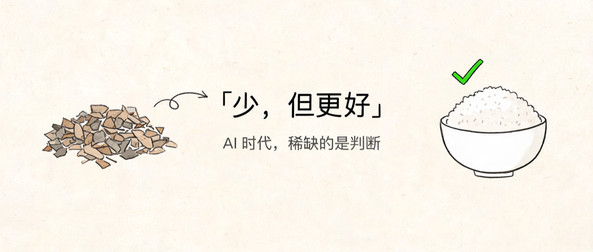
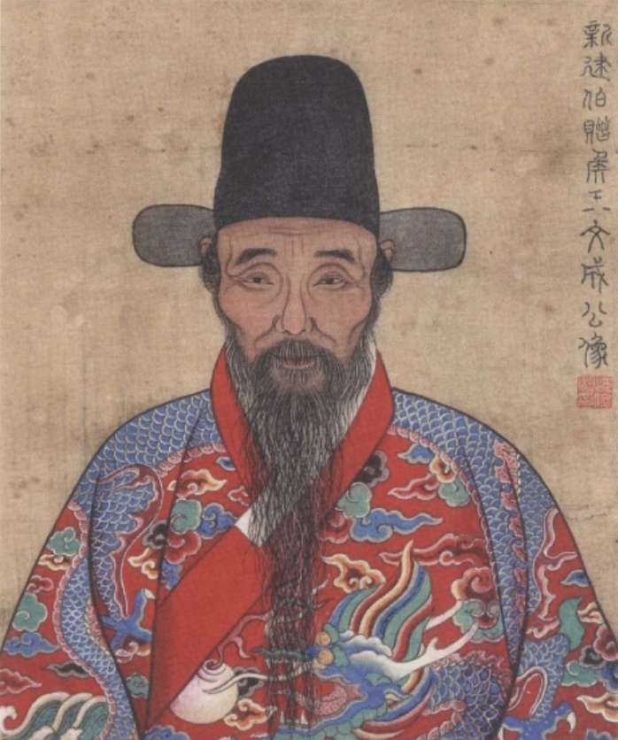
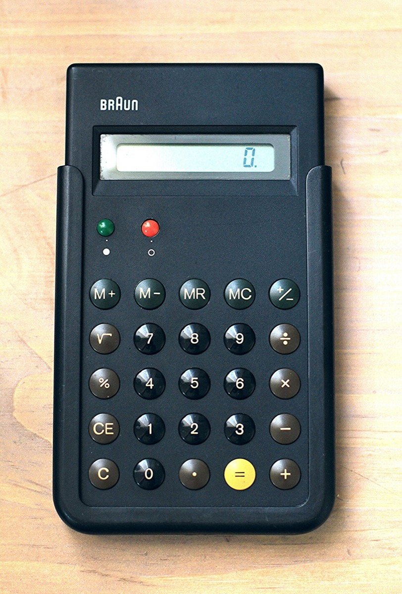
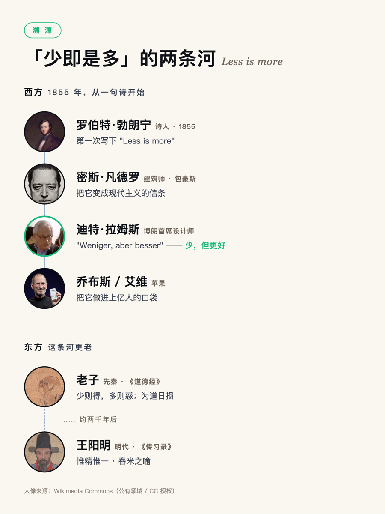
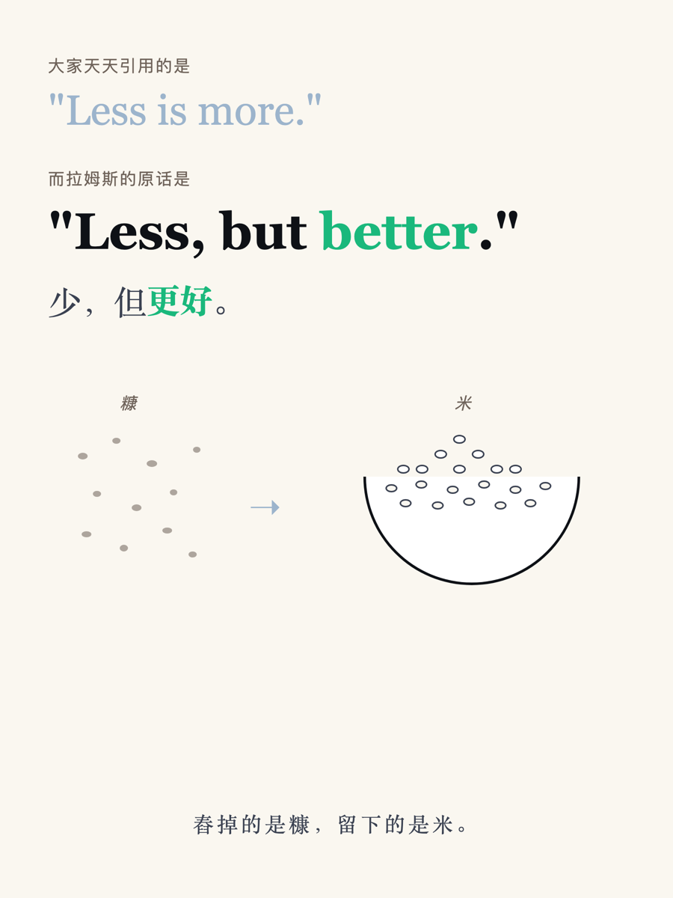
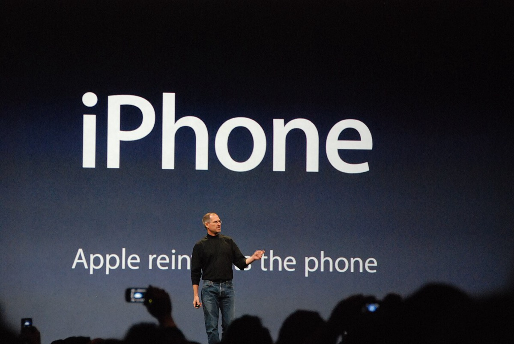
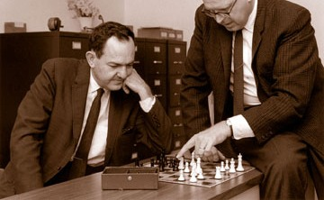
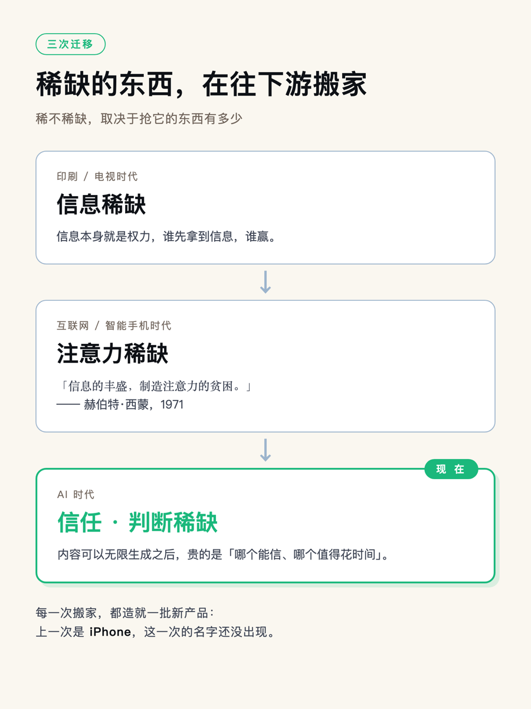
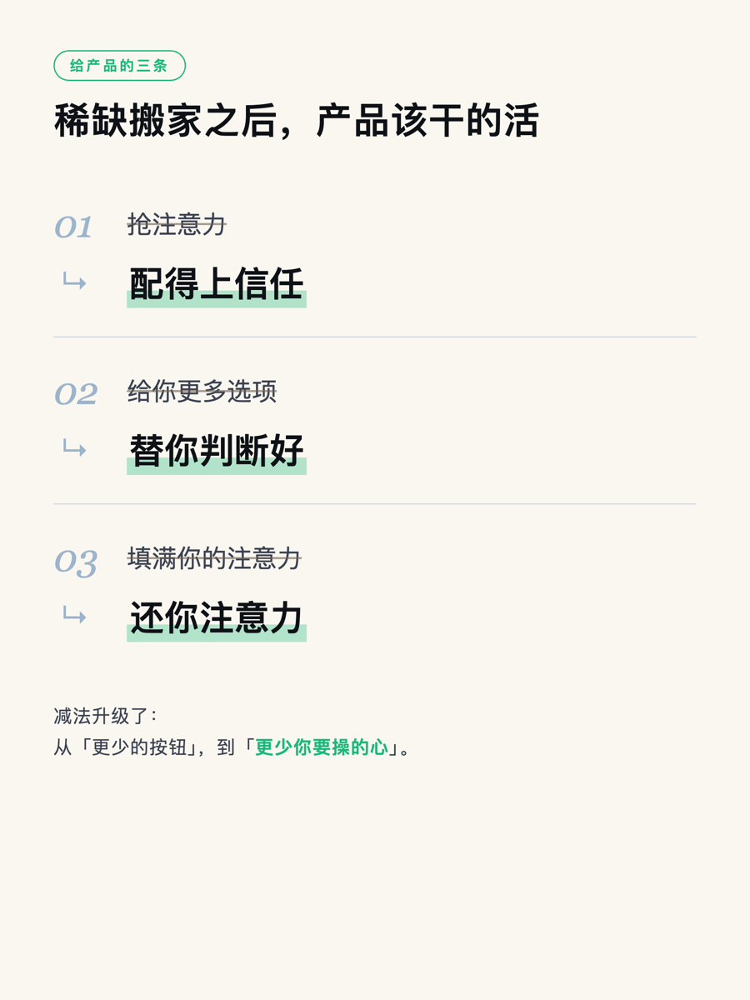

# 从「少即是多」到「值得信任」——AI 时代真正稀缺的东西

上周三深夜，我在读一本五百年前的书。

王阳明的《传习录》。读到一段讲「惟精惟一」的，他打了个米的比方：想让一碗米纯白干净，光在心里想「我要它纯」没有用，得真去舂、去簸、去筛、去拣，把糠秕一点点去掉，米自己就白了。

<em>王阳明（王守仁，1472–1529）。图：Wikimedia Commons</em>

我盯着这段看了很久，然后把手机放下了。

因为我脑子里冒出来的，是乔布斯那句话：Less is more。一个做了十几年营销的人，深夜读明代心学，读出来的居然是自己天天挂在嘴边的产品哲学。我可能一直没真正搞懂这句话。

---

### 先说个可能扫兴的事实：这句话不是乔布斯发明的

我们默认「少即是多」是苹果的专利，是乔布斯的口头禅。其实他很少这么说，这句话也不是他的。

往回捋，是两条河。

西方这条河很清楚：诗人罗伯特·勃朗宁 1855 年在一首诗里第一次写下 "Less is more"；包豪斯的建筑大师密斯·凡德罗把它变成现代主义的信条；再往下，博朗的传奇设计师迪特·拉姆斯改了一个字，成了 **"Weniger, aber besser"——少，但更好**。乔纳森·艾维公开说过，苹果的设计根就在拉姆斯这里。你把博朗上世纪那台计算器和早年 iPhone 里的计算器摆一起，几乎是同一个东西。至于乔布斯自己常挂在嘴边的，是另一句——「至繁归于至简」，这句挂在达芬奇名下（真伪其实有争议），印在苹果 1977 年的第一份宣传册上。

<em>拉姆斯参与设计的博朗 ET66 计算器（1987）。打开早年 iPhone 的计算器，你会认出它。图：Wikimedia Commons</em>

东方这条河更老。老子在两千多年前就写过「少则得，多则惑」，还有那句「为学日益，为道日损」——做学问是天天往上加，求道反过来，是天天往下减。

所以「少即是多」这个念头，古人早就想透了。乔布斯了不起的地方，是把它做成了一件能装进上亿人口袋、真的改变了世界的产品。

<em>「少即是多」的两条河</em>

但那天晚上点醒我的，是拉姆斯改的那个字。大家天天引用的是 "Less is more"，可原话是 "Less, but **better**"。

> **这句话的重量，全在「但更好」三个字上。**

---

### 我做了十几年 SaaS，见过太多「只减不好」的产品

我入行的时候，正赶上国内 SaaS 最热的那几年。那时候产品之间比什么？比功能。

每次竞品发新版本，第一件事就是数它多了几个功能。后台的仪表盘越堆越满，一个模块套一个模块，一个下拉菜单里塞着十几个选项。销售拿着功能清单去打单，功能多的那个赢。产品越做越重，重到我们自己人都要翻文档才找得到某个开关在哪。

2007 年那台 iPhone 出来的时候，冲击就在这。一个手机，把当时所有智能机引以为傲的实体键盘全砍了，正面只留一块屏、一个圆钮。当年多少人嘲笑它「连键盘都没有还敢叫智能机」。后来的事我们都知道了。

<em>2007 年 1 月 9 日，初代 iPhone 发布。图：Blake Patterson，CC BY</em>

那时候我学到的教训是：牛的产品都在做减法。但我学了个半吊子。因为我以为减法的关键在「减」，在于少。

那天读完王阳明我才明白，减只是手上的动作，目的另有其物。舂米的人一遍遍舂、簸、筛，去掉的是糠，留下的是米——他心里始终盯着那碗「纯白的米」。

> **减法难就难在判断该删掉哪一个，舍不舍得倒在其次。**

删对了是米，删错了是把米也筛没了。市面上学乔布斯学到走火入魔的产品太多了，满屏留白、按钮藏得找都找不到，看着极简，用起来处处别扭。它们抄到了「少」，没抄到「但更好」。

---

### 那它到底为什么能成？又为什么不是「多就是多」？

「少即是多」能横扫全球、被无数产品模仿，底下其实只有一件事：乔布斯赌对了一个时代的稀缺资源。

经济学家赫伯特·西蒙 1971 年就说过一句话——信息的丰盛，制造了注意力的贫困。人脑一天就那么多小时、那么点带宽，一万年没变过。稀不稀缺，取决于抢它的东西有多少。到了智能手机时代，每个 App、每条推送、每个功能都在抢你那点注意力，注意力就成了最稀缺的东西。这时候谁替用户做减法、谁替用户省事，谁就赢。减法，本质是给用户的注意力退税。

<em>赫伯特·西蒙与艾伦·纽厄尔在下棋。图：Wikimedia Commons</em>

可我要提醒一句，「多就是多」并没有错。

自助餐、Costco、逛不完的电商货架、极繁主义的奢侈品，它们卖的就是「丰盛」本身，你要的就是多到挑花眼那种爽。在这些地方硬做极简，是自断经脉。

所以判准从来没有「多好还是少好」这么简单。它落在一个更朴素的问题上：这个场景里，用户最缺的到底是什么？他缺选择、缺丰盛，那就多；他被淹没了、缺清静、缺一个能信的答案，那就少。乔布斯的天才，在于他早早看准了：在数字时代，最稀缺的那样东西，从「商品」换成了「注意力」。

---

### 现在，稀缺又要换一次了

我最近天天用 AI 生产内容，看着它一秒钟吐出我过去要憋一下午的东西，心里其实是有点发凉的。

因为 AI 干的事，是把「生产内容」的成本从低打到了零。人人都能无限生成文字、图片、视频，全网正在被 AI 泔水灌满。如果说智能手机时代注意力已经很稀缺了，那 AI 时代，每一条内容能分到的注意力，正在趋近于零。

但更要命的是另一件事：稀缺的东西，正在往下游搬家。

就像当年从「信息稀缺」搬到了「注意力稀缺」一样，现在正从「注意力稀缺」往「信任稀缺」「判断稀缺」搬。你想想，当任何内容都能被无限生成、被伪造，当 AI 能给你吐出一万个看着都对的答案，你还缺内容吗？你缺的是判断：这里面哪个能信，哪个值得你花时间。

我盯着 AI 生成的第一百段文案时，忽然懂了王阳明那碗米。

AI 把糠做成了无限。它能无穷无尽地生产「文」，那些漂亮的、看着专业的表达。可它生产不出那碗纯白的「米」，那个「哪个才对、哪个才好」的判断。而这个判断，恰恰是拉姆斯那个「但更好」，是乔布斯说不清怎么来的品位，是王阳明讲了一辈子的、每个人心里那把叫良知的尺子。

> **AI 越强，这把尺子越值钱。**

因为内容、选项、答案全都烂大街了，剩下唯一还稀缺、没法批量生产的，是「什么是好」的判断力本身。

---

### 那 AI 时代对产品的要求，也得跟着换

如果稀缺的东西真的在从注意力搬向信任和判断，那产品该干的活，也得跟着搬。我把这几年想明白的，摊开讲三条。

第一条，从「抢注意力」到「配得上信任」。过去二十年，产品都在抢你的眼球——无限下滑、红点推送、多巴胺循环，把你的时间榨干。可当 AI 能无限生成看着都对的东西，抓眼球就不再是护城河了，你敢不敢信我，才是。来源可查，有人署名担责，信任会变成新的壁垒。做营销的人最该嗅到这个：AI 文案泛滥之后，一个敢署自己名字、敢负责的品牌，比一百条漂亮空文值钱。

第二条，从「给你更多选项」到「替你判断好」。AI 塞给你一万个选择的时候，赢的那个产品，是替你把关的那个。它不会甩给你一万个「你自己挑」，它会告诉你「就这个，因为……」。好产品会变成一双有品位的眼睛的延伸，它自己得带着一个立场，一个关于「什么是好」的态度。

第三条，从「填满你的注意力」到「还你注意力」。上一代产品分成了两拨：一拨拼命榨取你的时间，刷到你麻木；一拨干完活就退场，把时间还给你。AI 时代能收溢价的是后者：帮你做你真正想做的事，做完就退场。

减法这件事，到 AI 时代升级了。过去是删按钮、降认知负荷；现在是替你把泔水挡在外面，甚至把你要费神做的那个判断都替你做好。减法从「更少的按钮」，升到了「更少你要操的心」。

如果你也在做产品，我劝你今晚就问自己一个问题：当我的竞品明天都能用 AI 无限生成一模一样的内容和功能时，我还剩下什么别人抄不走？如果答案是某个功能、某套话术，危险，那些都会被 AI 迅速抹平。如果答案是「一个稳定的品位，一段被人信任的关系」，那才是你该往里砸时间的地方。而且窗口在快速关闭，AI 的进化是按周算的。

---

### 五百年前那个人，早就说透了

写到这，我又想起那台博朗计算器和那碗米。

「少即是多」从来就是「少，但更好」。舂掉的是糠，留下的是米。乔布斯做了一辈子减法，减到最后剩下的，是一种没法教、只能自己一次次磨出来的品位。

现在 AI 把糠做成了无限，把那碗纯白的米，反而衬成了这个时代唯一还稀缺的东西：你的判断，你的品位，你值不值得被信任。

五百年前那个被贬到贵州龙场、在山洞里悟道的人，其实早把话说完了。他说，别往外面去堆、去攒；那把最准的尺子，本来就在你心里，你要做的是把它擦亮。

在一个什么都能被无限生成的时代，这句话，忽然成了最实用的一条产品建议。

---

## 关于作者

> **老雷（Andy）**，明道云 & Nocoly CMO，SaaS 行业从业十余年。骨子里是个技术迷，乔布斯的信徒，相信好的产品能改变世界。深度关注 AI、商业与科技趋势，目前在深度使用和实践 Claude Code，专注探索 AI 如何重塑产品形态和商业逻辑。不聊概念，只聊真实发生的事。
