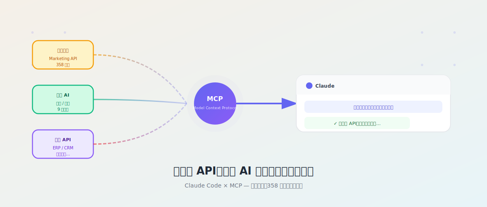
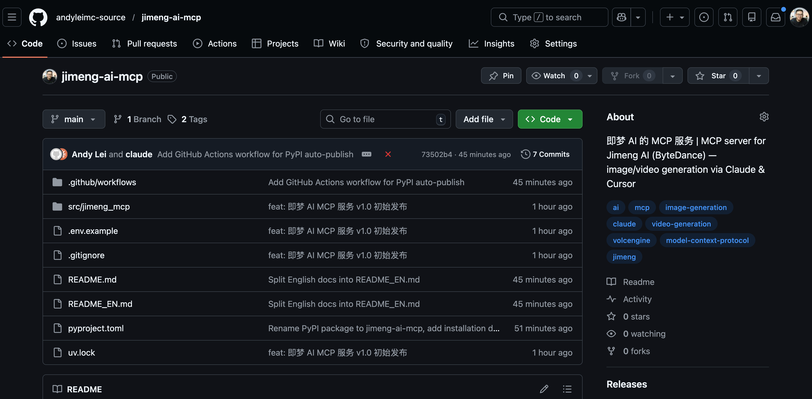
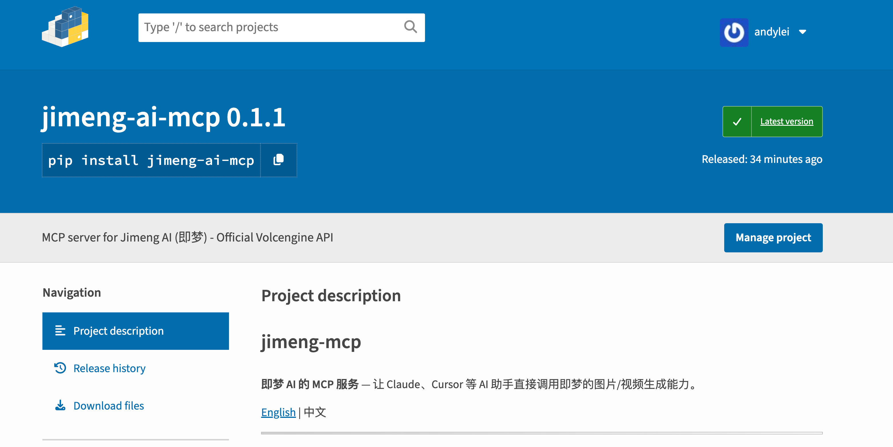
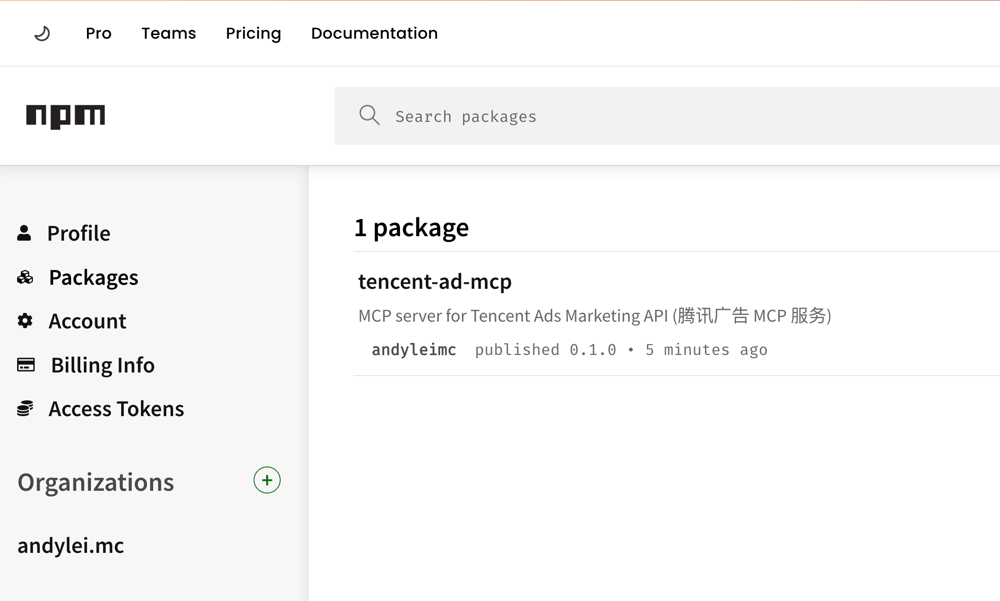
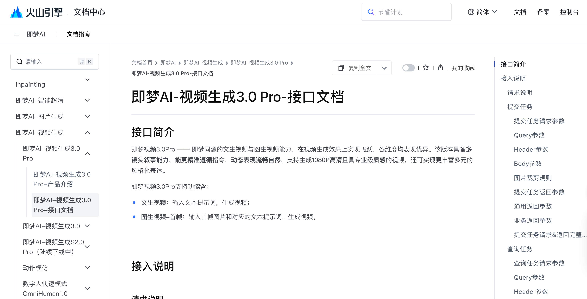

# 把任何 API，变成 AI 可以直接操作的工具



上周我在 Claude 里说了一句话：

> "帮我查一下腾讯广告账户昨天的消耗，和上周同期对比一下。"

Claude 停顿了两秒，然后给了我一张完整的对比表格，还附上了分析结论。

我没有打开任何广告后台。没有导出任何表格。没有写任何代码。

这不是魔法——是我把腾讯广告的 API 接进了 Claude。接进的方式，叫 **MCP**。


*以前需要人盯着屏幕操作，现在你说需求，AI去跑*

---

## 先说清楚：MCP 是什么

你可以把 AI 助手（Claude、GPT 这类）想象成一个聪明绝顶的顾问。

但这个顾问有个问题：**他只能动嘴，不能动手**。他知道怎么查广告数据，但没法替你登录后台操作；他知道怎么生成图片，但没法替你点击即梦的网页。

**MCP（Model Context Protocol）** 就是给这个顾问接上"手"的标准接口。

Anthropic（Claude 的母公司）在 2024 年推出了这个开放标准。一旦你把某个服务按 MCP 格式封装好，Claude 就能直接调用它——查数据、生成内容、操作系统，全部可以。

用一个比喻：MCP 就像 USB 接口。你不需要为每个设备单独改电脑，统一接口，插上就用。

---

## 我做了两个 MCP 工具，你可以直接用

### 工具一：即梦 AI MCP

**即梦**是字节跳动旗下的 AI 生图/生视频平台，效果很好，但一般要打开网页手动操作。

我把它的 API 封装成了 MCP，现在 Claude 里可以直接说：

> "帮我生成一张赛博朋克风格的城市夜景，16:9"

Claude 自动调用即梦，生成完毕，图片保存到你本地，对话里直接显示。

**包含 9 个工具：** 文生图、图生图、局部重绘、超清放大、文生视频、图生视频、动作模仿、数字人、视频翻译。

下面这张小红书风格的宣传海报，就是用即梦 4.0 直接在 Claude 里生成的：


*一句话描述，即梦直接出图，保存到本地*

👉 GitHub：https://github.com/andyleimc-source/jimeng-ai-mcp


*开源，任何人都可以查看代码或提交改进*


*发布到 PyPI 后，一行 `pip install jimeng-ai-mcp` 即可安装*

---

### 工具二：腾讯广告 MCP

腾讯广告的营销 API 有 358 个接口，我全部封装了进去。

现在你可以在 Claude 里说：

> "帮我查最近 7 天各广告组的 CPM 和 CTR，找出效果最差的 3 个"

Claude 调用 API，拿数据，分析，给结论。不用打开任何后台。

**包含 358 个工具：** 广告账户、投放管理、素材、报表、受众……全覆盖。

👉 GitHub：https://github.com/andyleimc-source/tencent-ad-mcp


*发布到 npm 后，用 `npx tencent-ad-mcp` 即可运行，无需提前安装*

---

## 怎么用这两个工具？

### 第一步：安装

这里要解释两个词：**pip** 和 **npx**。

**pip** 是 Python 的"应用商店"命令行工具。你在终端输入 `pip install 包名`，就像在手机上点"下载"，会自动把软件装好。

**npx** 是 Node.js（JavaScript 运行环境）的类似工具，输入 `npx 包名` 可以直接运行，甚至不用提前安装。

- 即梦 MCP 用 Python 写的，安装命令：`pip install jimeng-ai-mcp`（或更推荐的 `uvx jimeng-ai-mcp`）
- 腾讯广告 MCP 用 TypeScript 写的，使用命令：`npx tencent-ad-mcp`

> 不懂这些也没关系，复制粘贴就行，终端会帮你搞定一切。

---

### 第二步：获取 API 密钥

每个服务都需要你去对应平台申请密钥（证明你有权限调用）：

- **即梦**：去[火山引擎控制台](https://console.volcengine.com/ai/ability/detail/2)开通服务，拿到 Access Key ID 和 Secret Access Key
- **腾讯广告**：去[腾讯广告开发者平台](https://developers.e.qq.com/)申请 App ID 和 App Secret

---

### 第三步：配置 Claude Desktop

打开这个文件（这是 Claude Desktop 的配置文件）：

- **Mac**：`~/Library/Application Support/Claude/claude_desktop_config.json`
- **Windows**：`%APPDATA%\Claude\claude_desktop_config.json`

加入这段配置（**密钥填在这里**）：

```json
{
  "mcpServers": {
    "jimeng": {
      "command": "uvx",
      "args": ["jimeng-ai-mcp"],
      "env": {
        "JIMENG_ACCESS_KEY_ID": "你的密钥填这里",
        "JIMENG_SECRET_ACCESS_KEY": "你的密钥填这里"
      }
    }
  }
}
```

保存，重启 Claude Desktop，就好了。

---

### 第四步：直接对话

重启后，Claude 对话框底部会出现一个小锤子图标，说明 MCP 工具已加载。

然后，就像平时聊天一样说话就好：

> "帮我生成一张宋代山水画风格的图，横版"
> "查一下我昨天的广告数据，按点击率排序"

---

## 你也可以做一个：用 Claude Code 封装任意 API

这才是我真正想说的部分。

**任何有 API 文档的服务，都可以用同样的方式接入 Claude。**

我用的工具叫 **Claude Code**，这是 Anthropic 推出的 AI 编程助手，在终端里运行。它能读懂 API 文档，然后直接帮你生成封装代码。

整个过程是这样的：

**1. 找到 API 文档**，把文档内容喂给 Claude Code


*官方 API 文档，Claude Code 能直接读懂，不需要你逐行解释*

**2. 让它创建项目结构**：
> "帮我用 Python + MCP SDK 创建一个项目，封装这个 API"

**3. 让它实现鉴权和接口**：
> "按照这个签名文档实现请求函数，然后把这 20 个接口全部封装成 MCP 工具"

**4. 发布到 GitHub**，让别人也能用

**5. 发布到 pip/npm**，别人一行命令就能安装

腾讯广告那 358 个接口，就是这样做出来的。Claude Code 批量生成，我来审核，发现问题让它改，来回几轮就完了。

以前这种事需要一个后端工程师干两周。现在半天，一个人。

---

## 这件事意味着什么

说实话，我刚开始做这两个项目的时候，只是觉得"好玩，顺手试试"。

做完之后才反应过来，这个模式本身很重要。

我们之前说"AI 辅助工作"，大多数还是 AI 在旁边帮你写写文字、改改文案。**人还是在操作系统，AI 在递工具。**

MCP 改变了这个结构。Claude 开始直接操作系统，人退到了"说需求"这一层。

你说指令，AI 查数据、调接口、生成内容、整合结果。整个执行链，AI 在里面跑。

更关键的是：**封装这件事本身，现在也可以交给 AI 来做。**

以前需要一个工程师才能接入的 API，现在一个不懂代码的产品经理、运营，用 Claude Code 喂文档，半天就能搞出来。

这不是技术话题，这是效率和权力的重新分配。

> 不会写代码，不代表你不能调用代码。会说话，就够了。

---

**关于作者**


**老雷（Andy）**，明道云 & Nocoly CMO，SaaS 行业从业十余年。骨子里是个产品人和技术迷，乔布斯的信徒，相信好的产品能改变世界。深度关注 AI、商业与科技趋势，目前在深度使用和实践 Claude Code，专注探索 AI 如何重塑产品形态和商业逻辑。不聊概念，只聊真实发生的事。
