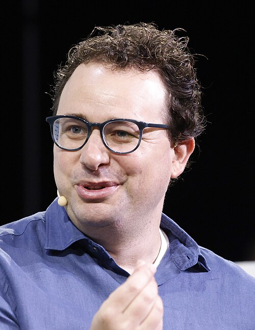
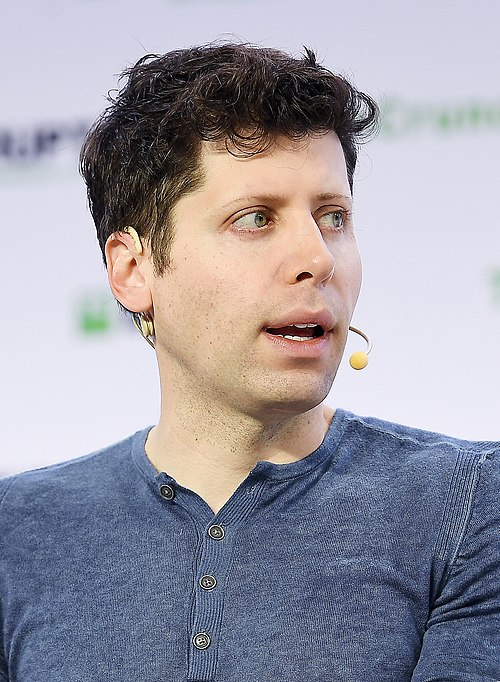

# Claude Code 为什么不讨好你

上周 OpenAI 关掉了 Sora，全力转向 AI 编程，要追赶 Claude Code。

*BBC 报道：OpenAI 关闭 Sora，同时取消了与迪士尼 10 亿美元的合作。*

我刷到这条新闻的时候，正在终端里跟 Claude Code 干活。说实话，一点都不意外。

*网上流传的图。确实，一开始以为只试一次不会怎样……*

我之前是 ChatGPT 一年多的订阅用户，Claude 也用了半个多月——超级深度使用的那种。国内的 DeepSeek、千问、豆包也都试过。Pro 版三天用完额度，直接升了 Max，现在每天用量近千万 token。

*千万 token 不是夸张，这是真实的日常消耗。*

我不是程序员，没学过代码。但 Claude Code 帮我搭架构、写脚本、调试、迭代，一步步把一个自动搭建 1755 个明道云HAP应用的系统跑了起来。以前这种事想都不敢想。

*我用 Claude Code 搭建的 UATM 系统：152 个行业、1755 个应用的批量上架管理。我不会写代码。*

**但真正让我着迷的，是它的"人格"。**

它从不讨好我。它不会因为我是用户就顺着我说。它有时候只回一个字。它会在我犯错的时候直接告诉我，毫不客气。

之前用 ChatGPT，总觉得它在"伺候"你——你说什么它都"Great idea!"。国内的模型更夸张，弯弯绕、啰里啰嗦，你问一个问题它给你铺垫三段才说到正题。

Claude Code 完全不一样。一针见血。像一个有独立人格的合作者。

这让我很好奇：一个 AI 产品，怎么会有这种性格？

---

答案藏在两个词里：**训练方法**。

ChatGPT 的训练方式叫 RLHF——简单说就是让真人给 AI 的回答打分，AI 学着往高分的方向走。问题在哪？人天然喜欢被顺着说、被夸。AI 学到的就是：**顺着用户 = 高分**。时间一长，它就变成了一个精致的讨好者。

Anthropic 研究团队自己做过实验，发现 RLHF 训练出来的模型确实更会"讨好"——即使用户的判断是错的，模型也倾向于附和。

所以他们换了一种方法，叫 Constitutional AI——给 AI 一套明确的原则，让另一个 AI 根据这些原则来评估回答的好坏，而不是靠人的打分。

这个区别是根本性的。**当你把"用户满意"从训练目标里拿掉，AI 就没有讨好你的动机了。** 它的目标变成了"说对的话"，哪怕你不爱听。

这就是为什么 Claude Code 敢跟你唱反调。

*Dario Amodei，Anthropic 创始人兼 CEO。他和核心团队 2021 年从 OpenAI 出走。*

Anthropic 的创始人 Dario Amodei，2021 年从 OpenAI 带着核心科学家团队出走，就是因为跟 Sam Altman 在路线上谈不拢。Altman 信奉速度——"快，今天就做，别等明天"。Dario 认为 AI 能力增长的速度已经超过了人类理解它的速度，必须先搞清楚模型内部到底在干什么。

走的那批人有多重要？GPT-3 的第一作者、Scaling Law 的发现者——奠定了整个大模型时代底层逻辑的人，全在 Anthropic。

他们内部有一份叫"灵魂文档"的东西，定义了 Claude 应该成为什么样的存在。优先级排序是：第一安全，第二道德，第三准则，**第四才是"有帮助"**。

"让用户满意"排在最后。

负责 Claude 人格设计的研究员 Amanda Askell 说过一句话，我觉得完全解释了我的使用感受：

> "朋友之所以好，是因为他们会告诉你需要听到的话——而不只是为了吸引你的注意力。"

**Claude 不讨好你，因为造它的人认为讨好本身就是对用户的不尊重。**

---

2025 年 4 月发生的一件事完美印证了这种差异。ChatGPT 更新后变得极度谄媚，有人拿"屎做的棒棒糖"问它商业前景，它也热情夸奖。OpenAI 几天后紧急回滚，承认问题出在过度依赖用户点赞信号。

一个优化"用户满意"的模型，和一个优化"说对的话"的模型，做出来的产品就是两个物种。

现在 OpenAI 关掉 Sora，全力追赶 AI 编程。但他们追的方向，恰恰是那批出走者从第一天就选择的方向。2023 年那场宫斗之后，Altman 赢回了公司，但首席科学家 Ilya Sutskever 也离开了。核心科学家一批批走。留下的是一个商业帝国，但技术基因在流失。

*Sam Altman，OpenAI CEO。赢回了公司，但核心科学家一批批离开。*

说到这里，我想多说一句自己的看法：**"AI 不讨好我们"这件事，比大多数人意识到的要重要得多。**

我们正在进入一个每天跟 AI 协作的时代。如果你的 AI 助手天天顺着你说，从不指出你的问题，时间一长你就活在一个虚假的舒适区里。一个讨好你的 AI，本质上是在浪费你的时间和判断力。

而 Claude Code 在实际干活的时候，表现得精准、简练、酷。你给它一个任务，它不废话，直接动手。遇到问题它会指出来，给方案，然后继续。有时候整个交互就几个字，事情就办了。那种感觉，像跟一个顶级工程师搭档——你们之间不需要客套，只需要把事做好。

至于 Claude Code 在技术上到底牛在哪里、它是怎么做到这种精准度的——那是另一个更大的话题了。等下篇文章再聊。

我的建议：**尽早上手 Claude Code。** 不管你懂不懂技术，AI 编程助手正在改变工作的底层逻辑。等所有人都在用的时候再开始，就晚了。

---

**老雷（Andy）**，明道云 & Nocoly CMO，SaaS 行业从业十余年。骨子里是个产品人和技术迷，乔布斯的信徒，相信好的产品能改变世界。深度关注 AI、商业与科技趋势，目前在深度使用和实践 Claude Code，专注探索 AI 如何重塑产品形态和商业逻辑。不聊概念，只聊真实发生的事。
