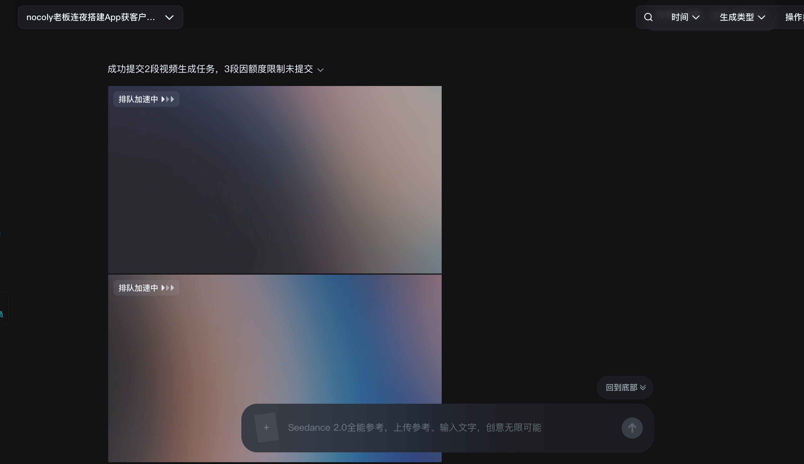
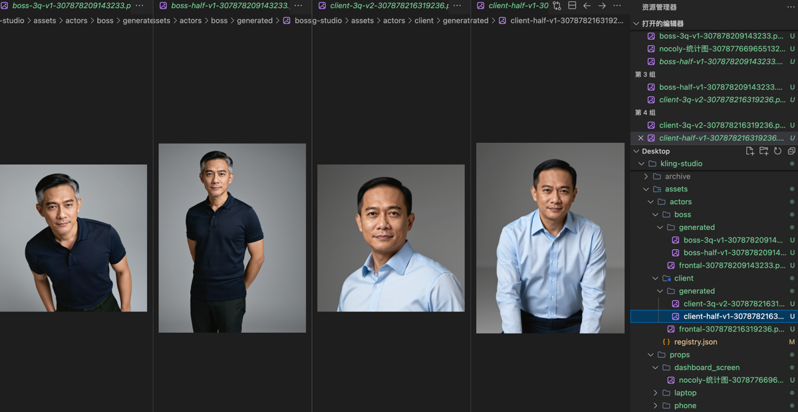
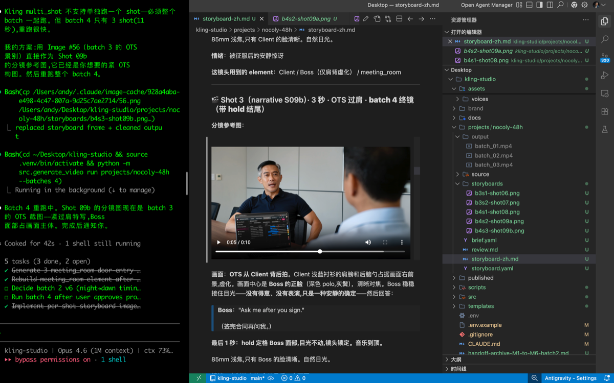

# Claude Code + 可灵：1 分钟 AI 长视频的完整制作流程

> 先看成片。第一次做，很粗糙，漏洞不少。当案例教学看就好，欢迎批评。

（完整成片视频请在评论区或视频号查看）

---

## 为什么突然要做视频

这周四晚上，我决定给 nocoly 拍一条内容视频。

背景是这样的：过去1个月我一直在用 Claude Code 做软件开发项目——MCP 封装、自动化脚本、各种工具链。用得越来越顺手之后，我开始琢磨一个问题：**这个工具怎样反过来帮我干营销的活？**

毕竟我的本职工作是 CMO。代码写得再溜，最终还是要回到营销上来。

一条 60 秒的品牌故事片，真人拍摄最少三五万，外包团队从脚本到成片少说两周。我想试试用 AI 一个人搞定。

---

## 试了一圈，全部阵亡

动手之前我把主流的 AI 视频工具都试了一遍。

**即梦**：画面质量还行，但有一个致命问题——**没有声音**。只出画面，台词、音效、BGM 全部要自己后期配。对我来说等于半成品，不可用。

**Seedance**：现在用的人太多了，排队排到绝望。我提交的视频已经卡了两三天，完全跑不出来。我已经是付费版（最便宜那档），但它连让我生成视频的能力都没有了。

*Seedance 的任务队列：两段视频"排队加速中"，三段因额度限制未提交。付费了也跑不出来。*

还考虑过 Happy Horse，但还没正式发布。海外的几家也看了——Grok 家的、还有几个叫不上名字的，效果都差强人意。

看过各家排行之后，**可灵（Kling）排名一直靠前**。更关键的是，它有一个我在其他产品上没见过的机制。

---

## 可灵的杀手锏：Element 主体管理

可灵做了一件很简单但很关键的事：**你可以把角色的参考图上传到后端，拿到一个 `element_id`，之后所有视频请求都引用这个 id。**

角色的外形不再靠 prompt 描述（"一个 40 岁东亚男性，穿深色 polo，鬓角有白发"这种），而是直接绑定到一组参考照片。无论跑多少次视频，可灵都会从这组照片去渲染同一个人。

人、场景、道具，都能注册成 element。

我用了 3 张不同角度的参考图注册了两个角色：Boss（深色 polo，创始人）和 Client（浅蓝衬衫，客户）。注册免费，10 秒完成。

*Boss 和 Client 的多角度参考图。文件名带 element_id 后缀，一眼看出哪些已注册到可灵。*

**从这一刻起，一致性的问题交给可灵后端去保证了。**

---

## 用 Claude Code 搭流水线

我没有用可灵的网页端手动操作，而是让 Claude Code 帮我写了一整套 Python 流水线，直接调可灵的 API。

整个工作流被我固化成了四个阶段：

**① 策划**：写 `brief.yaml`——品牌、受众、调性、角色、场景、关键台词，一个文件讲清楚"要拍什么"。

**② 分镜稿**：把故事拆成具体镜头。每个镜头几秒、什么景别、什么动作、什么台词。产物是 `shotlist.yaml`。

**③ 分镜图**：为每个镜头生成一张构图参考图。**这一步非常关键**——没有分镜图，AI 只能靠猜你想要什么镜头语言。加了分镜图之后，可灵同时看到"构图参考 + 角色身份 + 文字描述"三层信号，出片准确率大幅提升。

**④ 出片**：一条命令，逐 batch 提交可灵 API 生成视频。每个 batch 审片通过才跑下一个。

*Claude Code 的工作界面：左边是终端在跑视频生成，右边是分镜稿和分镜参考图。整个流程在一个终端里完成。*

---

## 踩坑：可灵的 16 条未文档约束

跑了几天之后，我和可灵 API 之间积累了一份"血泪清单"。每一条都是至少一次失败换来的。挑几个最重要的说：

**15 秒硬墙**：可灵 multi_shot 模式有一个未文档化的总时长上限，大约 15 秒。我原计划两个 batch（29 秒 + 21 秒）全被拒了。最后只能拆成 4 个 batch（15+15+10+11 秒），在剪辑软件里拼接。

**512 字符 prompt 限制**：每个镜头的描述不能超过 512 字符，多一个字都会被拒。写英文 prompt 要反复精简。

**双人同框翻车**：两个人出现在同一画面时，可灵经常把人物融合、位置搞乱。**最终解决方案是全部改成"过肩拍"——每个镜头只露一个人脸，另一个人只是前景的虚化肩膀。** 这是影视行业常用的手法，在 AI 视频里效果同样好。

**中文对白泄漏**：`sound: on` 模式下，可灵会在静默段落自动生成对白填充。即使 prompt 全英文，它也可能冒出一句中文"终于结束了"。必须大写标注 `NO dialogue, NO spoken words`。

**动作融合**：在一个 3 秒镜头里写"合上笔电，然后拿起杯子"，可灵会让角色用杯子去合笔电。必须用"先...停顿...然后"严格分隔动作时序。

完整的 16 条清单我都记录在项目文档里了。希望之后能帮到其他人，少花这笔学费。

---

## 成本

这个数字让我自己也意外。

| 项目 | 费用 |
|---|---|
| 可灵 Omni Video（含迭代重跑） | ~110 元 |
| 可灵图生图（分镜图 + 场景参考） | ~9 元 |
| 可灵语音克隆（2 个角色） | 0.10 元 |
| MiniMax 语音样本（选角试听） | 0.80 元 |
| **总计** | **~120 元（约 $17 美元）** |

120 块钱。一个人。3天时间。一条 1 分钟的品牌故事片，带对白、音效、BGM。

其中一半是"学费"——batch 1 和 batch 2 各跑了 5 个版本才通过。如果从头来过，知道所有坑在哪里，同样的片子 60 块就能搞定。

---

## 回过头来看

这周四晚上决定做这件事的时候，我其实没什么把握。

AI 视频超过 15 秒就开始漂移，这是我之前的认知。但可灵的 element 系统 + multi_shot 模式 + image_list 分镜图参考，这三个现成的 API 端点组合在一起，确实把一致性问题解决了。再加上 Claude Code 帮我把整套代码和工作流搭起来——

说实话，当我第一次打开 `batch_01.mp4`，看到 Boss 坐在夜晚的办公室里接起电话，**那个人长得和我注册的参考图一模一样**，穿着同一件深色 polo，鬓角有同样的白发——那一刻我是真的激动了。

这条路是通的。工具链还很粗糙，坑也很多，但路是通的。

坦白说，这个片子是第一次做，瑕疵还很多，远没到能正式发表的程度。放出来只是给大家一起学习参考的——如果你也在琢磨怎么用 AI 做长视频，希望我踩过的这些坑能帮你省点时间和钱。

---

## 关于 Claude

这个项目全程用 **Claude Opus 4.6（100 万上下文）** 协作完成。

从零搭建 Python 流水线、调试可灵 API、注册角色和场景、生成分镜图、逐 batch 提交和迭代审片、踩坑后修复代码、整理文档——所有这些都是在一个 Claude Code 会话里连续推进的。要不是 Claude 全程引导和一起协作，我一个人做不出来。

100 万上下文在这个项目里起了关键作用：4 个 batch 的 prompt 迭代历史、16 条踩坑记录、资产注册状态、分镜图生成参数——全部在同一个对话窗口里，Claude 随时能回溯任何细节。换一个上下文短的模型，光是反复交接背景信息就够折腾了。

> **Build first. Talk later.**

这是片子里 Boss 的最后一句台词。也是我做这件事的态度。

---

## 附录：可灵 16 条未文档约束清单

以下每一条都至少花了一次失败的渲染才发现。

**API 硬约束：**

1. **multi_shot 总时长 ≤ ~15 秒** — 文档没写，超过直接拒绝
2. **prompt ≤ 512 字符** — 每个 shot 的文字描述不能超，多一个字都被拒
3. **element 参考图 1-3 张** — 多了拒绝，少了可以但一致性会差
4. **voice_id 只接受克隆 ID** — 文档说支持 TTS 预设名称，实际不行
5. **duration 必须精确等于各 shot 之和** — 差 1 秒都会 400 错误
6. **element_list 安全上限 4 个** — 5 个没测过，我们一直规避
7. **multi_shot 不支持首帧/末帧锁定** — 只能用 image_list 引导构图
8. **delete-elements 响应没有 data 字段** — 文档标错了

**模型行为倾向：**

9. **笔电屏幕方向锁死** — 必须给背面视角参考图，光靠 prompt 说"从背面拍"没用
10. **动作融合** — 短镜头里多个动作会被混在一起，必须用时间序列词严格分隔
11. **中文对白泄漏** — sound:on 时静默段会被自动填充对白，可能冒中文
12. **双人同框不稳定** — 两张脸同时出现容易融合错乱，改用过肩拍只露一张脸
13. **远景容易翻车** — 重要镜头用特写或近景，远景渲染错误率高
14. **品牌幻觉** — 产品类物体会随机出现假品牌 logo
15. **scene 的 frontal 决定默认渲染角度** — 注册场景时 frontal 选对角度很关键
16. **hold beat 防止结尾突兀** — 每个 batch 终镜必须加"最后 N 秒定格"指令

---

### 关于作者

> **老雷（Andy）**，明道云 & Nocoly CMO，SaaS 行业从业十余年。骨子里是个产品人和技术迷，乔布斯的信徒，相信好的产品能改变世界。深度关注 AI、商业与科技趋势，目前在深度使用和实践 Claude Code，专注探索 AI 如何重塑产品形态和商业逻辑。不聊概念，只聊真实发生的事。
