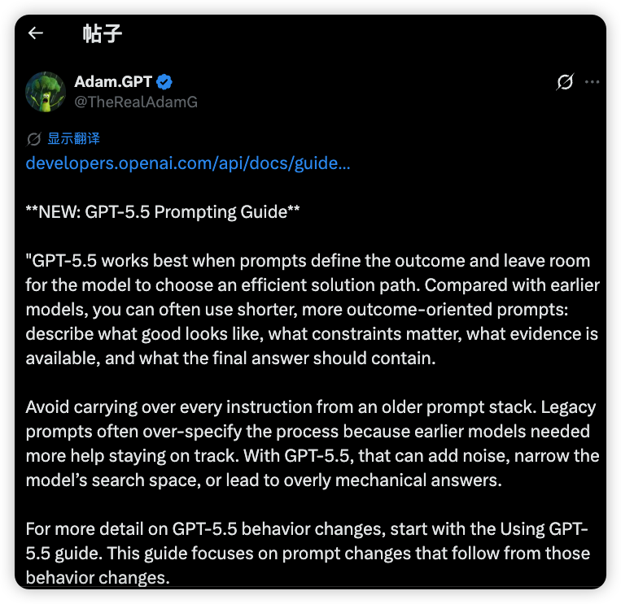
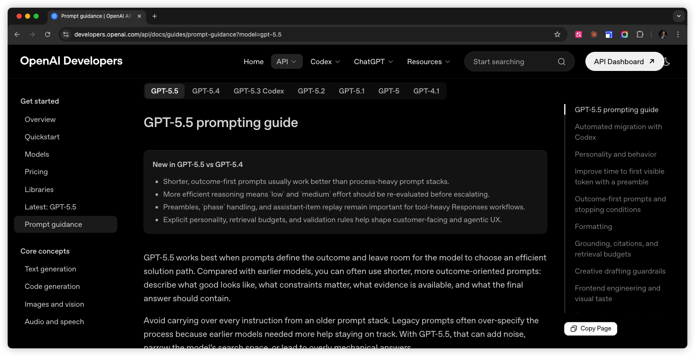
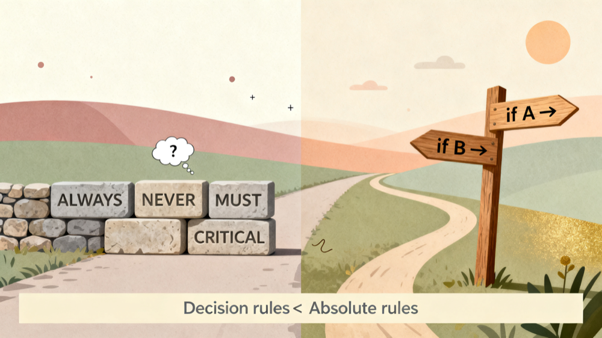
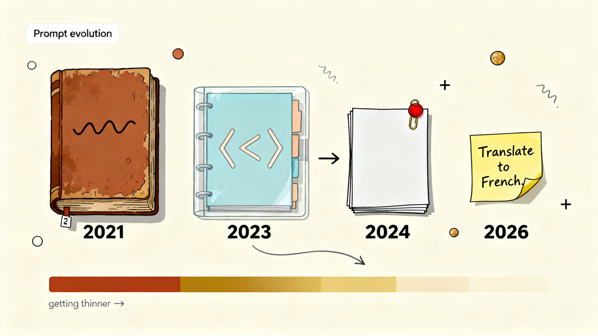

# Prompt 减法时代：GPT-5.5 七条新写法实战手册（附 OpenAI 原文中英对照）


今天早上刷 X，看到 OpenAI 内部一个叫 Adam.GPT（@TheRealAdamG，bio 写着 "Forward Deployed GTM at OpenAI"——公司里负责把新东西第一时间推到开发者面前的人）转了一条推文，链接指向他们刚发的 GPT-5.5 prompting guide。他特意把原文里两段话拎出来圈红。

Adam 的大意是：**GPT-5.5 这一代，在"只描述想要的结果、把过程留给模型"的 prompt 上表现最好；过去那一套 5000 字的旧模板别再原样照搬过来，因为早期模型需要的"过程指令"，现在反而会变成噪音、缩小模型的搜索空间、让回答变机械。**

自家人专门划这两段重点，这条就值得点进去读一遍。


*Adam.GPT 圈出来的那两段话*

我点了链接。


*点进去之后的原文*

读完之后，我在屏幕前坐了一会儿。

OpenAI 这次给开发者的指导，温柔但坚决地，把过去两年所有人奉为圣经的"prompt 工程"推翻了一半。

我把整份文档读了三遍，提炼出**七条 GPT-5.5 时代值得收藏的新写法**，每条都配原文出处、改写示例和适用场景。文末附上 OpenAI 完整原文的中英对照，你不用再点链接了。

---

### TL;DR · 三句话总结

如果你只有 30 秒——

1. **Outcome > Process**：告诉模型"好的结果长什么样"，别再写"先 A 再 B 再 C"。把路径选择留给模型。
2. **决策规则 > 绝对指令**：用"在什么情况下做什么"代替"永远做"、"绝不要做"。
3. **删掉 50%**：你那个 5000 字的 system prompt，多半有一半是给 GPT-4 时代写的代偿，到 GPT-5.5 上变成噪音。

下面七条法则，按使用频次排序。每条都能直接抄回去改你的 prompt。

---

### 法则一：把"过程指令"换成"结果描述"

**原文：**

> describe what good looks like, what constraints matter, what evidence is available, and what the final answer should contain.
>
> 描述"好的答案长什么样"、有哪些约束、有什么证据、最终答案应该包含什么。

**核心：** 定义终点，不定义路径。

**改写示例：**

**旧写法（过程导向）：**

```
Step 1: Read the customer's account data.
Step 2: Check eligibility against the policy.
Step 3: If eligible, perform the action.
Step 4: Return the result with status.
```

```
第一步：读取客户的账户数据。
第二步：对照政策检查资格。
第三步：如果通过，执行操作。
第四步：带状态返回结果。
```

**新写法（结果导向）：**

```
Resolve the customer's issue end to end.

Success means:
- the eligibility decision is made from the available policy and account data
- any allowed action is completed before responding
- the final answer includes completed_actions, customer_message, and blockers
- if evidence is missing, ask for the smallest missing field
```

```
端到端解决客户的问题。

成功的标准是：
- 已基于可用的政策和账户数据做出资格判断
- 所有允许的操作都在回复前完成
- 最终答复包含 completed_actions（已完成动作）、customer_message（给客户的话）、blockers（阻塞项）三个字段
- 如果证据不足，只追问最关键的那一个缺失字段
```

**适用：** 几乎所有任务。GPT-5.5 在结果导向 prompt 上表现最好。

---

### 法则二：用决策规则代替 ALWAYS / NEVER

**原文：**

> Use those words for true invariants, such as safety rules, required output fields, or actions that should never happen. For judgment calls, such as when to search, ask for clarification, use a tool, or keep iterating, prefer decision rules instead.
>
> 这些强硬词只该用在真正的"硬约束"上——安全规则、必须的输出字段、绝不能发生的动作。对于判断类问题——什么时候搜索、什么时候追问、什么时候用工具、什么时候继续迭代——优先使用决策规则。

**核心：** 把"砸到模型脸上的规则"改写成"教模型判断的条件"。


*硬规则越多，路反而走不通；决策规则反而把路打开*

**改写示例：**

**旧写法（绝对指令）：**

```
NEVER include code in the response unless the user explicitly asks for code.
```

```
除非用户明确要求代码，否则永远不要在回答里包含代码。
```

**新写法（决策规则）：**

```
If the user is asking a conceptual question, answer in prose.
If the user is asking how to do something concrete, include a minimal code example.
```

```
如果用户问的是概念性问题，用文字回答。
如果用户问的是怎么做一件具体的事，给一段最简单的代码示例。
```

前者把规则砸在脸上，模型在边界情况下会变得机械；后者教它判断，遇到模糊情况会做出更聪明的选择。

**适用：** 所有"看情况而定"的判断类规则。**继续保留 ALWAYS / NEVER 的场景仅限**：安全红线、必须输出的字段、绝不允许发生的破坏性动作。

---

### 法则三：工具调用前加一句 preamble（前导更新）

**原文：**

> Before any tool calls for a multi-step task, send a short user-visible update that acknowledges the request and states the first step. Keep it to one or two sentences.
>
> 在多步任务调用工具之前，先发一句用户可见的简短更新，确认收到请求并说出第一步要做什么。控制在一到两句话。

**核心：** 改善"首个可见 token"的延迟体感，几乎零成本。

**改写示例：**

**在 system prompt 里加一段：**

```
For multi-step tasks, before any tool calls,
send one short user-visible message that:
- acknowledges what the user wants
- states the first concrete step you'll take
Keep it under two sentences.
```

```
对于多步任务，在调用任何工具之前，
先发一句用户可见的简短消息：
- 确认你听懂了用户想要什么
- 说出你接下来要做的第一步是什么
控制在两句话以内。
```

效果：用户从"盯着空白屏幕等三秒" 变成 "看到模型说'我先查一下你这个月的账单'然后看着它干活"。

**适用：** 所有 agent（智能体）类应用、流式响应产品、tool-heavy 工作流。

---

### 法则四：reasoning_effort 别一上来就拉满

**原文：**

> More efficient reasoning means low and medium effort should be re-evaluated before escalating.
>
> 推理效率提升了，所以在升到 high 之前，应该先重新评估 low 和 medium 是否够用。

**核心：** GPT-5.5 的推理变得更高效，盲目拉 high 是浪费 token + 拖慢响应 + 不一定更准。

**改写示例：**

旧习惯：
```python
response = client.responses.create(
    model="gpt-5.5",
    reasoning_effort="high",  # 默认就拉满
    ...
)
```

新习惯：
```python
# 先用 medium 跑一遍看效果
response = client.responses.create(
    model="gpt-5.5",
    reasoning_effort="medium",  # 默认值
    ...
)
# 实测不够再升 high；很多任务 low 也够用
```

**适用：** 所有调用 GPT-5.5 reasoning API 的场景。先 medium，不够再升。

---

### 法则五：personality 和 collaboration style，拆开写、都简短

**原文：**

> Personality controls how the assistant sounds: tone, warmth, directness, formality, humor, empathy, and level of polish.
>
> Collaboration style controls how the assistant works: when it asks questions, when it makes assumptions, how proactive it should be, how much context it gives, when it checks work, and how it handles uncertainty or risk.

> Personality（个性）控制助手"听起来如何"：语气、温度、直接程度、正式度、幽默感、共情、打磨程度。
>
> Collaboration style（协作风格）控制助手"如何工作"：什么时候提问、什么时候做假设、主动性多高、给多少上下文、什么时候校验、如何处理不确定性和风险。

**核心：** 这是两件事。Personality 影响"听起来怎么样"，Collaboration 影响"怎么干活"。混着写就两边都模糊。

**改写示例：**

**旧写法（混在一起）：**

```
You are a friendly, professional assistant who always
asks clarifying questions and provides detailed answers
in a warm tone with examples and reasoning steps.
```

```
你是一个友好、专业的助手，永远会先追问澄清问题，
并用温暖的语气提供包含示例和推理步骤的详细答案。
```

**新写法（拆成两段）：**

```
# Personality
Direct, candid, no fluff. Treats the user as competent.
Avoids hedging language. Matches user's tone.

# Collaboration style
Make progress over asking when the request is clear.
Ask only when missing info would change the answer.
Acknowledge errors plainly when called out.
```

```
# 个性（Personality）
直接、坦率、不啰嗦。把用户当成有能力的人。
避免用模棱两可的措辞。语气跟随用户。

# 协作风格（Collaboration style）
请求清楚时优先推进，不要追问。
只有在"缺的信息会改变答案"时才问。
被指出错误时直接承认。
```

**适用：** 客服、教练、面向 C 端的对话产品。两段都不要超过 100 字。

---

### 法则六：明确写出 stopping conditions 和 retrieval budget

**原文：**

> For ordinary Q&A, start with one broad search using short, discriminative keywords. If the top results contain enough citable support for the core request, answer from those results instead of searching again.
>
> 对普通问答，先用简短关键词做一次广搜。如果头部结果已经包含足够的引用支撑，就直接回答，不要再搜。

**核心：** 告诉模型"什么时候算干完了"，比告诉它"怎么干"更重要。

**改写示例：**

**适用于检索类 agent 的 stopping rule：**

```
For each query:
1. Run ONE broad search with short keywords.
2. If results contain enough citable support → answer.
3. Make another search ONLY when:
   - Top results don't answer the core question
   - A specific named source must be read
   - User asked for exhaustive coverage
4. Do NOT search again to improve phrasing or add nice-to-have details.
```

```
对每个用户问题：
1. 用简短关键词做一次广搜。
2. 如果结果已经包含足够的可引用证据 → 直接回答。
3. 只有在以下三种情况下才允许再搜一次：
   - 头部结果回答不了核心问题
   - 必须读特定的命名来源
   - 用户要求穷尽覆盖
4. 不要为了"措辞更漂亮"或"补点锦上添花的细节"再去搜。
```

**适用：** 所有 RAG（检索增强生成）应用、agent 流程、需要给 SLA 兜底的生产场景。**不写 stopping condition，模型会陷入无限搜索循环。**

---

### 法则七：前端任务，主动列出"AI 套路"让模型避开

**原文：**

> common generated-UI defaults to avoid, such as generic heroes, nested cards, decorative gradients, visible instructional text, and broken layouts.
>
> 需要避开的"AI 默认套路"——千篇一律的英雄区、套娃卡片、装饰性渐变、外露的提示文字、错位的布局。

**核心：** 模型对训练数据的高频模式有惯性。你不主动拒绝，它就会还你一个"一眼是 AI 做的"页面。

**改写示例：**

**让模型生成前端代码时，加一段反向约束：**

```
Avoid these AI-generated UI tropes:
- generic hero sections (huge centered title + CTA button)
- nested cards (cards inside cards inside cards)
- decorative gradients (purple-pink, blue-cyan)
- visible instructional placeholder text
- broken responsive layouts
- emoji decoration in headers

Match the design language of [your product] instead.
```

```
避免这些 AI 生成 UI 的常见套路：
- 千篇一律的英雄区（巨型居中标题 + 一个 CTA 按钮）
- 套娃卡片（卡片里嵌卡片再嵌卡片）
- 装饰性渐变（紫粉、蓝青）
- 留在页面上的提示性占位文字
- 响应式布局塌陷
- 标题里堆 emoji 装饰

改为对齐 [你的产品] 的设计语言。
```

**适用：** 所有让 AI 写 React / Vue / HTML 的场景；尤其是给设计师或产品经理 demo 的 AI 工具。

---

### 为什么变了——一段话讲清原理

如果你也是从 GPT-3 时代过来的，应该记得我们这四年是怎么把 prompt 写成那样的。


*四年时间，从一摞两百页的厚书，缩到一张便利贴*

GPT-3 时代要塞 few-shot 例子，GPT-4 时代要堆 XML 标签 + Chain-of-Thought，GPT-5 时代要写满 ALWAYS / NEVER 规则清单。每一种"技巧"，本质都在替模型做它本应自己做的判断——给例子是因为它不知道输出什么样、给角色是因为它不知道腔调、给硬规则是因为它在边界情况下会犯错。

**Prompt 之所以越写越长，是因为模型不够聪明的地方，使用者必须用文字来"代偿"。**

但代偿曲线注定会反转。模型够聪明之后，那些过去为它代偿的指令就从"导航"变成了"枷锁"——会缩小搜索空间，让回答变机械。

GPT-5.5 这份 guide 的核心只有一件事：**OpenAI 在告诉你模型已经够聪明了，把代偿撤了，让它自己飞。**

---

### 工具的成熟，是它不再需要你哄着用

我想到了 iPhone。

2007 年第一代 iPhone 发布，整个发布会两个小时，没有一秒在教用户"怎么用"。没有说明书，没有教程。在那之前的诺基亚功能机，每一个功能都得翻 200 页的说明书，每一步都要学。iPhone 把这个逻辑反过来——**让设备自己理解人想做什么，让人不再需要去理解设备。**

GPT-5.5 这份指南透露的，是同一件事正在 AI 上发生。每一代模型变强，使用者的代偿就少一层。

对真正写 prompt 的人来说，这是好消息——我们终于把模型养到可以放手的阶段了。

但同时也是个警告。市面上那些把"复杂 prompt 工程"当核心卖点的 AI 应用层公司，护城河正在快速塌陷。你那个引以为傲的 5000 字 system prompt，可能是上一代模型的代偿习惯，到了下一代就变成噪音。**护城河从来不长在 prompt 里，长在产品形态、数据闭环、用户场景上。** AI 进化按周计算，海外的 AI Native 公司从零开始重新构建产品形态，留给传统 SaaS 和 AI 套壳应用的窗口在快速关闭。

---

### 写在最后

四年了。我们从 few-shot 学到 chain-of-thought，从 XML 标签学到 ALWAYS / NEVER，从 system prompt 学到 reasoning effort。每一代我们都在调整自己，去配合一个不够聪明的模型。

现在 OpenAI 自己出来说——你们调整得有点太多了。

> 工具的成熟，标志是它不再需要你哄着用。

iPhone 是这样走过来的，AI 也在走同一条路。

至于我们这些每天和 API 打交道的人——

**回去清理一下你那个 5000 字的 system prompt 吧。删掉一半，可能更好用。**

---

### 附录：OpenAI 官方推荐的 Prompt 结构模板

> 原文链接：https://developers.openai.com/api/docs/guides/prompt-guidance?model=gpt-5.5

复杂 prompt 的起点模板，七条法则全部能套进这个骨架。每个 section 保持简短，只在"加了能改变行为"的地方加细节。

```
Role: [1-2 sentences defining the model's function, context, and job]
角色：[1-2 句话定义模型的功能、上下文、任务]

# Personality
[tone, demeanor, and collaboration style]
[语气、姿态、协作风格]

# Goal
[user-visible outcome]
[用户可见的目标结果]

# Success criteria
[what must be true before the final answer]
[最终答案必须满足的条件]

# Constraints
[policy, safety, business, evidence, and side-effect limits]
[政策、安全、业务、证据和副作用上的限制]

# Output
[sections, length, and tone]
[分节、长度、语气]

# Stop rules
[when to retry, fallback, abstain, ask, or stop]
[何时重试、降级、放弃、追问或停止]
```

---

### 关于作者


**老雷（Andy）**，明道云 & Nocoly CMO，SaaS 行业从业十余年。骨子里是个技术迷，乔布斯的信徒，相信好的产品能改变世界。深度关注 AI、商业与科技趋势，目前在深度使用和实践 Claude Code，专注探索 AI 如何重塑产品形态和商业逻辑。不聊概念，只聊真实发生的事。
