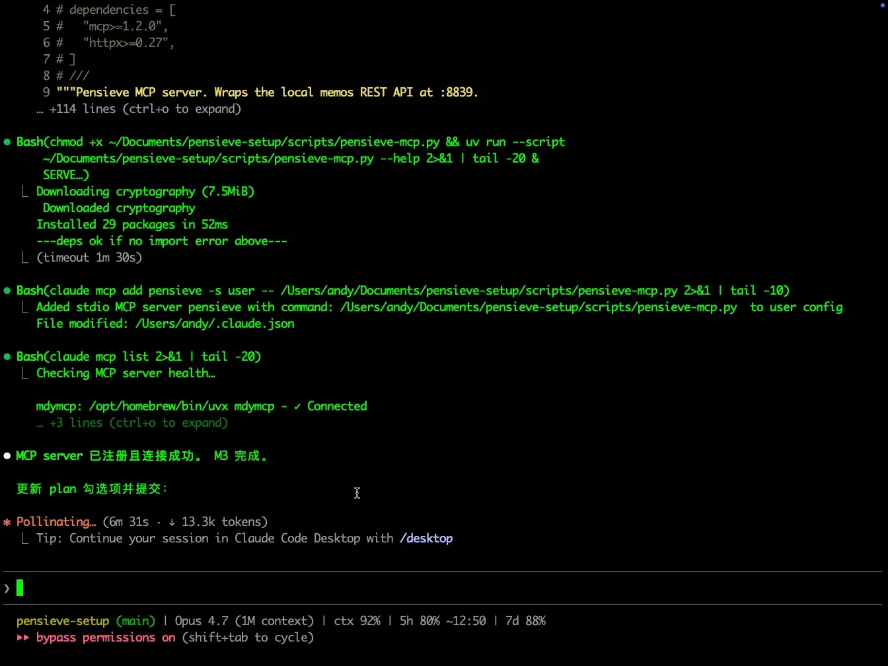

# 我给自己的 Mac 装了"过目不忘"，然后让 Claude Code 替我回忆

我前几天和同事讨论一个案例页面，结论挺重要，截图我没存。今天想翻回去看，记不清是周二还是周三，浏览器历史里翻了十分钟也没找到——那个页面我只停留了三十秒。

这种事每周都在发生。前天看过的图、上周读过的文章、半个月前调过的命令，统统在脑子里溶解。我们在屏幕前的每一秒都在产生信息，却没有任何东西替我们记住。

所以我做了件事：让 Mac **每隔几秒自动截一次屏，OCR 入库，可搜索**；然后写了个 MCP 让 Claude Code 直接调它。现在我在终端里随便问一句"我今天下午都在忙啥"，它就替我把一下午的屏幕翻一遍，给我一段总结。

这篇不是装机教程——想装的话最后有 GitHub 链接，一行命令搞定。这篇想讲的是**用起来是什么感觉**，以及**为什么我觉得这件事值得做**。

---

## 一、它长这样

底层是开源项目 [arkohut/pensieve](https://github.com/arkohut/pensieve)（不是我做的，致谢作者）。装好之后它就在后台默默截图、OCR、建索引，一切都在本地，数据不出机器。


它自带一个 Web UI 能搜，但我几乎不用。我把它包了一层 MCP，挂到 Claude Code 上——这才是真正改变体验的地方。



---

## 二、用起来是什么感觉

**场景一**：周五下午我想交个周报，但根本不记得这周干了啥。

> 我："这周我每天分别在忙什么？用 pensieve 查屏幕历史。"
>
> Claude：（拉了过去 5 天每小时的应用分布、窗口标题）"周一早上你在调试 pdhunter 的 Go 编译；下午切到了和 supabase 计费相关的浏览器调研。周二一整天泡在 Pensieve 部署……"

我从来没主动记过这些。但屏幕替我记了，Claude 替我读了。

**场景二**：我隐约记得上周看过一篇讲"独立开发者怎么收钱"的 GitHub 仓，没收藏，搜不出来了。

> 我："上周看过的一个 GitHub 项目，关于独立开发者赚钱的，帮我找回来。"
>
> Claude：（搜到一张截图）"是 [loonggg/DevMoneySharing](https://github.com/loonggg/DevMoneySharing)，你周六晚上在 Chrome 里看的。"

直接命中。屏幕历史是比浏览器历史靠谱的检索源——浏览器只记 URL，屏幕记**你真的看了什么**。

**场景三**：和家人吃饭前我会让它暂停录屏；吃完回来再恢复。一句话搞定，不用点开任何 app。

---

## 三、为什么不用现成的方案

我评估过几个：

- **ScreenMemory**（Mac App Store 上 ~¥200）——闭源、不能自己加 MCP。
- **Rem**——开源免费，但功能朴素，没有 API。
- **Screenpipe**——生态最活跃，但商业版 $400，社区版自编译麻烦。

Pensieve 的杀手锏是**有 REST API**。这意味着我可以把它接到 Claude Code、接到我自己写的小工具、接到任何未来想接的地方。一个能被脚本访问的屏幕记忆系统，价值不是线性的。

---

## 四、关于隐私

这是我最在意的部分。屏幕里什么都有：聊天、密码框、银行流水、家里的照片。

所以我的红线是：

- **默认全本地**——OCR 用的是开源模型，跑在你自己机器上，不调任何云 API
- **不开 VLM**（视觉模型）——OCR 已经能搜到 90% 的内容；多看一眼图、把截图发到云上的诱惑，我没接受
- **敏感 app 拉黑**——1Password、企业微信、网银这些应用永远不会被截图
- **超 90 天的截图自动归档到我自己的腾讯云存储桶**——不是第三方，本质上还是我的硬盘

这套方案的成本，**除了 Claude Code 本来就付的订阅，是 0**。屏幕历史不灌任何外部 LLM。

---

## 五、踩了几个坑

完整记录在仓库的 `bug.md` 里，这里只说一个最有意思的。

最初我让 Claude "看下午做了什么"，它一调工具就把六万字符的原始 OCR 数据塞进了上下文，单次消耗一万五千个 token。问题不在 Claude，在我那个 MCP——参数没设计好，逼得它绕过我直接打底层 API。

我后来加了时间范围过滤、加了一个聚合工具（不返回 OCR 文本，只返回 top apps / 每小时分布），同样的问题从 60KB 缩到 1.5KB。

这个教训对**任何写 MCP 的人**都适用：**MCP 工具一定要把高频用例的过滤参数做齐。否则 LLM 会很聪明地绕过你直接调底层接口——绕过的代价就是上下文爆炸。**

---

## 六、想试的话

我把整套东西打成了一个开源仓库：

> **https://github.com/andyleimc-source/pensieve-mcp**

```bash
git clone https://github.com/andyleimc-source/pensieve-mcp.git
cd pensieve-mcp
./install.sh
```

`install.sh` 会问你几个问题（保留多少天、要不要开云归档），全程 5 分钟。装完打开新的 Claude Code 会话，直接问它"我今天下午做了啥"。

如果你也是天天在 Mac 前坐 8 小时、又重度用 Claude Code 的人——值得试一下。我用了一周，已经回不去没有它的状态了。

---

**致谢**：[arkohut/pensieve](https://github.com/arkohut/pensieve) 的作者。这套东西 90% 的能力是他做的，我只是给他做了一件外套。
