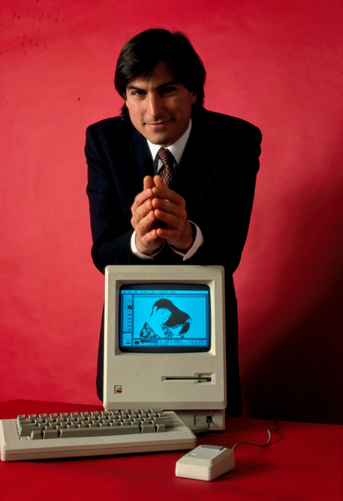

# Steve Jobs Invented the Interface. AI Is Eliminating It.

### Preface

The core idea behind this essay has been brewing in my mind for a long time.

A few days ago, I was chatting with a friend about a product called Pexo, and I noticed a button in its top-right menu bar -- "Connect to OpenClaw." In that instant, all the pent-up thoughts I'd been carrying around suddenly caught fire. I had to get this idea out.

This essay captures what I've been feeling during my intensive daily use of Claude -- from Jobs inventing the graphical interface to AI dismantling it, tracing the arc from the origins of human-computer interaction all the way to the seismic shift about to hit the SaaS industry. I truly believe **we are living through a fundamental turning point.**

Many of us were pioneers, witnesses, and participants in the SaaS industry's rise over the past two decades. Since AI arrived, what I feel is an unprecedented opportunity for transformation. Can we seize it? How do we meet the challenge? Honestly, I'm both excited and worried.

My perspective has its limits, and there are bound to be rough edges in what follows -- criticism is welcome. Writing down my thinking and sharing it with others: if it sparks even a small insight, that's enough.

---

### A Menu Button That Changed Everything

I'm Andy, and I've spent over a decade in the SaaS industry. I'm also someone with an obsessive streak when it comes to products and technology.

A few days ago, a friend recommended a project management tool called Pexo. Out of professional habit -- I work in marketing, so whenever I see a new product, my first instinct is to study its website and interface -- I opened Pexo and started clicking around. Menu bars, feature entry points, page layouts -- I've been studying these for over a decade and can usually tell a product's positioning at a glance.

Then I saw an option in the top-right corner: **Connect to OpenClaw**.

*"Connect to OpenClaw" in Pexo's menu bar -- software is building connection points for AI, not for humans.*

I froze.

Not because I didn't understand the feature -- quite the opposite. I understood it all too well. A SaaS product had placed "be callable by AI" in the most prominent position of its menu bar. This wasn't some advanced option buried in a settings page. This was a product boldly declaring to all its users: **We're not just built for humans. We're built for AI too.**

That was electrifying. As someone who studies product design obsessively, I know what the top-right corner of a menu bar signifies -- it's where a product puts its most critical, highest-frequency features. A company willing to give that real estate to "connect with AI" has fundamentally rethought what its product actually is.

What I felt in that moment was complicated -- excitement, because the future I'd been sensing was becoming real; urgency, because I know all too well that most SaaS products haven't grasped what this means.

The SaaS software of the future will look nothing like what we have today. Every button, every dropdown menu, every carefully designed dashboard you see now may become redundant in the AI era. Why? Because **AI doesn't need interfaces. It needs APIs.**

To understand this trend, we need to go back to the very beginning of computing -- to the world before a man named Steve Jobs changed everything. And my own story happens to be woven into that history.

---

### Origins: Computers Never Needed Interfaces

For the first few decades of computing, the concept of an "interface" simply didn't exist. Nobody discussed "user experience." Nobody cared about "interaction design." The logic of that era was brutally simple -- you gave the machine a command, the machine gave you a result. That was it.

In 1963, the Teletype Model 33 was introduced. It was one of the earliest human-computer interaction devices -- essentially a "keyboard + printer." No screen, no cursor, no visual feedback whatsoever. You typed a command on the keyboard, and the machine printed the result on a paper tape. The whole process was like sending a telegram -- in fact, the word "Teletype" itself comes from telegraph technology.

*Teletype Model 33 (1963) -- The earliest form of human-computer interaction: no screen, just a keyboard and a printer.*

People today would probably find this machine laughably primitive. But here's the thing: to the engineers of that era, this was the most advanced productivity tool in existence. They never felt that "no interface" was a problem -- because at the dawn of computing, **the relationship between human and machine was at its purest: you told it what to do, and it did it.** No icons to click, no windows to drag, not even a screen to look at. The computer cared about only one thing -- executing your command.

Remember that sense of purity. Because by the end of this essay, we'll discover that AI is bringing us back to it.

In 1978, the DEC VT100 terminal marked an important milestone. For the first time, it gave the command line a screen -- users could finally see their input and the system's response in real time. Engineers were thrilled -- no more waiting for paper tape to slowly print out! But the essence hadn't changed -- interaction was still text commands. The VT100 defined the standard for virtually all terminal emulators that followed (ANSI escape codes), and its influence persists in every Terminal window you open today.

*DEC VT100 (1978) -- The screen arrived, but interaction remained text-based. The terminal standard it defined is still in use today.*

Unix Shell pushed command-line philosophy to its extreme. Its design principle was beautifully simple: each program does one thing, and pipes chain small tools together into powerful workflows. `ls | grep ".txt" | wc -l` -- a single line that lists files, filters for text files, and counts them. No graphical elements, yet elegant and efficient.

*Unix Shell -- The interaction mode closest to the system's essence, still the primary tool for developers today.*

To this day, developers, ops engineers, and data scientists worldwide still use the command line every day. Not because there aren't "prettier" alternatives, but because **the command line is the shortest path between a human and a computer** -- no intermediary layers, no visual decoration, direct access to system capabilities.

This history reveals a fact that's easy to overlook: **The essence of a computer is computation and execution, not display.** For the first two-plus decades, the phrase "interface design" didn't even exist. Humans told machines what to do directly, and machines did it.

So how did the graphical interface come about?

---

### Jobs's Revolution: Making Computers for Everyone

In the late 1970s, computers belonged to engineers and scientists. Ordinary people facing a screen full of command lines were like facing a foreign language -- completely lost. You had to memorize hundreds of precise command spellings, parameter formats, and execution sequences. One wrong character meant an error. This wasn't something regular people could handle.

Then a young man named Steve Jobs changed everything.

In 1979, Jobs visited the Xerox Palo Alto Research Center (Xerox PARC) and saw an entirely new way of interacting with computers -- windows, icons, a mouse, dropdown menus. He was reportedly so excited that he paced back and forth across the lab, shouting: "How can you not be making a product out of this? This is going to change everything!"

*Xerox Alto / PARC original interface -- This is what had Jobs pacing the room in excitement. Xerox's researchers invented it but didn't see its commercial potential.*

Xerox's researchers had invented this graphical interface, but they didn't recognize its commercial value. Jobs did. He didn't just see a new technology -- he saw a vision: **making computers as easy to use as home appliances, for everyone.**

This is what I admire most about Jobs. He wasn't the best engineer or the best scientist, but he was the person who understood people best. He knew that technology unreachable by ordinary people was meaningless.

But what many people don't know is that Jobs's ambitions went far beyond the graphical interface.

Around the same time -- in 1983, at the International Design Conference in Aspen -- 28-year-old Jobs made a stunning prediction:

*Steve Jobs, 1983 International Design Conference in Aspen -- In the final minutes of this talk, he delivered that prophecy about Aristotle.*

> "If we really can come up with these machines that can capture an underlying spirit, or an underlying set of principles, or an underlying way of looking at the world, then, when the next Aristotle comes around, maybe if he carries around one of these machines with him his whole life, and types in all this stuff, then maybe someday, after this person's dead and gone, we can ask this machine, 'Hey, what would Aristotle have said? What about this?' And maybe we won't get the right answer, but maybe we will. And that's really exciting to me."
>
> -- Steve Jobs, 1983

1983. Over forty years ago. Personal computers had just been born. The internet didn't exist yet. "Artificial intelligence" was still just a concept in academic papers. And this 28-year-old was already describing a machine that could understand human thought patterns and carry on conversations -- isn't that exactly what ChatGPT and Claude are today?

In 1985, he said something even more direct: computers shouldn't just be automation tools; they should be **"bicycles for the mind"** -- humanity had already completed the amplification of physical ability (cars, planes, machinery), and the next amplification would be cognitive. And cognitive amplification would ultimately require machines to understand what humans are trying to express.

You see, Jobs had already thought this through by 1983. He invented the GUI because it was the best way at the time for machines to understand humans. But what he truly pursued in his heart was never the graphical interface itself -- it was making the distance between humans and machines shorter and shorter, until it disappeared entirely.

In 1983, the Apple Lisa was released -- the first commercial graphical interface computer, priced at a staggering $9,995.

*Apple Lisa (1983) -- The first commercial graphical interface computer. At $9,995, it cost about as much as a used car.*

Lisa's operating system introduced the "desktop metaphor" -- the screen was your desk, folders were real folders, the trash can was the wastebasket beside your desk, and windows stacked like sheets of paper. It was a stroke of genius: mapping the abstract operations of a computer onto real-world concepts people already understood. Someone who'd never touched a computer could see a folder icon on the desktop and instinctively know "clicking this will show me files."

*Lisa OS with its windows, menus, and desktop metaphor -- helping humans understand computers by "simulating the real world."*

*Popular Science* magazine called it "possibly the most groundbreaking personal computer ever made." They weren't wrong.

Lisa was a commercial failure (too expensive), but the Macintosh that followed a year later succeeded. That famous 1984 Super Bowl ad positioned the Mac as a freedom fighter against "Big Brother" -- this wasn't just a product launch; it was a manifesto declaring that computers should belong to everyone. Later, Microsoft's Windows brought this paradigm to the world. The GUI revolution had arrived -- computers moved from labs and server rooms into every household, from specialists' tools into everyday life.

This revolution shaped the information society for the next half-century. Without it, there would have been no mass internet adoption, no smartphones, no digital life as we know it. Every single one of us is a beneficiary of Jobs's revolution.

**But -- we need to see a crucial fact: the GUI is fundamentally a "cognitive adaptation layer."**

Computers never needed a graphical interface to process data. File systems work perfectly fine without "folder icons"; process management runs without "windows"; database queries return results without "table views." The GUI exists entirely to accommodate human eyes and hands -- because humans couldn't directly express their intent to machines, we needed buttons, menus, and mice as intermediaries.

Jobs's contribution was lowering the barrier to entry. But the cost was this: **we began mistaking the adaptation layer for the software itself.**

This misconception has persisted for forty years.

---

### Half a Century of "Wrapping": From Desktop to Mobile

In the forty years since the GUI revolution, interface design went through three stages. Each stage did the same thing -- making it easier for humans to operate software. But ironically, each stage also imperceptibly thickened that "wrapping," until we could no longer tell: were we using the software, or were we using the interface?

**The Desktop GUI Era (1990s-2000s):**

If you grew up in the '90s, you remember the first time you used Windows 95 -- that Start button, that startup chime, the feeling that computers had suddenly become *yours*. Maybe it was in a school computer lab, or at a friend's house, or the family PC your parents finally brought home. You kept clicking "My Computer" over and over, not because you needed to do anything -- just because the feeling of clicking that icon was pure magic.

The release of Windows 95 was a milestone -- people lined up around the world, camping outside electronics stores overnight just to buy an operating system on CD. The Start menu, the taskbar, desktop icons -- the interaction paradigm known as WIMP (Window, Icon, Menu, Pointer) became the global standard. For the first time, people felt that computers were "easy to use."

But the price of ease was an explosion of complexity. As software features multiplied, menu hierarchies deepened, and toolbar buttons grew ever more crowded. By 2003, Microsoft Office had over 1,500 commands scattered across countless menu layers -- user surveys showed that the "new feature" people wanted most actually already existed. They just couldn't find it. Think about how absurd that is: the feature you wanted was right there in the software, but the interface itself had become the obstacle.

*The Desktop GUI era -- The peak of "humans operating software," but the more features, the more uncontrollable the complexity.*

**The Web / SaaS Era (mid-2000s onward):**

This shift began in earnest around 2005. Salesforce proclaimed "No Software," and the whole industry felt the tremor. Software moved into the browser -- Salesforce, Google Docs, Slack -- you no longer needed to install anything. Open a webpage and start working.

For a few years, SaaS funding flowed like water, and everyone felt they were changing the world. I dove headfirst into the industry during that period, full of passion.

But here's the irony: SaaS didn't kill software -- it only killed the installer. Interfaces actually got heavier.

This era saw a subtle but profound shift: the role of UI quietly evolved from "interaction medium" to "data view." People using SaaS software were essentially viewing data, editing data, analyzing data. Tables, lists, dashboards, reports -- the interface was just a skin over data. Yet we poured enormous effort into designing that skin, as if it were the product itself.

*Web SaaS interfaces -- UI begins to serve data (tables, dashboards, lists). The interface is just a skin over data.*

**The Mobile-First Era (2012-present):**

January 9, 2007. If you're in the tech world, you should remember this date -- Jobs unveiled the original iPhone at Macworld.

Honestly, I didn't notice the first iPhone when it launched. What really hit me was the iPhone 3G and 3GS that followed -- people around me started using them, and I got to touch that glass screen for the first time. No keyboard, no stylus -- just a finger swipe to turn the page. A phone could be like *this*? I still remember Nokia executives publicly mocking it, saying "a phone without a physical keyboard will never succeed." We all know how that turned out.

iPhone and Android completely transformed the interaction paradigm. Screens got smaller, mice disappeared, fingers replaced everything. Content feeds, cards, and single-column layouts became the norm.

But have you noticed a deeper change? In the desktop era, you opened software to complete a task -- write a document, make a spreadsheet, send an email. You were the operator, with a purpose. But in the mobile era, you open Instagram, scroll through TikTok, browse Twitter/X -- on the surface, you're "using" the app, but in reality, algorithms decide what you see. **Humans went from being the system's operators to being the system's consumers.** UI was further compressed into a "content distribution container," and you no longer actively operated the system -- the system drove you.

*The mobile-first era -- UI compressed into a "content distribution container." Users no longer operate the system; the system drives them.*

Looking back at this journey, I sometimes feel a mix of awe and absurdity. From Windows 95 to the iPhone, from the dot-com boom to the SaaS golden age to the mobile internet -- we spent over twenty years building an entire industry around this "adaptation layer": UX design, front-end engineering, design systems, interaction guidelines. The clicking, dragging, scrolling, and navigation menus we take for granted today aren't natural behaviors -- they're a set of operations that humans learned to compensate for their inability to directly express intent to machines.

We spent half a century perfecting a layer of "gift wrapping," making it more and more beautiful, more and more complex -- then one day suddenly realized: **we had mistaken the wrapping for the product itself.**

Until AI arrived.

---

### The Turning Point: AI Doesn't Need Eyes

Before we talk about AI, I want to tell a story that many people don't know.

In 2010, Jobs made one of the last major decisions of his life: acquiring Siri. Some people inside Apple assumed it was for building a search engine, but Jobs corrected them: No, this is an **artificial intelligence** company.

According to Walter Isaacson, Jobs's biographer, Jobs's vision for Siri was far grander than the "Hey Siri" you see on iPhones today. What he wanted was a true AI assistant -- like in the movie *Her* -- one that could understand you, converse with you, and get things done for you. Not a voice search box, but a partner that *knows* you.

On October 4, 2011, Siri launched with the iPhone 4S. The next day, Jobs passed away.

He never got to see the AI he truly envisioned. But eleven years later, it arrived.

In late 2022, ChatGPT went live. I was among the first to start using it, spending every day on it from GPT-3.5 onward. Honestly, my initial reaction wasn't awe -- it was an indescribable sense that something was "off." The interface was absurdly simple: an input box and a conversation window. No menus, no toolbars, no dashboards. That's it?

*The original ChatGPT interface -- UI compressed to a single input box. Language replaced interface structure; functionality no longer depended on UI hierarchy.*

But five minutes in, I realized that sense of "something's off" was actually a paradigm shift: **language replaced interface structure.** You no longer needed to find the right menu, click the right button, or fill in the right values in the right form -- you just said what you wanted. One input box could invoke operations that previously required a dozen different screens.

This was insane. The massive interface system we'd spent forty years building had been upended by a text box?

From GPT-3.5 to GPT-4, then to Claude, the deeper I went, the more certain I became: this isn't just a "useful tool." This is a fundamental shift in the interaction paradigm.

And Claude Code goes even further. It's an AI Agent that runs in the terminal -- no graphical interface at all, pure command line. I use it every day now, and honestly, once you've used it, there's no going back. It reads files, writes code, executes commands, calls APIs -- all in a black terminal window. No flashy UI, but it's orders of magnitude more efficient than traditional methods.

*Claude Code -- The CLI "resurrected" in the AI era, but the operator is no longer human. It's an AI Agent.*

Do you see the stunning historical spiral here?

**Command line -> Graphical interface -> Visual peak -> Back to the command line.**

But this isn't regression. Absolutely not. In the first command-line era, humans had to learn the machine's language and memorize hundreds of commands. In today's "command-line" era, AI already understands human language -- you tell it what you want in everyday speech, and it does it. We've come full circle, back to the starting point, but on an entirely different plane.

Remember the "purity" I asked you to hold onto at the beginning? -- You tell the machine what to do, and it does it. AI is bringing us back to that purity, except this time, you don't need to learn any commands.

The scenario Jobs dreamed of in 1983 -- conversing with a machine the way you'd converse with Aristotle -- has finally been realized. Just not by Apple.

**When AI becomes the operator, the entire "cognitive adaptation layer" becomes unnecessary overhead.** Software can return to its essence: data processing capabilities, exposed through APIs.

---

### The Present: AI as Bolt-On or AI as Foundation?

Most products today integrate AI as a "bolt-on" -- adding a sidebar next to the existing interface, dropping in a Copilot.

*The Copilot sidebar pattern -- AI is still a "bolt-on layer." The UI persists but is being demoted to a supporting role. This is a transitional form, not the endgame.*

Frankly, every time I see this "sidebar AI" design, I feel a twinge of frustration. It's useful, but it fundamentally changes nothing -- it still assumes humans are the primary operators and AI is just the assistant. The interface is still there, the complexity is still there; you've just added a "helper that can talk."

It's like after the automobile was invented, you strapped an engine onto the side of a horse-drawn carriage to make the horse run faster. But the question is -- why do you still need the horse?

**The real revolution isn't adding AI next to the interface. It's making the software itself directly callable by AI.**

Back to Pexo from the opening -- its "Connect to OpenClaw" isn't an AI assistant tacked onto the interface. It makes the product's entire capability set connectable and orchestratable by external AI Agents. This represents a fundamentally different approach:

- **Bolt-on model:** Software designs interfaces for humans, with AI embedded as a helper inside the interface
- **Foundation model:** Software exposes capability APIs, AI calls them directly, and the interface becomes optional

The latter is the future. Which path will you choose?

---

### The Future: Software Is Capability, Not Interface

The history of UI is essentially a "noise reduction" process:

- **CLI era:** Direct control (but high barrier to entry)
- **GUI era:** Lower barrier (but increased complexity)
- **AI era:** Direct expression of intent (both barrier and complexity eliminated)

The end result: **UI will be compressed to its absolute minimum. The real competition will happen at the level of data structures, APIs, and system capabilities.**

The SaaS software of the future won't be differentiated by who has the prettier dashboard or the smoother interactions. It will be: Whose data structures are cleanest? Whose APIs are easiest to call? Whose system capabilities are most composable?

I have to say something that might not be pleasant to hear: **Most SaaS vendors, everywhere in the world, are not moving fast enough.**

A lot of my peers in the industry won't want to hear this. But I'm genuinely worried.

To be fair, the SaaS industry isn't standing still. Most vendors have recognized that AI matters and have integrated large language models into their products -- adding an AI chat box, building smart Q&A, creating "AI-assisted form filling." These changes are real, and I don't deny that.

**But the problem is: the transformation isn't thorough enough.** Neither in mindset nor in action.

In mindset, many teams are still trying to "grow new buds on old trees" -- leaving the existing product architecture untouched, keeping the existing interface logic intact, just gluing a few AI features onto the margins. They seem unable to accept a harsh reality: your product may need to be fundamentally rethought, not patched up. Treating AI as a nice-to-have instead of an existential imperative -- that's what I mean by a mindset that isn't thorough enough.

In action, it's even slower. Look at the leading edge of the industry -- it's not just legacy products being retrofitted. A wave of **AI Native** companies is building from scratch. These companies have had no legacy interface baggage from day one. Their products are designed for AI Agents from the ground up: APIs are first-class citizens, and the interface is just an optional skin. These companies aren't "improving the horse-drawn carriage" -- they're building the automobile. And most established SaaS vendors? They're still strapping engines onto carriages.

In my daily use of Claude, I've come to deeply appreciate one thing: **When AI can directly call a software's API, the efficiency gain isn't measured in percentages -- it's measured in orders of magnitude.** An operation that takes a human user ten minutes of clicking through a SaaS interface, an AI Agent completes in two seconds via API. This isn't an exaggeration -- it's my actual daily work experience. Ten minutes versus two seconds. Tell me, is that even the same playing field?

So I'm issuing a call to all SaaS vendors and software developers -- and I want to emphasize: **you're running out of time:**

**First, starting today, you must treat your software's callability by large language models as a top priority.** If an AI Agent can't invoke your core functionality through APIs, you're already falling behind. Don't think "our customers don't use AI yet" -- your competitor's customers will, very soon. By the time you react, your users will be gone.

**Second, restructure your APIs and your software's architecture -- and do it fast.** Simple REST endpoints with basic CRUD aren't enough. You need structured, semantically rich, AI-friendly interfaces -- ones that let large language models understand, authorize, and call your services. Protocols like MCP (Model Context Protocol) are defining this direction. If you don't know what MCP is yet, you should find out today. Not next week, not next quarter -- today. AI evolves on a weekly timeline. Your competitors won't wait for you.

**Third, face a reality: the entire SaaS industry is being restructured.** This isn't the choice of a few companies; it's the direction of the entire industry. Only a very few will successfully complete the transformation. And virtually all newly built software going forward will be AI Native -- designed for AI invocation from the very first line of code. If your product doesn't do this, you're not facing a "falling a few years behind" problem -- you're facing an "being excluded from the entire new ecosystem" problem. Nobody will notify you. Nobody will send you an email saying "we're not renewing." You'll simply, silently, disappear from other people's workflows.

Stop stacking more buttons and features onto your existing graphical interfaces. That road has reached its end.

**This isn't alarmism. It's what's already happening.** That "Connect to OpenClaw" in Pexo's menu bar is the proof.

---

### A Tribute to Steve Jobs

*Steve Jobs with the Macintosh 128K (1984) -- He turned computers from specialist tools into everyone's companion.*

Over forty years ago, Jobs did something extraordinary: he taught computers to "speak human" -- using graphics, icons, and mice to transform the cold world of the command line into something ordinary people could understand. This wasn't just technological progress; it was a philosophical revolution about the relationship between humans and machines.

As a devoted Steve Jobs fan, I've always believed deeply that his product philosophy changed the world. Our entire generation benefited from this revolution -- my love for products and my obsession with technology were largely shaped by his influence. Every time I rewatch his smile as he unveiled the Macintosh in 1984, I can feel that pure, heartfelt joy -- the expression of someone who truly loves building products, watching his creation change the world.

But today, AI is doing something that runs in the opposite direction yet is equally profound: **Instead of making humans adapt to interfaces, it's making systems understand human intent.**

Jobs taught humans to understand computers. AI is teaching computers to understand humans.

This isn't a repudiation of the GUI revolution -- it's its natural continuation. From "making humans adapt to machines" to "making machines understand humans." If Jobs were still alive, I believe he'd be the first to embrace this change. Because he was never someone who clung to his past achievements -- he was always asking what the next world-changing possibility might be.

> The software interface has traveled from the command line to the graphical interface, and back to a "command-line-like" paradigm. This isn't technological regression; it's a complete spiral: **Humans no longer need interfaces. AI operates the system for you.**
>
> Is your software ready to be called by AI?

---

### About the Author

**Andy** -- A SaaS industry veteran with over a decade of experience. A product person and tech enthusiast at heart, and a devoted Steve Jobs follower who believes great products can change the world. Currently deep in daily use of Claude, redefining how he works with AI. Focused on sharing practical AI techniques and exploring the productivity frontier where AI meets no-code platforms. No empty buzzwords -- only real-world productivity gains from AI in actual business scenarios.

**雷码工坊笔记** (WeChat Official Account) — Scan to follow for more AI insights.