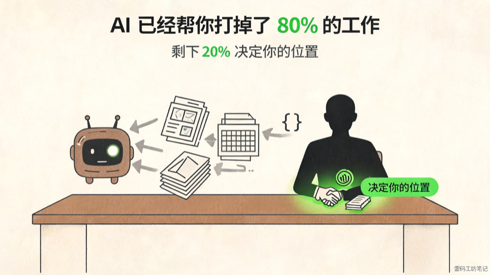
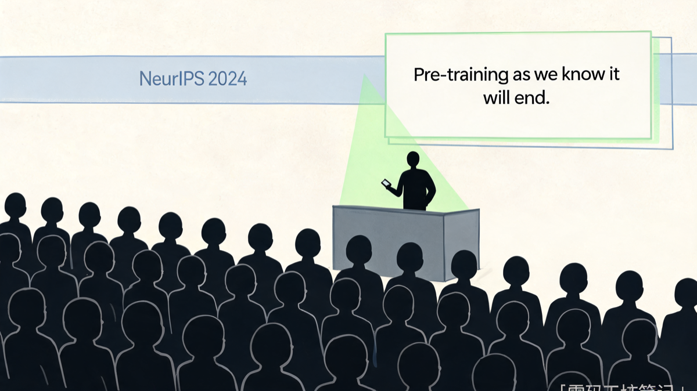
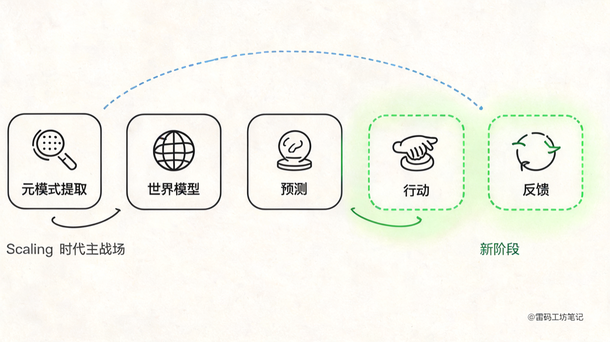
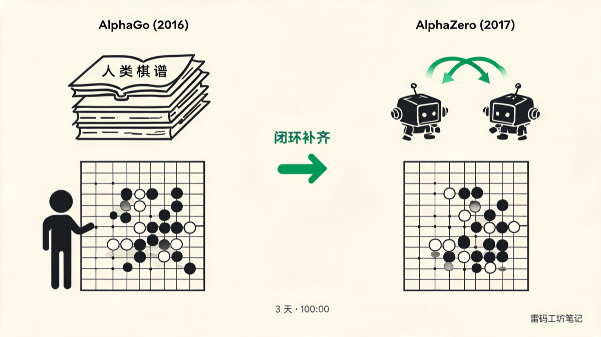
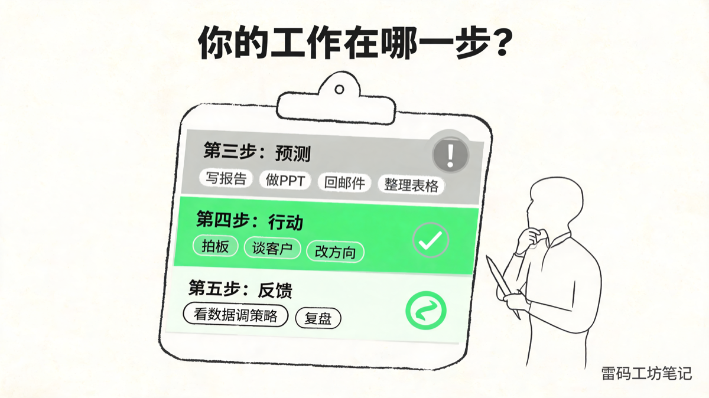
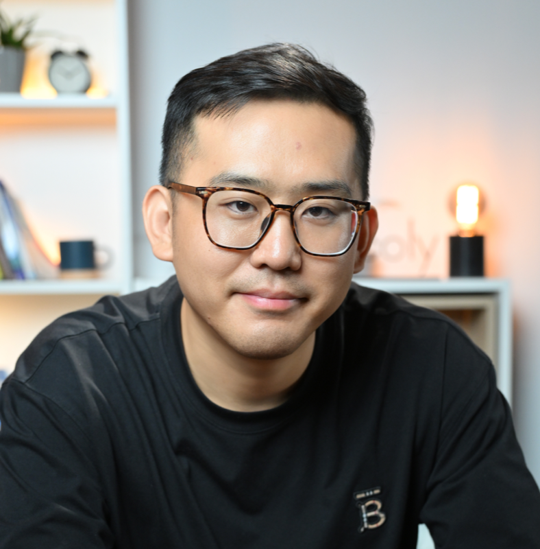

# AI 已经帮你打掉了 80% 的工作，剩下 20% 决定你的位置



> *老雷写在前面*：
>
> *这本来是一个三篇的系列。上一篇立了框架——智能 = 元模式提取 → 世界模型 → 预测 → **行动** → **反馈**。我原计划第二篇向外看产业（AI 进化到什么阶段了），第三篇向内看个人（你会不会被替代）。*
>
> *动笔之后发现：产业现在正在补的那两步，就是你正在补的那两步。硬拆成两篇，写产业那篇结尾你会问"那对我呢"，写个人那篇又得把产业的事重讲一遍。合一篇反而干净。*
>
> *没读过上一篇也不影响。这一篇我会把背景补全，让它独立可读。*

---

## 一、2024 年 12 月，温哥华

那是 NeurIPS 2024 的现场。Ilya Sutskever 上台领 Test of Time Award——这个奖颁给十年前那些定义了整个时代的论文。他和 Hinton、Krizhevsky 合作的 AlexNet 让深度学习从学术边缘走进工业主流，之后所有的 GPT、所有的 Transformer，根上都有那篇 2012 年论文的影子。

台下坐着半个 AI 圈。所有人都以为这会是一场胜利演说。

然后 Ilya 说了那句话：

> *"Pretraining as we know it will end."*
>
> *我们所熟悉的预训练，将会终结。*

他接着把比喻打满：互联网是 AI 的化石燃料。每一条推文、每一本电子书、每一个 GitHub 仓库，都已经被爬下来喂进模型了。地球上没有第二个互联网在等着被发现。

全场震动。亲手推开 Scaling 时代大门的那个人，亲口说这扇门要关上了。



<section style="text-align:center;color:#888;font-size:14px;font-style:italic;margin-top:-0.5em;">2024 年 12 月，NeurIPS 现场，Ilya 在领奖台上抛出那句话</section>

我刷到这条新闻的时候是深夜。如果是别人说的，我会当成又一次唱衰；可这是 Ilya，OpenAI 的前首席科学家，那个把"堆数据、堆参数、堆算力"三件事变成行业宗教的人。他没有理由唱衰自己亲手建起来的东西。

所以他说的"完了"，到底指什么完了？完了之后呢？

这件事和你的工作有什么关系？

这篇文章就是讲这件事的。一句话剧透：Ilya 说的不是 AI 完了，是 AI 完成了第一阶段，要进第二阶段。而你的工作，正好也站在同一个转折点上。

---

## 二、半年来的"见顶"叙事

接下来的半年，"见顶论"在国内外科技圈反复出现。

The Information 报道 OpenAI 的下一代模型 Orion 进步幅度低于预期。Yann LeCun 不止一次在演讲里说 LLM 是死胡同，要走世界模型那条路。媒体追着写「Scaling Law 失效」「AI 寒冬要来了」「巨头估值见顶」。国内的一线分析师开始算 GPT-5 如果难产，对一级市场意味着什么。

朋友圈里能看出来情绪在变。2023 年所有人都在转 ChatGPT 的截图，惊叹"奇点要来了"；到 2024 年下半年，转发的多是冷思考、质疑和唱衰。

但奇怪的事情同时在发生。

如果你也是 AI 重度用户，你大概率体感到过同一件事：**模型本身的进步在变慢，可你的产出力在加速翻倍**。

我去年的体感是这样的：新版模型每一代都用，每一代都有进步，但都属于优化，谈不上革命。给一段相同的 prompt 让两代模型分别写，差别没那么大。但同期我的产出——文章数、配图数、对外发布的小工具数——肉眼可见在翻倍。

这两件事拼不起来。如果 AI 真的见顶了，给我的产出加成应该也跟着平掉。可现实是模型迭代曲线在变平，而我和身边一批重度用户的工作方式却在被加速重写。

哪里出了问题？

---

## 三、先把智能这件事说清楚

要理解 Ilya 说的"完了"是什么意思，得先把智能这件事说清楚。

上一篇我立了一个框架。即使你没读过那篇，这一段也够你接住后面所有内容。

**智能不是 IQ，不是知识量，不是会不会做题。智能是一个五步闭环：**

```
元模式提取 → 世界模型 → 预测 → 行动 → 反馈
   (输入)    (内部表征)  (推演)  (干预)  (校正)
```



<section style="text-align:center;color:#888;font-size:14px;font-style:italic;margin-top:-0.5em;">智能五步框架——前三步已是 Scaling 时代主战场，后两步刚刚启动</section>

每一步我用一句话讲清楚：

- 元模式提取：从一堆经验里抽出共性规律。看了 1000 张猫的照片，你抽出了"猫"这个概念。
- 世界模型：把抽出的规律压成内部的世界表征。你脑子里有了一套关于猫怎么动、怎么叫、怎么躲的模型。
- 预测：用这套世界模型对接下来要发生的事做推演。听到喵的一声，你能预测背后有只猫。
- 行动：基于预测主动去做事。你伸手去逗它。
- 反馈：从行动结果里拿到信号，回头校正世界模型。它跑了，你下次知道不要伸手太快。

五步是个闭环，缺一不可。一个智能体如果只会前三步——只会看、只会想、只会预测——它就是个图书馆里的学生，背了很多书，没办过事。聪明，但脆弱。

现在拿这五步去对当下的 AI 大模型：

- 元模式提取 ✓ 整个互联网的文本里几乎所有可见的元模式都被抽过一遍
- 世界模型 ✓ 千亿参数里压缩着人类知识的高维表征
- 预测 ✓ 给一段上下文，输出下一个 token 的概率分布——这就是 Transformer 在做的事

打勾打到第三步，全部完成。然后呢？

第四步、第五步，2024 年底之前的所有 Scaling 努力，几乎一步都没走。

模型不能真正"行动"。它只能输出文字，输出完就结束。它不能去执行代码、调用工具、操作文件、和环境交互。它也没有第五步的"反馈"——它不知道自己昨天那句话是不是把事办成了，因为它根本没办过事。

Scaling Law 那条曲线，本质上是在把前三步推到极致：把元模式抽得越来越细、世界模型压得越来越大、下一个 token 预测得越来越准。

到 2024 年底，这条曲线见到天花板了。因为前三步只能从静态文本里挤——互联网那点存量挤干了。

智能没走到头。Scaling Law 走完了自己的本职工作。

把一个学生关在图书馆里背书背了十年，背到全世界没有他没看过的书。然后他出来了。这时候他写一篇命题作文还不错，但你让他真去开个公司、做个产品、谈个客户——他从来没做过。

要让他变得更"聪明"，你不能再让他多背一本书。

你得让他出去做事，然后告诉他做错了。

---

## 四、产业其实没停，只是悄悄换了发动机

所有人都以为 Scaling 见顶之后大家会束手就擒。结果完全相反——战场只是从前三步挪到了后两步。

过去 18 个月里，业内真正在干的事是这些：

**关于"行动"**：OpenAI 推 o1 和 o3，主打推理时间强化学习。Anthropic 在 Claude 里加入 Computer Use，让模型可以直接操作鼠标键盘浏览器。一批 agent 产品起来了——能读文件、跑命令、看终端输出、调用工具、操作网页表单。模型不再只是聊天助手，开始变成可以下手做事的执行者。

**关于"反馈"**：从 RLHF（人类反馈强化学习）到 RLAIF（AI 自己给反馈），再到 Agentic RL——让 agent 在真实任务里跑，用任务是否完成作为奖励信号。数学题和代码任务尤其爆发，因为这两个领域有"可验证奖励"：代码跑通就是跑通，数学证明对就是对，不需要人来判分。模型可以自己出题、自己解、自己验证、自己改进——闭环全自动跑起来。

这就是为什么 2025 年所有强推理模型一上来都先在数学和代码上突破。

业内只是悄悄换了发动机。前三步那台老发动机烧的是化石燃料（互联网文本），烧得差不多了。后两步那台新发动机烧的是闭环里自己产出的合成数据——模型采取行动、拿到反馈、自我更新，循环往复。

---

## 五、AlphaGo 已经走过这条路

如果你觉得这套"换发动机"的剧本有点眼熟，那是因为 DeepMind 十年前就演过一遍了。

2016 年的 AlphaGo 打败李世石，用的是监督学习——先看几十万局人类棋谱，学会人类怎么下。本质上就是预测：给定棋盘，预测人类高手下一步会下哪。这是五步框架的前三步。

AlphaGo 已经是世界最强围棋 AI 了。如果按今天"AI 见顶"的逻辑，那就是终点了。

但 DeepMind 做了另外一件事。

2017 年他们推出 AlphaGo Zero，扔掉所有人类棋谱，让 AI 自己跟自己下。从零开始，自我对弈，每一局结果都是一次反馈。三天之后，AlphaGo Zero 100:0 击败了打败李世石的那个 AlphaGo。

再之后是 AlphaZero——同一套自我对弈框架，同一套算法，迁移到国际象棋、将棋，全部碾压人类历史上所有引擎。



<section style="text-align:center;color:#888;font-size:14px;font-style:italic;margin-top:-0.5em;">从 AlphaGo 学人类棋谱，到 AlphaZero 自我对弈——闭环补齐的那一步</section>

AlphaZero 比 AlphaGo 强的原因只有一个：闭环补齐了。参数没多多少，棋谱反而见得更少——它从零开始自己跟自己下。行动（下棋）和反馈（输赢）两步彻底跑通，模型就可以无限次自我升级。

LLM 现在面对的，是同一个转折点。

只不过棋盘从 19×19 的格子，换成了整个数字世界——所有的代码、所有的文档、所有的 API、所有的网页表单、所有可以被模型操作的接口。

Ilya 那句话的真正意思在这里。他没在说 AI 完了。他在说：AlphaGo 那一段已经训练到头了，AlphaZero 那一段才刚刚开始。

---

## 六、产业在补的两步，正是你在补的两步

写到这里我本来要进入下一篇——"那对你和我意味着什么"。但坐下来才发现，再写一篇就重复了。

因为这两件事其实是同一件事。

产业在补的那两步——行动和反馈——也是你正在补的那两步。

发生在硅基上叫产业升级，发生在碳基上叫职业升级。底层逻辑完全一样。

想一想你过去一年对 AI 焦虑的来源到底是什么。

"模型变聪明了所以我不行了"——这个说法不准确，没人会因为别人变聪明就失业。

让人焦虑的其实是另一件事：你过去赖以谋生的那些动作——写报告、做方案、回邮件、写 PPT、查资料、画原型、敲代码、做表格——这些动作的本质都是"预测下一个 token"。给一段输入，输出一段合理的输出。

而模型在第三步上已经做得比绝大多数从业者好了。

如果你的工作主要就是这第三步，你已经站在被替代曲线的起点上。

但反过来——如果你的工作大量发生在第四步（行动：拍板、和真实世界博弈、改产品、谈客户）和第五步（反馈：从结果里学到东西、调整下一次的判断），那 AI 在短期内动不了你。因为模型现在也才刚开始补这两步，它还远远没补完。

把这两件事并在一起看，图景就清楚了：

- 大模型没走到头。它把第三步做到了 80 分，接下来要去补第四、五步。
- 你焦虑的根源也在这里。你的工作大半还停留在第三步，接下来你也要去补第四、五步。

人和 AI 没在赛跑。我们在同一条进化路径上，一前一后往同一个方向走。

---

## 七、你这一年是不是也变了

回想一下你过去一年用 AI 的方式，有没有发生过这种变化。

一年前你用 AI 的方式大概是这样的：你描述问题，AI 给一段回答；你把回答复制走，自己拿去用；如果不对，再回来描述问题，AI 给新的回答；你再复制走。AI 是个聊天对象，你在两端跑腿。

现在你用 AI 的方式开始变成这样：你扔给它一个任务，它自己读相关材料、自己尝试、自己看结果、自己改、自己再试一遍，做完跟你说一声"搞定了"。你中间没动手。

如果你也有过这样的体感，停下来想想——**真正变化的是什么？**

变的不是模型的智商。模型本身的"预测下一个 token"能力，这一年其实没有飞跃。变化的是模型现在可以行动（读文件、跑命令、调工具、操作界面），可以接收反馈（看运行结果、解析报错、判断有没有做对），并且基于反馈自动迭代。

第四步和第五步补齐了。

爆发力就在这里。模型本身的"聪明程度"没变多少，但因为补上了行动和反馈，模型从"会答题的助理"变成了"会办事的执行者"。

而你的角色，被悄悄重新定义了。

一年前，你是干活的人，AI 是工具，工具帮你省点力气。

现在，你越来越像设计闭环的人——你给 AI 一个任务、一个执行边界、一个反馈通道，闭环跑起来，结果自己出来。你看的是产出，过程交给闭环。

这件事每天都在发生，已经在每个 AI 重度用户的电脑上发生。而且会越来越快地发生在更多人的电脑上。

问题是——**当你的工作从"做事"变成"设计闭环"时，你的能力结构也要跟着变**。

下一节讲的就是这件事。

---

## 八、用五步法看看你的工作在哪一步

把这五步框架变成自查工具，是这篇文章最实用的部分。



<section style="text-align:center;color:#888;font-size:14px;font-style:italic;margin-top:-0.5em;">把昨天的工作按五步法分类——哪一步最重的人，就站在 AI 时代的哪个位置</section>

试一下：把你昨天的工作分成动作清单，每个动作打一个标签：

- 收集信息、写文档、做 PPT、写代码、回邮件、整理表格 → 大概率是"预测"层（第三步）
- 拍板、和客户当面 battle、推动跨部门协作、修改产品方向、面试招人 → "行动"层（第四步）
- 看销售数据后调策略、从客户投诉里发现新功能、从用户使用路径里发现 PMF → "反馈"层（第五步）

如果你昨天 70% 以上的时间花在第三步，你站在替代风险最高的位置。明天你不会失业，但这条曲线已经开始往下走了。

如果 70% 以上花在第四、第五步，短期你是安全的。

最稀缺的是能把五步全跑通的人——他用 AI 完成第三步（让 AI 帮自己预测、写初稿、整理资料），然后亲自下场做第四步（决策、行动、博弈），并且会从结果里学习做第五步（反馈、迭代、更新自己的世界模型）。

我把这套自查清单按几个常见职位过了一遍，给你一个参考：

- 产品经理：如果你大部分时间在写 PRD、画原型、整理需求文档——第三步。如果你在做用户访谈、推方案落地、看数据调方向——第四第五步。
- 销售：电话约访、写邮件、做演示文档——第三步。陪客户决策、谈商务条款、复盘失单——第四第五步。
- 设计师：出方案、做视觉、画图——第三步。提需求、改方向、跟工程师博弈落地——第四第五步。
- 工程师：写代码、查文档、调 API——第三步。设计架构、修线上故障、看监控调系统——第四第五步。
- 运营/营销：写文案、剪视频、做内容——第三步。看数据调策略、跟用户互动、做品牌决策——第四第五步。

每个职位都有两个层面。AI 短期内吃掉的是第三层，留给人的是第四第五层。

第三层的工作当然有价值。重点在于：**第三层正在被 AI 加速吃掉，你不主动往后两层挪，就只能被推下去**。

聪明的做法只有一条：主动把自己往后两层挪。

让 AI 帮你打掉第三步的体力活，把省下来的时间和精力，全部投到行动和反馈上——亲自做决定，亲自看结果，亲自调整下一次的判断。

这就是这篇文章标题的意思。AI 已经帮你打掉了 80% 的工作，剩下 20% 决定你的位置。

---

## 九、产业的同一道分水岭

把镜头拉回到产业一下，再回到你。

我现在看公司，已经不太用"大模型公司 / 应用层公司"这种分法了。我用一个更简单的分法：

- 还在卷更大模型的——第一阶段公司
- 开始卷更深闭环的——第二阶段公司

第二阶段公司的特征是：它把模型的"行动"和"反馈"做深做透——让 AI 真的能下场做事，并且从做事的结果里学。第一阶段公司的特征是：还在比谁的模型参数大、context 长、benchmark 分数高，但模型出来之后做什么没人说得清。

判断一家 AI 公司未来 18 个月的潜力，看这一件事就够了。

判断一个职场人未来 18 个月的潜力，也是同一件事。还在卷第三步的人，是第一阶段。开始卷第四第五步的人，是第二阶段。

公司和人，是同一道分水岭。

---

## 十、Ilya 此刻在做什么

回到温哥华那场演讲。

Ilya 后来离开了 OpenAI，创办了 SSI（Safe Superintelligence）。这家公司不做产品、不发模型、不接受采访、不参加发布会。融了几十亿美金，安静得像不存在。

业内有各种猜测。我自己的猜测——他在攻闭环更深的那一段。

预测、行动、反馈这三步现在产业能看见、能做。但智能完整闭环的第一步、第二步——元模式提取和世界模型——在 Transformer 这套架构下，已经接近瓶颈了。

如果有人正在做"在 Transformer 之外重新发明一种学习机制，让 AI 真正建立起对物理世界的世界模型"——我相信 Ilya 在那条路上。

他没走到头。他只是觉得第三步已经做完了，他要回到第一第二步去重做。

这就是 Ilya 那场演讲底下藏着的真意思——这段路走完了，下一段路另起一条。

我相信他做得出来。但那是另一个故事，可能要等三年五年才能看见。

至于你和我，不用等三年五年。

下一步立刻可以做：把你工作里的第三步交给 AI，把自己的时间和注意力，全部投到第四步和第五步。

亲自做决定。亲自看结果。亲自学。

闭环跑起来了，你也就跑起来了。

---

## 关于作者



**老雷（Andy）**，明道云 & Nocoly CMO，SaaS 行业从业十余年。骨子里是个技术迷，乔布斯的信徒，相信好的产品能改变世界。深度关注 AI、商业与科技趋势，目前在深度使用和实践 Claude Code，专注探索 AI 如何重塑产品形态和商业逻辑。不聊概念，只聊真实发生的事。
