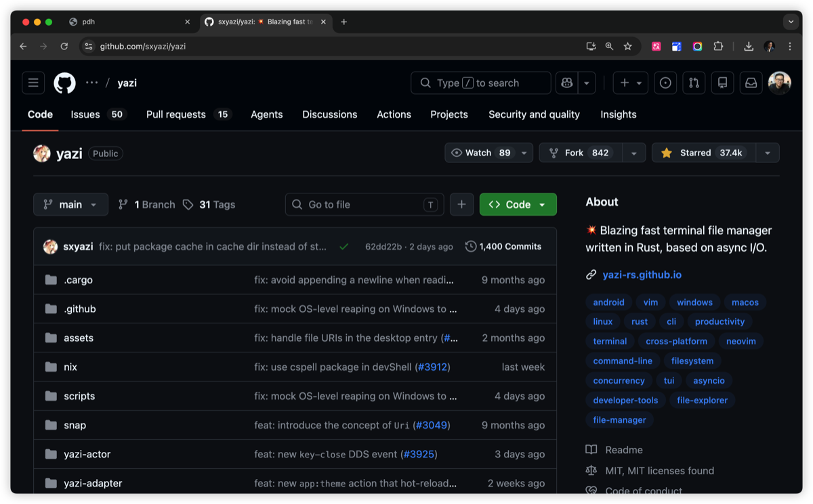
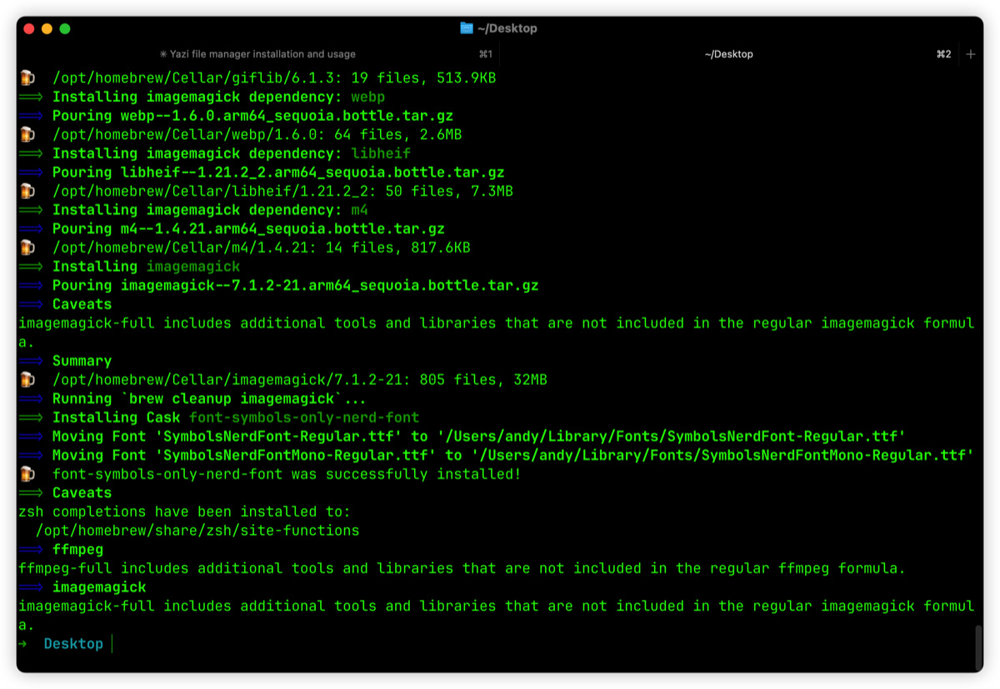
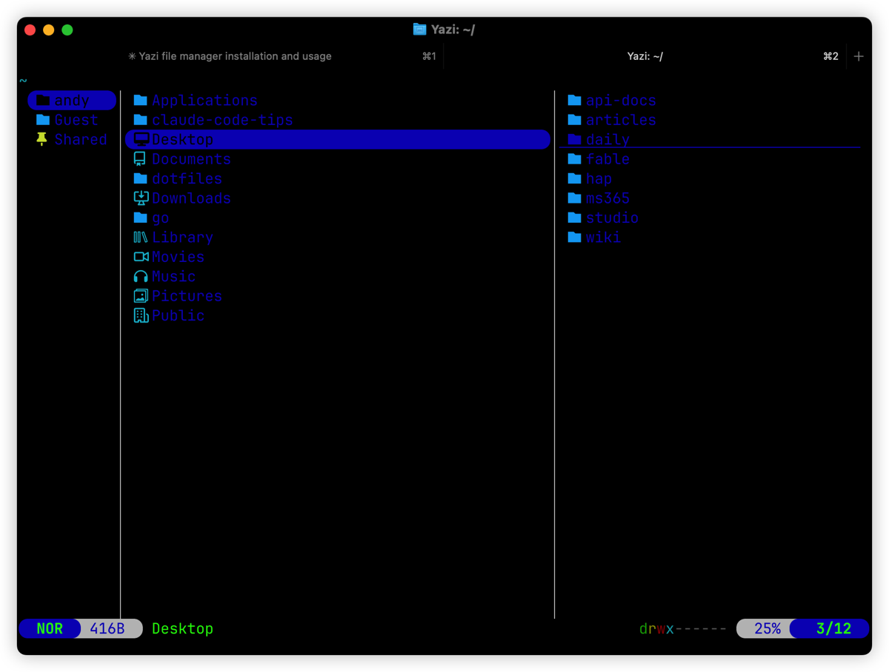
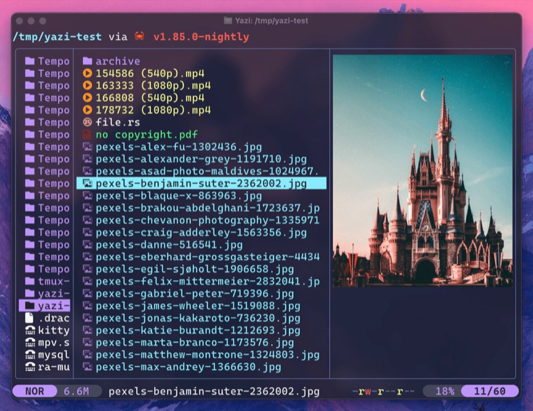
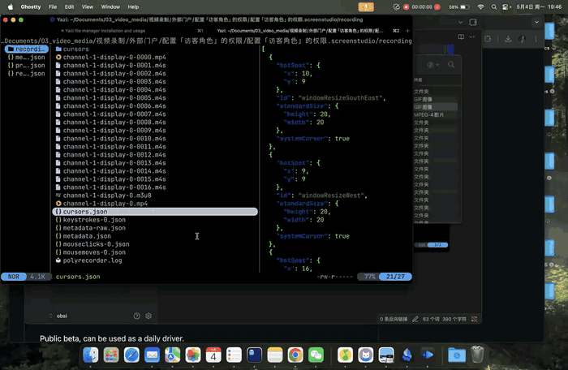
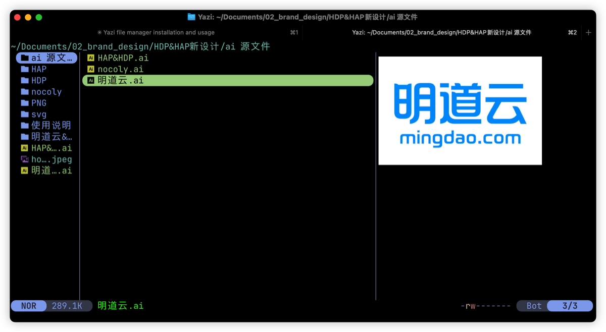

# yazi：终端里的文件管家，给重度 Claude Code 用户

我每天的工作台几乎只有一个 iTerm 窗口。

Claude Code 帮我处理代码、文档、命令行琐事，剩下偶尔要做的就是「看一眼这个文件夹里都有些啥」。但这一眼挺尴尬：`ls` 看不出图片是什么；想瞄个 PDF 得切到 Finder 用空格键 quick look；想找个视频，鼠标点开播放器又跳一个新窗口。

为了一秒钟的查看动作，我得离开终端、动鼠标、再回来。心流就这么断了。

直到我装了 yazi。

---

## 这是什么

yazi 是一个 Rust 写的终端文件管理器，主打异步 I/O 和图片预览。光标移动到一张图、一个视频、一个 PDF 上，右侧栏直接渲染缩略图、播放第一帧、显示文档内容。

项目地址：https://github.com/sxyazi/yazi


*GitHub 上的 yazi 项目页*

---

## 安装

macOS 一条命令搞定，把所有可选依赖都装上才能跑出完整体验：

```sh
brew install yazi ffmpeg sevenzip jq poppler fd ripgrep fzf zoxide resvg imagemagick font-symbols-only-nerd-font
```

后面这堆依赖各司其职：

- `ffmpeg` — 视频缩略图、帧抽取
- `poppler` — PDF 预览
- `fd` / `ripgrep` — 闪电级文件名 / 全文搜索
- `fzf` — 模糊匹配
- `zoxide` — 跳转到历史去过的目录
- `imagemagick` / `resvg` — 图像 / SVG 渲染
- `sevenzip` — 压缩包预览
- `font-symbols-only-nerd-font` — 文件类型图标字体


*一条命令把生态装齐*

---

## 关键一步：让 yazi 能改变 shell 的工作目录

直接 `yazi` 启动、退出后，你的终端还停在原来的目录。但你在 yazi 里翻了半天到 `~/Documents/03_video_media/...`，退出后想接着在那儿干活，shell 不会跟着跳过去。

官方给了一个解法：包一层 `y` 函数。在 `~/.zshrc` 末尾追加：

```sh
function y() {
	local tmp="$(mktemp -t "yazi-cwd.XXXXXX")" cwd
	yazi "$@" --cwd-file="$tmp"
	IFS= read -r -d '' cwd < "$tmp"
	[ -n "$cwd" ] && [ "$cwd" != "$PWD" ] && builtin cd -- "$cwd"
	rm -f -- "$tmp"
}
```

`source ~/.zshrc` 之后用 `y` 启动。退出时 yazi 把最后停留的目录写到一个临时文件里，shell 读到再 `cd` 过去。

这一步看起来小，没装等于体验直接腰斩。yazi 配合终端的核心价值就是「我用键盘逛完，退出，当场在那儿继续敲命令」，链路不能断。

---

## 换主题

yazi 默认主题偏蓝，看久了眼睛累：


*默认蓝色主题，能用但不好看*

社区有一堆 flavor（主题包），用官方包管理器 `ya` 装一行就行：

```sh
ya pkg add yazi-rs/flavors:catppuccin-frappe
```

然后写个 `~/.config/yazi/theme.toml`：

```toml
[flavor]
dark = "catppuccin-frappe"
light = "catppuccin-frappe"
```

退出重进，眼睛立刻舒服很多：


*换上 Catppuccin Frappé 之后*

更多 flavor 在这里挑：https://github.com/yazi-rs/flavors

---

## 视频不只是看缩略图，还能拖时间轴

这是 yazi 让我意外的一点。光标停在 mp4 上，右侧栏出现的不是死的封面。按 `J` 预览前进 5 秒、按 `K` 后退 5 秒，整个视频可以像拖时间轴一样在终端里扫一遍。


*按 J/K 在终端里 seek 视频帧*

我经常用这个找素材：找一段录屏、找一段会议录像里的特定片段，不用打开播放器，键盘按一下就到了。

想要更细的控制可以自定义按键。在 `~/.config/yazi/keymap.toml` 加几行：

```toml
[[mgr.prepend_keymap]]
on = [".", "j"]
run = "seek 1"
desc = "前进 1 秒（微调）"

[[mgr.prepend_keymap]]
on = [".", "J"]
run = "seek 30"
desc = "前进 30 秒（快跳）"
```

这样就有了 5 秒（J）、1 秒（. j）、30 秒（. J）三档。

> 小坑提醒：yazi 25.5.31 之后把配置段名 `[manager]` 改成了 `[mgr]`。如果你的 keymap 怎么改都不生效，先看是不是写错段名了。新装用户高频踩这个。

---

## 打开方式调教：别用 QuickTime 看视频

yazi 里按 Enter 默认调系统打开。视频走 QuickTime 有个老毛病：QT 已经开着窗口的时候，再 `open` 一个新视频，它经常不切换，停在原来那个上面。我连开三个 mp4，QuickTime 给我看的是同一个 4 秒片段，对错俩小时。

解决方法是装 IINA（macOS 上最好用的播放器），让 yazi 视频默认调它：

```sh
brew install --cask iina
```

然后写 `~/.config/yazi/yazi.toml`：

```toml
[opener]
play = [
  { run = 'open -a IINA "$@"', orphan = true, desc = "IINA", for = "macos" },
  { run = 'open "$@"', orphan = true, desc = "Default", for = "macos" },
]

[open]
prepend_rules = [
  { mime = "video/*", use = "play" },
  { mime = "audio/*", use = "play" },
]
```

每个视频独立窗口，不会串。

---

## 常用按键速查

进 yazi 后按 `~` 调出完整 help。最高频的几个我列一下：

| 键 | 作用 |
|---|---|
| `h j k l` | 左 / 下 / 上 / 右（vim 风） |
| `Enter` | 进目录 / 打开文件 |
| `Space` | 多选切换 |
| `y` / `x` / `p` | 复制 / 剪切 / 粘贴 |
| `d` / `D` | 移到回收站 / 永久删除 |
| `a` | 新建文件（结尾 `/` = 建目录） |
| `r` | 重命名 |
| `/` | 当前目录过滤 |
| `s` | fd 全局搜索文件 |
| `S` | ripgrep 搜文件内容 |
| `z` | zoxide 跳转历史目录 |
| `Tab` | 切换多 tab |
| `:` | 命令模式 |
| `q` | 退出 |

图片预览效果给你看一眼：


*光标移到图片上，右侧直接渲染*

---

## 我没搞定的：Office 文件实时预览

诚实说一段。docx / xlsx / pptx 这种 office 文件，我一开始想把它们做成右侧栏直接显示文本的预览，用 piper 插件配 pandoc 和 xlsx2csv 转纯文本输出。

理论链路是通的：脚本在 shell 里手动跑，转文本完全没问题。但接到 yazi 26.1.22 的 `prepend_previewers` 上，规则就是不响应。mime 匹配试过，url 后缀匹配也试过，TOML 解析过，piper 插件装好，段名改成 26 版的 `[mgr]`，yazi 彻底重启过，右侧栏还是显示默认的 `Microsoft Excel 2007+`。

折腾两个小时没结果，停手了。最终的工作流改成：office 文件按 Enter 走系统默认打开，Mac 上有 WPS 就 WPS，没有就 Pages / Numbers / Keynote。秒开、能编辑。比硬要在终端里渲染纯文本舒服。

> 工具上的妥协不丢人。键盘搞定 80% 高频动作就值回票价，剩下 20% 该弹原生 App 就弹。

---

## 为什么这套组合对 Claude Code 用户特别值

我自己的体感：装完 yazi 之后，**Finder 打开次数从一天十几次变成两三次**。

说穿了 Finder 的活我大部分时候根本不需要。「管理文件」这种重活很少出现，更多时候我只需要「瞄一眼」。CC 帮我处理掉绝大多数实操（写代码、改文档、跑脚本、搜索内容、回答问题），yazi 补齐了那块「不切窗口浏览」的空白。

整个工作流变成：

- 一个 iTerm，左边 CC 跟我对话
- 需要看图 / 视频 / PDF / 文件结构，切到另一个 tab，`y` 进 yazi，键盘翻完 `q` 退出
- 退出当场 `cd` 在了那个目录
- 继续跟 CC 干活

少切窗口、少动鼠标、心流不断。这事儿真正的价值在**注意力不被打散**，省下几秒操作时间反倒是次要的。这也是我推荐给所有重度终端 / CC 用户的核心原因。

工具不是越多越好。工作流里的关键空白被填上，体感会突然一下子顺。yazi 对我就是干了这件事。

---

## 关于作者

**老雷（Andy）**，明道云 & Nocoly CMO，SaaS 行业从业十余年。骨子里是个技术迷，乔布斯的信徒，相信好的产品能改变世界。深度关注 AI、商业与科技趋势，目前在深度使用和实践 Claude Code，专注探索 AI 如何重塑产品形态和商业逻辑。不聊概念，只聊真实发生的事。
