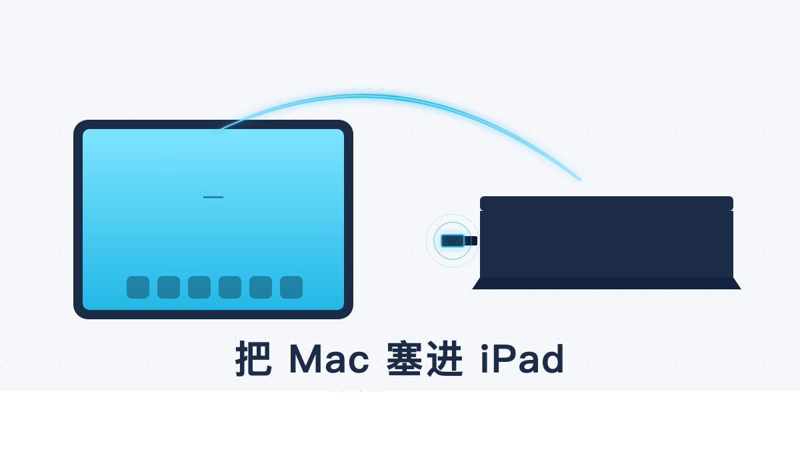

# 我把整台 Mac 塞进了 iPad，从此电脑关机也能 vibe coding

上周外出，突然想起白天那个改了一半的 PR 还没 push。包里只带了 iPad。

放在三个月前我会认命，等晚上回家再说。但那天我顺手在 iPad 上点开了网易 UU 远程，输了一下密码，家里那台 Mac 完整地出现在屏幕上，Claude Code 还停在我中午离开时的那个 session，光标在那一行闪。

我接着写完，commit、push，关掉 iPad 看窗外。前后没超过五分钟。

*iPad 上的 Mac 桌面，完整的 macOS*

[几天前我写过一篇 ——「我把 Claude Code 塞进了微信，从此可以躺在床上写代码」](https://mp.weixin.qq.com/)。那篇解决的是"不想走到桌前"，这篇解决的是"人根本不在桌前"。背后是同一个执念：我不想被物理位置绑住。

---

## 一、为什么需要这个东西

vibe coding 这件事很怕摩擦。一个想法冒出来，三十秒之内得能开始改，开机、打开 IDE、找到文件、装上下文，每多一步都在劝退。上周吃饭吃到一半，我突然想起一个变量名拼错了，掏 iPad 半分钟改完，回头继续吃。这种事 IDE 是给不了的，得有那台 Mac。

微信桥解决了"懒得走过去"，但它有一道天花板：它只能聊天。我让它跑脚本、读文件、改 commit 都行，但当我需要看一个 markdown 渲染、扫一眼 Chrome 里某个页面、对着一份设计稿一行行调，对话式入口就不够了。

我需要一台 24/7 在线、随时可视化操控的 Mac。

---

## 二、试过的四个方案，前三个都没留下来

**Termius + Tailscale**——技术圈的标准答案。Tailscale 拉一条内网隧道，Termius 走 SSH 进去。稳，但只有终端。Claude Code 写到一半要预览一张图、看一下渲染好的 README、打开 Chrome DevTools，纯终端永远卡在第一步。我用了两个月，最后发现自己每次都得切回 Mac 跟前，只是为了看一眼东西。

**Paseo**——一个技术同事重度推荐。自带文件预览，看着像 Termius 的进化版。

*Paseo 在手机和 Mac 上的双端界面*

用下来感觉技术不够成熟。多项目切换不如终端那种 tab 顺手；偶尔卡顿；遇到长输出会丢字符。最关键的是它仍然是一个对话式入口，我跟它的关系是问答，不是操控。

**Claude Code 自带的 web/remote 模式**——官方方案。听上去最对，实际经常掉线。重连之后 session 状态丢了一截。本质也是对话式入口，切终端、看文件、跑长任务都不顺。

**Screens**——Mac 圈里有名的 VNC 客户端。付费、生态封闭。让我最介意的是它解决不了 Mac 自己关机/休眠的问题，Mac 黑了，你访问进去也是一片黑。这个根问题不解，再贵的客户端都白搭。

四个方案试完，没找到一个能留下来的。

---

## 三、最后留下的，是一个游戏加速器

转折点很意外。偶尔看到小红书上的推荐，说网易 UU 远程做 vibe coding 有惊喜。我装的时候随手翻了翻这个 app，发现它有个"远程电脑"功能。

> 网易 UU 本来是给云游戏和远程联机用的。它把一台电脑的画面、声音、键盘鼠标毫秒级地传到另一台设备上，这事它已经为了让人打游戏不卡，调了好多年。

我登了一下试试。第一次进我家 Mac，画面流畅得超出我预期，比之前用过的任何方案都顺。

*家里的 Mac 访问公司的 Mac，全屏丝滑*

后来我才反应过来，这帮人为了把《黑神话》串到客厅电视，把延迟优化到了什么程度。远程 vibe coding 是我顺手蹭的副作用。

UU 远程能打动我的几点：完全免费，网易主营是游戏加速器，远程功能附赠，没有任何订阅；多端原生，iPhone、iPad、Android、Windows、Mac 全平台，iPad 上是真正的 iOS app，不是套壳浏览器；延迟低，5G 信号下我开 Claude Code 几乎感觉不出来是远程；零配置，下载、登录、扫码授权三步上手，没有 Tailscale、没有 SSH、没有端口转发。

它意外地把我需要的东西打包好了。

*手机上访问 Mac——临时改一行代码再也不用找电脑*

---

## 四、还差最后一步：HDMI 欺骗器

但我很快撞上了一个所有 Mac 用户都熟悉的鬼问题：合上盖子，Mac 就睡了。

更阴间的是，就算我让它一直插着电、设置成"永不睡眠"，只要外接显示器拔掉，macOS 还是会把分辨率降到一个奇怪的 1024×768，桌面元素全部错位。远程进去看到的是一坨乱码般的窗口。这是 macOS 的图形系统在偷懒：它认为没有显示器就不需要好好画桌面。

解法叫 HDMI 欺骗器（HDMI Dummy Plug）。淘宝几十块钱一个。

*HDMI 欺骗器——一根比 U 盘还小的东西，骗 Mac 以为外接了 4K 屏*

它就是一个假显示器：插在 Mac 的 HDMI 或 Type-C 口上，里面写死了一份 EDID 信息（"我是一块 4K 60Hz 显示器"）。Mac 信以为真，按 4K 分辨率持续渲染桌面。

买的时候认准两点：支持 4K@60Hz，别买只到 1080p 的廉价款，远程进 iPad 上分辨率不够会糊；接口对应你的 Mac，M1/M2 选 Type-C 款，老 Intel Mac 或 Mac mini 选 HDMI 款。

插上之后，合盖、关灯、整个房间黑下来，Mac 在那里持续工作。我在另一个城市打开 iPad，桌面依然是 4K 高清的完整布局。

没有这一步，再好的远程软件都只能看到一台正在睡觉的 Mac。

---

## 五、用起来是什么感觉

高铁上：iPad 打开 UU，Mac 屏完整出现。Claude Code 还在昨晚那个 session 里，连未保存的 buffer 都在。

周末咖啡馆，朋友问我能不能帮他看一段 Python 报错。我在自己的 iPad 上调出家里 Mac 的 Cursor 环境，把他的代码贴进去让 Claude Code 现场诊断。他全程坐我对面，看着 iPad 上一台远在三公里外的 Mac 替我们干活。他问我这是哪家云 IDE，我说是我家书桌。

去海外出差。落地插上当地 SIM 卡，UU 一登，跟在家里没差别。家里那台 Mac 是我的"AI 工厂"，完整的 MCP 配置、所有的密钥、所有跑过一半的项目都在那里。它不该被我的物理位置绑死。

---

## 六、为什么是 UU，不是别的

绕了一圈最终留下来的，竟然是游戏加速器。我自己也意外。

免费这一点就压过另外三个：Termius 收费、Paseo 收费、Screens 收费。免费的产品天然有更高的容错率，我敢推荐给身边所有人。其次，网易做了多年云游戏的延迟优化，副作用是远程操作丝滑。专业 SSH 工具反而做不到这种端到端的低延迟，因为它们没有图形传输的硬实力。再者，iPad 上是真正的 iOS app，不是 web 套壳，手势、外接键盘、横竖屏切换全部跟 iPad 本身的体验一致。最后是入口低，同事的 iPad 装一个，连上 Mac 看一份 Numbers 表格，Tailscale + SSH 那套对非技术用户基本是天书。

还有一个我自己想了很久才想明白的事：它本来不是给我写代码用的工具，这反而是优点。一个为云游戏调延迟的产品没有"专业开发者工具"的傲慢，它的目标用户是要在沙发上吃薯片打《艾尔登法环》的人，对延迟、对易用性、对多端体验的要求比开发者工具苛刻得多。

vibe coding 是我蹭到了游戏玩家积累了多年的红利。

---

## 七、写代码这件事，正在离开桌面

上一篇我说过：把 Claude Code 塞进微信，使用频率从一天十次变成五十次。这一篇我想说一个更具体的事：游戏加速器变成了我的远程 IDE，HDMI 欺骗器变成了我的 dev box 唤醒器。这两样东西原本和编程没关系。

我没法预测未来五年开发设备会长成什么样。但我知道，过去那一整套仪式——双显示器、机械键盘、Aeron 椅子——已经不是必须的了。前几天我朋友看到我在 iPad 上写代码，问我这能算开发吗。我说我不知道算不算，反正活已经干完了。

---

## 关于作者

**老雷（Andy）**，明道云 & Nocoly CMO，SaaS 行业从业十余年。骨子里是个技术迷，乔布斯的信徒，相信好的产品能改变世界。深度关注 AI、商业与科技趋势，目前在深度使用和实践 Claude Code，专注探索 AI 如何重塑产品形态和商业逻辑。不聊概念，只聊真实发生的事。
