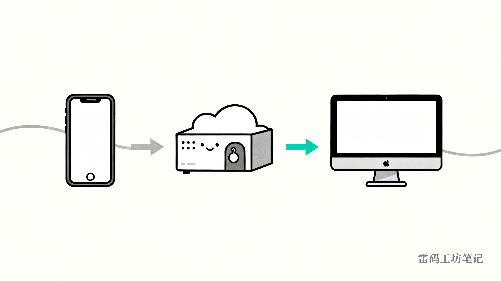

# 人在外面，怎么稳稳连回家里那台 Mac

周末跑出去办事，临时想连回家里的 Mac 拿个文件、跑一段脚本。掏出手机，Tailscale 是开着的，SSH 一连——转圈，半天没反应；好不容易连上，打字一顿一顿，敲一个字等半秒。

我以前就这么忍着用，时灵时不灵。后来花了点时间把它彻底搞明白：卡在哪、怎么绕过去、连上之后怎么长期顺手地用。配一次，长期能用。这篇把方法从头讲到尾，你照着抄就行。


---

## 先搞懂为什么卡

Tailscale 让你的设备组成一张私有网络，互相能用一个固定的内网 IP 直接访问。它的逻辑是：能点对点直连就直连；直连打不通，就走它自己的中转服务器（官方叫 DERP）帮你转发。

问题就出在这个中转。

你的手机在移动网络后面，家里的 Mac 在路由器后面，两边都没有对外暴露的固定地址。它俩想直连，得各自在自家路由器上"打个洞"。手机在运营商的大内网里，这个洞经常打不通——于是只能退回去走中转。

而 Tailscale 离我们最近的几台中转在东京、香港，正好卡在墙上。又慢又容易断。手机连家里 Mac，十次有八次掉进这条又堵又远的中转路，结果就是连不上、卡成 PPT。

Tailscale 本身没毛病，问题在于国内的网络环境把它最依赖的那条退路堵死了。

---

## 思路：找一个谁都找得到的中间人

换个角度想。手机找不到家里 Mac 的门，这没法改。但有一样东西，手机能轻松找到，家里的 Mac 也能轻松找到——**一台有公网 IP 的云服务器**。

公网 IP 就像一个挂在门口、全世界都看得见的门牌号。手机连它，像打开一个网站一样直接，不需要打洞；家里的 Mac 连它，也是主动连出去，照样直接。

那就让这台云服务器居中搭桥。手机先连上它，再从它身上跳进你的 Mac。这台云服务器在中间当**跳板**。

第二段（跳板 → Mac）虽然还是走 Tailscale，但跳板有固定公网 IP，和你的 Mac 之间很容易打通直连。我实测过，国内云服务器到家里的 Mac，预热之后稳定在 10ms 上下，全程不碰那条被墙的中转。

整条路长这样：



```
手机 ──(公网直连，快)──▶ 云服务器(公网IP) ──(Tailscale 直连，~10ms)──▶ 家里的 Mac
```

---

## 需要准备什么

三样东西：

1. 一台有公网 IP 的云服务器。腾讯云轻量、阿里云、搬瓦工都行，几十块一个月。国内的设备就买国内节点，延迟最低。系统用 Ubuntu 省事。
2. 你的 Mac 装好 Tailscale、登录，并在「系统设置 → 通用 → 共享」里打开「远程登录」（也就是 SSH）。
3. 云服务器也装 Tailscale，登录同一个账号，让它和 Mac 进同一张网。

云服务器装 Tailscale 一行命令：

```
curl -fsSL https://tailscale.com/install.sh | sh && sudo tailscale up
```

装完跑 `tailscale status`，能看到你的 Mac 就对了。记下 Mac 那台的 Tailscale IP（100 开头），下面要用。

---

## 动手配置

下面的命令都在**云服务器**上跑。占位符按你自己的改：`<MAC_IP>` 是 Mac 的 Tailscale IP，`<MAC_USER>` 是你 Mac 的登录用户名。

**第一步，让云服务器免密进 Mac。** 先在云服务器生成密钥：

```
ssh-keygen -t ed25519 -N "" -f ~/.ssh/id_ed25519
cat ~/.ssh/id_ed25519.pub
```

把打印出来的这串公钥，复制到你 Mac 的 `~/.ssh/authorized_keys` 文件里（一行）。之后云服务器连 Mac 就不用输密码了。

**第二步，设一个快捷命令。** 不然每次都要敲一长串 IP。编辑云服务器的 `~/.ssh/config`，加上：

```
Host mac
    HostName <MAC_IP>
    User <MAC_USER>
    StrictHostKeyChecking accept-new
```

那行 `accept-new` 是关键，省得第一次连接被"主机指纹"卡住。配好以后，在云服务器上直接敲 `ssh mac` 就进 Mac 了。

想更短，往 `~/.bashrc` 里加个别名：

```
alias mac='ssh <MAC_USER>@<MAC_IP>'
```

以后敲一个 `mac` 回车就进去。

---

## 想要更跟手的体验，再加 mosh

纯 SSH 在网络一抖就断、延迟一高就卡。mosh 能解决这两件事：断网自动续上、本地即时回显（你打的字立刻显示，不用等服务器回包）。

哪一段用 mosh，得看哪一段网络差。**手机 → 云服务器**这段走的是移动网络，信号忽强忽弱、还会在 Wi-Fi 和 4G 之间切，最该用 mosh，体验提升最明显。手机端的 Termius、Blink、Moshi 这些客户端都内置 mosh，连的时候选 mosh 就行。**云服务器 → Mac**这段在机房里走 Tailscale 直连，本来就稳，用普通 ssh 就够，后面会讲到这段用 ssh 还能少一类麻烦。

如果你也想在云服务器 → Mac 这段用 mosh，Mac 上装一下：`brew install mosh`；云服务器上装：`sudo apt install -y mosh`。这里有两个坑，踩过的人都知道有多烦：

一是 Mac 上 mosh-server 的路径。Homebrew 装的在 `/opt/homebrew/bin/mosh-server`，但 SSH 进去时的环境变量里往往没有这个路径，mosh 会报"找不到 mosh-server"。解决办法是连的时候手动指定路径：

```
alias mmac='mosh --server=/opt/homebrew/bin/mosh-server <MAC_USER>@<MAC_IP>'
```

二是防火墙。mosh 走的是 UDP（默认 60000-61000 这段），而 SSH 走 TCP。很多人云服务器上 SSH 通、mosh 死活连不上，就是因为云厂商的安全组只开了 TCP 22，没开 UDP。去你云服务器的安全组/防火墙里，加一条入站规则：协议 UDP，端口 60000-61000，来源 0.0.0.0/0，放行。mosh 自带会话密钥，开这个端口是安全的。

---

## 连上只是第一步，断了要能回到原地

mosh 解决的是"网线抖一下不断"。但有几种情况它接不住：你切到别的 App 太久、手机重启、或者顺手关掉终端又重开——再连进去，常常是一个全新的 shell，刚才跑到一半的脚本、Claude Code 的对话、翻了半天的命令历史，全没了。mosh 自己没有"重新接回上一个会话"的本事。

补这一块的是 **tmux**。把它想成一个常驻在 Mac 里的"工作间"：你所有的活都在工作间里干，连接只是通到工作间的一根网线。网线断了、换了，工作间原封不动地在那等你。


理解这套的关键是分清两层：

```
tmux 会话（工作间）  ← 程序、对话、命令历史都在这，常驻 Mac，不随连接消失
      ▲
      │  连接（ssh / mosh）= 通到工作间的网线，随时可断、可换
      ▼
    你的手机
```

工作间活在 Mac 自己的 tmux 里，跟你连不连、用什么连，没关系。断网那会儿，里面的 agent 照样在跑。所以"连接断了"和"工作丢了"是两回事——只要不手动关掉工作间、不重启 Mac，活就一直在。

Mac 上装一下：`brew install tmux`。然后把跳进去的方式改成"连上就钻进工作间"。在云服务器上，把那个 `mac` 别名换成：

```
alias mac='ssh <MAC_USER>@<MAC_IP> -t "tmux attach || tmux new"'
```

`tmux attach` 接回上一个工作间；要是还没有，`|| tmux new` 就新开一个。这样断网重连、隔天再连，敲一下 `mac` 就回到上次那个画面，agent 还在跑，对话还在。

> 一个提醒：tmux 只在**最终干活的 Mac 上开一层**就够。别在云服务器上也开 tmux 再套一层——前缀键会打架（Ctrl-b 要按两下）、状态栏会叠两条，纯添乱。

---

## 把跳板别名配齐：多台 Mac、多个工作间

如果你像我一样有两台 Mac（一台家里、一台公司），在云服务器上配一套别名，管起来会顺手很多。下面这套加到云服务器的 `~/.bashrc`，`<HOME_IP>` / `<WORK_IP>` 换成两台 Mac 各自的 Tailscale IP：

```
# 直接 ssh 进去（纯 shell，不进 tmux）
alias home='ssh <MAC_USER>@<HOME_IP>'
alias work='ssh <MAC_USER>@<WORK_IP>'

# 进去并开一个新 tmux 工作间
alias ht='ssh <MAC_USER>@<HOME_IP> -t "/opt/homebrew/bin/tmux new"'
alias wt='ssh <MAC_USER>@<WORK_IP> -t "/opt/homebrew/bin/tmux new"'

# 看有哪些工作间
alias htl='ssh <MAC_USER>@<HOME_IP> "/opt/homebrew/bin/tmux ls"'
alias wtl='ssh <MAC_USER>@<WORK_IP> "/opt/homebrew/bin/tmux ls"'

# 一把杀光某台的所有工作间
alias htka='ssh <MAC_USER>@<HOME_IP> "/opt/homebrew/bin/tmux kill-server"'
alias wtka='ssh <MAC_USER>@<WORK_IP> "/opt/homebrew/bin/tmux kill-server"'

# 接回最近的工作间；带名字就接指定那个（名字用 htl/wtl 查）
hta(){ if [ -n "$1" ]; then ssh <MAC_USER>@<HOME_IP> -t "/opt/homebrew/bin/tmux attach -t '$1'"; else ssh <MAC_USER>@<HOME_IP> -t "/opt/homebrew/bin/tmux attach || /opt/homebrew/bin/tmux new"; fi; }
wta(){ if [ -n "$1" ]; then ssh <MAC_USER>@<WORK_IP> -t "/opt/homebrew/bin/tmux attach -t '$1'"; else ssh <MAC_USER>@<WORK_IP> -t "/opt/homebrew/bin/tmux attach || /opt/homebrew/bin/tmux new"; fi; }

# 杀掉某台的指定工作间
htk(){ ssh <MAC_USER>@<HOME_IP> "/opt/homebrew/bin/tmux kill-session -t '$1'"; }
wtk(){ ssh <MAC_USER>@<WORK_IP> "/opt/homebrew/bin/tmux kill-session -t '$1'"; }
```

记法很简单：`h`=home、`w`=work，`t`=tmux，`a`=attach（接回）、`l`=list（列表）、`k`=kill（杀）。`ht` 就是 "home tmux 开新的"，`hta` 是 "home tmux 接回最近的"，`htl` 是 "home tmux 看列表"。两台对称，换个字母而已。

这里藏着一个非踩不可的坑：上面别名里 tmux 全写了**全路径** `/opt/homebrew/bin/tmux`。原因是 `ssh 主机 -t "命令"` 跑的是一个不加载 `.zshrc` 的精简 shell，它的 PATH 里没有 Homebrew 那个目录，直接写裸 `tmux` 会报 `command not found`。写全路径就稳了。

---

## 平时怎么用

手机上随便一个 SSH/mosh 客户端（Termius、Blink、Moshi 都行）：

1. 存一个连接，用 mosh 连云服务器的公网 IP。
2. 连上后，敲 `hta` 接回家里 Mac 的工作间，或 `wta` 接回公司那台。要全新开就用 `ht` / `wt`。

就这两下。中途手机断网、锁屏、换地方，回来重连云服务器，再敲一次 `hta`，画面、agent、对话原样接回来。

还有个意外的好处：这套方案下，**手机根本不用开 Tailscale**。手机连的是云服务器的公网 IP，走普通公网。要开 Tailscale 的是云服务器和你那几台 Mac——它们必须一直开着，Mac 也别关机、别睡死，否则跳板就够不到了。

---

## 维护：别让 mosh 进程在背后堆成山

用久了会冒出一个小毛病：**mosh-server 进程越攒越多**。

原因在 mosh 的工作方式。每开一次 mosh 连接，被连的那台就起一个 mosh-server 守着。可你手机切 App、锁屏、换网、杀客户端的时候，连接是断了，但 mosh-server 不知道你是暂时离开还是再也不回，默认就一直活着等你重连——这是它能"漫游、断网续上"的代价。下次你重连往往又新起一个，旧的就成了没人连、空等的"孤儿"，杵在那占内存。

它会堆在两个地方：

- **云服务器上**：每条 手机→服务器 的 mosh 连接留一个。
- **每台 Mac 上**：如果你 服务器→Mac 这段也用了 mosh，断一次就在 Mac 上留一个。

这也是前面说"服务器 → Mac 这段建议用普通 ssh"的实际理由：ssh 断了进程自己就退干净，不留孤儿；这段网络本来就稳，没必要上 mosh。把 mosh 留给真正需要它的 手机→服务器 那段，孤儿就只会出现在云服务器一处，好管。

清理本身不用担心丢东西。**杀掉 mosh-server，不等于丢工作间**——你的活都在 tmux 里，mosh-server 只存了一份屏幕缓存，杀了重连，tmux 会把当前画面完整重画出来，实际损失约等于零。

最省事的是让机器自己定时清。下面这个脚本会保留你**当前正在用的**那个连接，只杀掉闲置超过设定天数的孤儿（Mac 和 Linux 通用）：

```bash
#!/usr/bin/env bash
# 清理本机闲置的死 mosh 残留 (Linux + macOS 通用)。用法: mosh-clean [闲置天数阈值, 默认3]
days=${1:-3}; thresh=$((days*86400)); now=$(date +%s)
mtime(){ stat -f %m "$1" 2>/dev/null || stat -c %Y "$1" 2>/dev/null; }
idle_of(){
  local ch tty dev m
  ch=$(pgrep -P "$1" | head -1)
  tty=$(ps -o tty= -p "${ch:-0}" 2>/dev/null | tr -d ' ')
  if [ -n "$tty" ] && [ "$tty" != "?" ] && [ "$tty" != "??" ]; then
    case "$tty" in /dev/*) dev="$tty";; *) dev="/dev/$tty";; esac
    m=$(mtime "$dev"); [ -n "$m" ] && { echo $((now-m)); return; }
  fi
  echo 999999999
}
servers=$(ps -eo pid,comm | awk '/mosh-server/{print $1}')
fresh=""; fmin=999999999
for p in $servers; do i=$(idle_of "$p"); [ "$i" -lt "$fmin" ] && { fmin=$i; fresh=$p; }; done
killed=0; kept=0
for p in $servers; do
  i=$(idle_of "$p")
  if [ "$p" = "$fresh" ] || [ "$i" -le "$thresh" ]; then
    kept=$((kept+1)); echo "$(date '+%F %T') keep  $p idle=${i}s"
  else
    ch=$(pgrep -P "$p" | head -1); gc=""; for c in $ch; do gc="$gc $(pgrep -P "$c")"; done
    kill $p $ch $gc 2>/dev/null; sleep 0.4; kill -9 $p $ch $gc 2>/dev/null
    killed=$((killed+1)); echo "$(date '+%F %T') KILL  $p idle=${i}s"
  fi
done
echo "$(date '+%F %T') done: killed=$killed kept=$kept threshold=${days}d host=$(hostname)"
```

存成 `~/bin/mosh-clean`、`chmod +x ~/bin/mosh-clean`，平时手动敲 `mosh-clean` 就清三天以上的（`mosh-clean 1` 更狠，清一天以上）。想让它每天自己跑，挂个 cron：

```
( crontab -l 2>/dev/null | grep -v 'bin/mosh-clean'; echo '0 4 * * * '$HOME'/bin/mosh-clean 3 >> '$HOME'/.mosh-clean.log 2>&1' ) | crontab -
```

云服务器和每台 Mac 上各放一份，各清各的，从此不用管。

> 如果你是用 Moshi（iPhone 终端 App）连，它自带会给每个 mosh-server 注入 24 小时超时，到点自己退，孤儿问题轻很多——这个脚本就当兜底，或者用来更激进地清。

---

## 一个小提醒

跳板和 Mac 之间的直连，如果很久没用会"睡着"，自动退回中转。等你下次一连，它又会醒过来重新打直连。所以偶尔头一两下会慢，马上就恢复。用 mosh 的话，连这点都感觉不到。

道理其实很朴素：自己打不通的两个点，就找一个双方都够得着的第三点居中搭桥；连进去之后，把"工作间"和"网线"分开——工作间常驻、网线随便断。把这两下想通了，剩下的全是体力活。

剩下的，去配吧。配好那一刻，人在天南海北，家里那台电脑就一直在你口袋里了。
