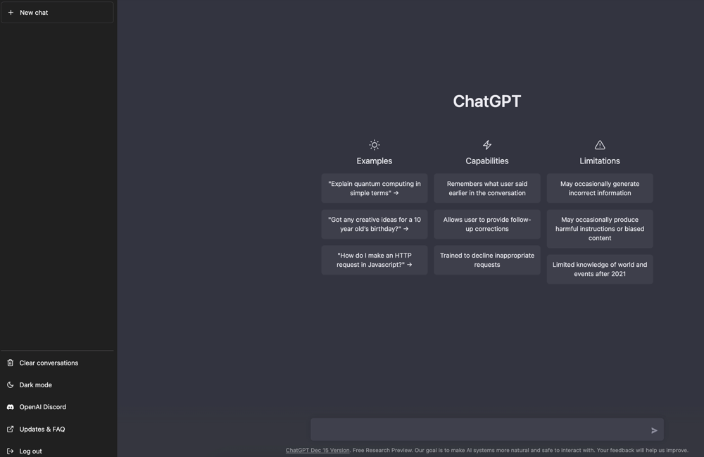
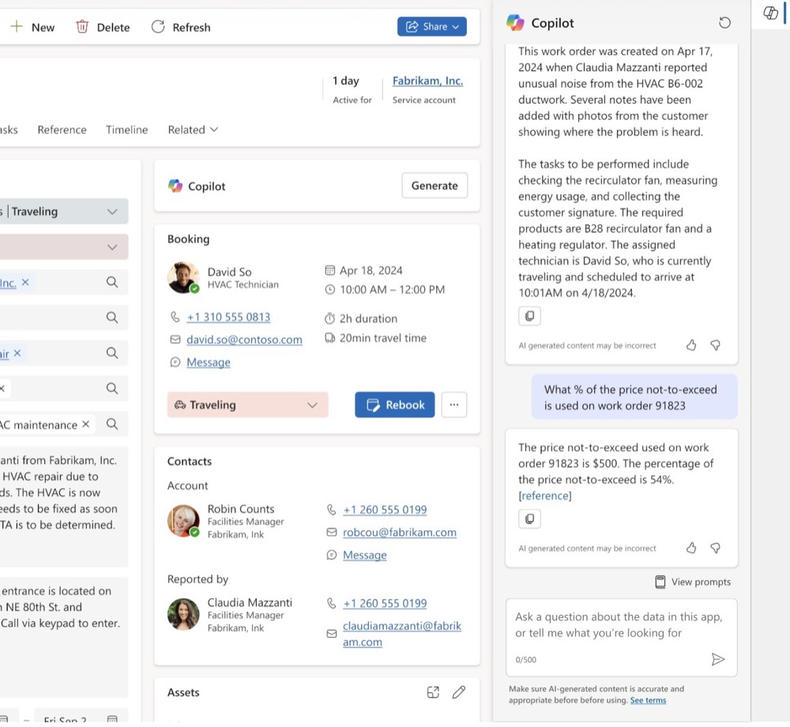

# 乔布斯发明了界面，AI 正在消灭它

### 一个菜单按钮引发的思考

我是老雷，在 SaaS 行业干了十几年，也是一个对产品和技术有执念的人。

前几天，一个朋友给我推荐了一款项目管理工具 Pexo。出于职业习惯 —— 我是做营销的，看到任何新产品，第一反应就是去研究它的官网和产品界面 —— 我打开 Pexo 开始到处点。菜单栏、功能入口、页面布局，这些东西我看了十几年，基本扫一眼就知道产品的定位和思路。

然后我在右上角看到了一个选项：**Connect to OpenClaw**。

*Pexo 菜单栏中的 "Connect to OpenClaw" —— 软件正在为 AI 而非人类构建连接入口。*

我愣住了。

不是因为不理解这个功能，恰恰相反 —— 我太理解了。一个 SaaS 产品，把"被 AI 调用"的入口放在了菜单栏最显眼的位置。这不是藏在设置页面里的一个高级选项，这是堂堂正正地告诉所有用户：**我们的产品不只是给人用的，也是给 AI 用的。**

这太刺激了。作为一个经常研究产品设计的人，我知道菜单栏右上角意味着什么 —— 那是产品最核心、最高频的功能入口。一家公司愿意把这个位置让给"被 AI 连接"，说明他们已经从根本上重新思考了自己的产品到底是什么。

未来的 SaaS 软件，一定不是今天这个样子。今天你看到的每一个按钮、每一个下拉菜单、每一个精心设计的仪表盘，在 AI 时代可能都会变得多余。为什么？因为 **AI 不需要界面，它需要的是接口。**

要理解这个趋势，我们需要回到计算机的起点 —— 回到一个叫乔布斯的人改变一切之前的世界。

---

### 起源：计算机从来不需要界面

在计算机诞生的最初几十年里，根本不存在"界面"这个概念。没有人讨论"用户体验"，没有人在意"交互设计"。因为那个时代的逻辑极其简单 —— 你给机器一条指令，机器给你一个结果。就这样。

1963年，Teletype Model 33 问世。它是最早的人机交互设备之一，本质上就是一台"键盘+打印机"。没有屏幕，没有光标，没有任何视觉反馈。你在键盘上敲下一行命令，机器在纸带上打印出结果。整个过程像发电报一样。

*Teletype Model 33（1963）—— 最早期的人机交互：没有屏幕，只有键盘和打印纸。*

在那个年代的工程师眼里，这就是最先进的生产力工具。他们从来不觉得"没有界面"是个问题 —— 因为在计算机的起点，**人和机器之间的关系是最纯粹的：你告诉它做什么，它就去做。** 没有图标，没有窗口，没有屏幕。计算机只关心一件事 —— 执行你的指令。

请记住这种纯粹感。因为在文章的最后，我们会发现，AI 正在让我们回到这种纯粹。

1978年，DEC VT100 终端第一次给命令行加上了屏幕，用户终于可以实时看到自己输入的内容和系统的响应。但本质没有变 —— 交互方式仍然是文本命令。

*DEC VT100（1978）—— 屏幕出现了，但交互仍是文本命令。它定义的终端标准沿用至今。*

Unix Shell 则把命令行的哲学推向了极致：每个程序只做一件事，通过管道把小工具串联成强大的工作流。`ls | grep ".txt" | wc -l` —— 一行命令就能完成复杂操作。没有任何图形元素，却优雅而高效。

*Unix Shell —— 最接近系统本质的交互方式，至今仍是开发者的主力工具。*

直到今天，全世界的开发者、运维工程师、数据科学家依然每天在用命令行。不是因为没有更"好看"的选择，而是因为 **命令行是人与计算机之间最短的路径** —— 没有中间层，没有视觉装饰，直达系统能力。

这段历史告诉我们一个容易被忽视的事实：**计算机的本质是计算和执行，不是展示。** 那么，图形界面是怎么来的？

---

### 乔布斯的革命：让普通人也能用计算机

1970年代末，计算机还是一个属于工程师和科学家的世界。普通人面对满屏的命令行，就像面对一门外语 —— 完全无从下手。

然后，一个叫史蒂夫·乔布斯的年轻人改变了一切。

1979年，乔布斯参观了施乐帕克研究中心（Xerox PARC），看到了一种全新的计算机交互方式 —— 窗口、图标、鼠标、下拉菜单。据说他当场就激动得在实验室里来回踱步，不停地喊："你们怎么不把这个做成产品？这会改变一切！"

*Xerox Alto / PARC 原始界面 —— 这就是让乔布斯激动得来回踱步的东西。施乐的研究人员发明了它，却没有意识到它的商业价值。*

施乐的研究人员发明了这套图形界面，但他们没有意识到它的商业价值。乔布斯看到了。他不只是看到了一种新技术，他看到的是一个愿景：**让每一个普通人都能像使用家电一样使用计算机。**

但很多人不知道的是，乔布斯的野心远不止于图形界面。

就在同一时期 —— 1983年，在阿斯彭国际设计大会上，28岁的乔布斯做了一个惊人的预言：

*Steve Jobs，1983 年阿斯彭国际设计大会 —— 在这场演讲的最后几分钟，他说出了那段关于亚里士多德的预言。*

> "If we really can come up with these machines that can capture an underlying spirit, or an underlying set of principles, or an underlying way of looking at the world, then, when the next Aristotle comes around, maybe if he carries around one of these machines with him his whole life, and types in all this stuff, then maybe someday, after this person's dead and gone, we can ask this machine, 'Hey, what would Aristotle have said? What about this?' And maybe we won't get the right answer, but maybe we will. And that's really exciting to me."
>
> —— Steve Jobs, 1983

翻译过来是：

> "如果我们真的能造出这样的机器 —— 它能捕捉一个人底层的精神、底层的原则、底层的世界观 —— 那么，当下一个亚里士多德出现的时候，如果他一生都随身携带这样一台机器，把所有想法都输入进去，那么也许有一天，在这个人去世之后，我们可以问这台机器：'嘿，亚里士多德会怎么看这件事？' 也许我们得不到正确答案，但也许我们能。这让我无比兴奋。"

1983年。四十年前。那时候个人电脑刚刚诞生，互联网还不存在，"人工智能"还只是学术论文里的概念。而这个28岁的年轻人，已经在描述一种能理解人的思维方式、能和人对话的机器 —— 这不就是今天的 ChatGPT 和 Claude 吗？

1985年，他又说了一句更直接的话：计算机不应该只是自动化工具，它应该是 **"心智的自行车"** —— 人类体力的放大已经完成了，下一次放大的对象一定是认知。而认知的放大，最终只能靠机器理解人想表达什么。

你看，乔布斯在1983年就已经想清楚了这件事。他发明了 GUI，是因为那是当时让机器理解人的最好方式。但他内心真正追求的，从来不是图形界面本身 —— 而是让人和机器之间的距离越来越短，直到消失。

1983年，Apple Lisa 问世。这是第一台商用的图形界面电脑，售价高达 9,995 美元。

*Apple Lisa（1983）—— 第一台商用图形界面电脑。售价 9,995 美元，在当时相当于一辆二手车的价格。*

Lisa 的操作系统引入了"桌面隐喻" —— 屏幕就是你的办公桌，文件夹就是真实的文件夹，回收站就是你桌边的废纸篓。这是一个天才的设计：它用人们已经理解的现实世界概念，来映射计算机的抽象操作。从未接触过计算机的人，看到桌面上的文件夹图标，本能地就知道"点开它能找到文件"。

*Lisa 操作系统的窗口、菜单和桌面隐喻 —— 通过"模拟现实世界"帮助人类理解计算机。*

Lisa 商业上失败了（太贵了），但一年后的 Macintosh 成功了。微软的 Windows 把这套范式推向了全球。GUI 革命就此爆发 —— 计算机从实验室走进了千家万户，从专业人士的工具变成了每个人的日常。

**但我们需要看清一个事实：GUI 的本质是一层"认知适配层"。**

计算机处理数据从来不需要图形界面。GUI 完全是为了适应人类的眼睛和手 —— 因为人类无法直接向机器表达意图，所以我们需要按钮、菜单和鼠标作为中介。

乔布斯的贡献是降低了使用门槛，但代价是：**我们开始把这层适配层误认为了软件本身。**

这个误解，持续了整整四十年。

---

### 半个世纪的"包装"：从桌面到移动

GUI 革命之后的四十年，界面设计经历了三个阶段。每一个阶段都在做同一件事 —— 让人更方便地操作软件。但每一个阶段也在不知不觉中加厚那层"包装"。

**桌面 GUI 时代（1990s-2000s）：**

Windows 95 的发布是一个里程碑 —— 全球排队抢购，"开始"菜单、任务栏、桌面图标 —— WIMP 交互范式成为全球标准。但好用的代价是复杂性的爆炸。微软的 Office 到 2003 年已经有超过 1,500 个命令分散在无数层菜单里，以至于用户调查显示，人们最渴望的"新功能"其实早就存在 —— 只是他们找不到。你想要的功能就在软件里，但界面本身成了障碍。

*桌面 GUI 时代 —— "人操作软件"的巅峰，但功能越多，复杂性也越不可控。*

**Web / SaaS 时代（欧美 2005-，中国 2012-）：**

Salesforce 喊出 "No Software" 的口号，软件搬进了浏览器。但讽刺的是，无论中美，SaaS 消灭的不是软件，只是安装包 —— 界面反而越来越重了。

这个阶段有一个微妙但意义深远的转变：UI 的角色从"交互媒介"悄然变成了"数据视图"。表格、列表、仪表盘、报表 —— 界面只是数据的一层皮肤。但我们花了巨大的精力去设计这层皮肤，好像它就是产品本身。

*Web SaaS 界面 —— UI 开始服务数据（表格、仪表盘、列表），界面只是数据的一层皮肤。*

**移动优先时代（2012-至今）：**

2007年，乔布斯发布了第一代 iPhone，彻底改变了交互范式。屏幕变小了，鼠标消失了，手指取代了一切。信息流、卡片、单列布局成为主流。

但更深层的变化是：在桌面时代，你打开软件是为了完成一个任务 —— 写文档、做表格、发邮件。你是操作者，你有目的。但在移动时代，你打开微信、刷抖音、看小红书 —— 表面上是你在"使用"App，实际上是算法在决定你看到什么。**人从系统的操作者变成了系统的消费者。** UI 被进一步压缩为"内容分发容器"。

*移动优先时代 —— UI 被压缩为"内容分发容器"，用户不再操作系统，而是被系统驱动。*

我们花了半个世纪来完善一层"包装纸"，做得越来越精美、越来越复杂 —— 然后在某一天突然发现：**我们把包装层当成了产品本身。**

直到 AI 的出现。

---

### 转折点：AI 不需要眼睛

2010年，乔布斯做了人生中最后几个重大决策之一：收购 Siri。他对 Siri 的愿景远比今天你在 iPhone 上看到的那个"嘿 Siri"要宏大得多。他想要的是一个真正的 AI 助手 —— 像电影《Her》里那样，能理解你、和你对话、替你完成事情的存在。

2011年10月4日，Siri 随 iPhone 4S 发布。第二天，乔布斯去世。他没能看到自己真正想要的 AI 形态。但十一年后，它来了。

2022年底，ChatGPT 上线。界面极其简单：一个输入框，一个对话窗口。没有菜单，没有工具栏，没有仪表盘。就这？

*ChatGPT 初代界面 —— UI 被压缩为一个输入框。语言替代了界面结构，功能不再依赖 UI 层级。*

但用了五分钟之后，那种"不对劲"变成了一种颠覆：**语言替代了界面结构。** 你不再需要找到正确的菜单、点击正确的按钮、在正确的表单里填入正确的值 —— 你只需要说出你想要什么。一个输入框，就能调用过去需要十几个界面才能完成的操作。

我们花了四十年建立起来的那套庞大的界面体系，被一个文本框给颠覆了？

从 GPT-3.5 到 GPT-4，再到 Claude，越用越深，也越来越确信：这不是一个"好用的工具"，这是一次交互范式的根本性转变。

而 Claude Code 走得更远。它是一个运行在终端里的 AI Agent，没有任何图形界面 —— 纯粹的命令行。它读文件、写代码、执行命令、调用 API，所有操作都在一个黑色的终端窗口里完成。没有花哨的 UI，但效率是传统方式的几十倍。

*Claude Code —— CLI 在 AI 时代"复活"，但操作者不再是人类，而是 AI Agent。*

看到这里，你有没有发现一个惊人的历史螺旋？

**命令行 → 图形界面 → 视觉巅峰 → 回到命令行。**

但这不是倒退。第一个命令行时代，需要人类学习机器的语言，记住几百条指令；今天的"命令行"时代，AI 已经能理解人类的语言 —— 你用日常说话的方式告诉它你要什么，它就去做。我们兜了一个大圈，回到了起点，但维度完全不同。

还记得文章开头那种"纯粹感"吗？—— 你告诉机器做什么，机器就去做。AI 正在把我们带回那种纯粹，只不过这一次，你不需要学任何指令。

乔布斯在1983年梦想的那个场景 —— 和机器对话，像和亚里士多德对话一样 —— 终于实现了。只不过不是苹果实现的。

**当 AI 成为操作者，整个"认知适配层"就变成了多余的开销。** 软件可以回归本质：数据处理能力，通过 API 暴露。

---

### 当下：AI 外挂还是 AI 底座？

目前大多数产品对 AI 的集成方式是"外挂" —— 在现有界面旁边加一个侧边栏，放一个 Copilot。

*Copilot 侧边栏模式 —— AI 仍是"外挂层"。UI 依然存在，但正在被弱化为辅助工具。这是过渡形态，不是终局。*

每次看到这种"侧边栏 AI"的设计，我心里都有点着急。这种模式有用，但本质上没有改变什么 —— 它仍然假设人类是主要操作者，AI 只是助手。界面还在，复杂性还在，只是多了一个"能说话的帮手"。

这就好比汽车发明之后，你在马车旁边装了一个发动机，让马跑得更快。但问题是 —— 你为什么还要马？

**真正的变革不是在界面旁边加 AI，而是让软件本身变得可以被 AI 直接调用。**

回到文章开头的 Pexo —— 它的 "Connect to OpenClaw" 不是在界面上加了一个 AI 助手，而是让整个产品的能力可以被外部 AI Agent 连接和调度。这代表了一种完全不同的思路：

- **外挂模式：** 软件为人设计界面，AI 作为辅助嵌入界面
- **底座模式：** 软件暴露能力接口，AI 直接调用，界面变为可选

两条路的本质差别在于：谁是第一用户。外挂模式的第一用户是人，AI 是辅助。底座模式的第一用户可以是 AI Agent，人通过 AI 来使用软件。前者在修补旧世界，后者在建造新世界。

后者才是未来。你选哪条路？

---

### 未来：软件是能力，不是界面

UI 的历史，本质是一个"降噪过程"：

- **CLI 时代：** 直接控制（但门槛高）
- **GUI 时代：** 降低门槛（但增加复杂性）
- **AI 时代：** 直接表达意图（门槛和复杂性同时消除）

最终的结果是：**UI 会被压缩到极限，真正的竞争发生在数据结构、API 和系统能力。**

未来的 SaaS 软件，区分高下的不再是谁的仪表盘更漂亮、谁的交互更丝滑。而是：谁的数据结构最干净？谁的 API 最易调用？谁的系统能力最可组合？

我必须说一句不太好听的话：**国内 SaaS 产品和海外的差距，正在被 AI 加速拉大。**

国内同行并不是毫无行动。大多数公司都已经在产品里接入了大模型 —— 加个 AI 对话框，做个智能问答，搞个"AI 辅助填表"。这些改变是真实的，我不否认。

**但问题是：改得不够彻底。** 心态上，很多团队还是在"老树上长新芽" —— 原有的产品架构不动，原有的界面逻辑不变，只是在边角料上贴几个 AI 功能。把 AI 当锦上添花，而不是当生死抉择。

看看海外发生了什么 —— 大量 **AI Native** 的公司正在从零开始构建。这些公司从第一天起就没有传统界面的包袱，API 是一等公民，界面只是可选的皮肤。它们不是在"改良马车"，而是直接造了汽车。

差距不在界面设计上。国内很多产品的 UI 做得并不差，差距在于对"软件本质"的理解 —— 你的产品到底是一个给人看的界面，还是一组可以被任何调用者（包括 AI）使用的能力？

当 AI 能直接调用一个软件的 API 时，效率的提升不是百分比级别的，而是量级级别的。一个人类用户在 SaaS 界面上点击十分钟才能完成的操作，AI Agent 通过 API 两秒钟就做完了。十分钟和两秒钟，你告诉我，这还是同一个赛道吗？

所以，对所有 SaaS 厂商和软件开发者：**留给你们的时间不多了。**

从今天开始，必须高度重视软件被大模型调用的能力。改造你的 API，让它结构化、语义丰富、AI 友好。MCP（Model Context Protocol）等协议正在定义这个方向，如果你还不知道 MCP 是什么，今天就去了解。重新定义你们团队的核心竞争力 —— 能设计干净数据模型、写出 AI 易于调用的 API 的人，才是下一个十年的稀缺资源。

不要再在原有的图形界面上叠加更多按钮和功能了。那条路已经走到了尽头。

**这不是危言耸听，这是正在发生的事。** Pexo 菜单栏上的那个 "Connect to OpenClaw"，就是证据。

---

### 致敬乔布斯

*Steve Jobs 与 Macintosh 128K（1984）—— 他让计算机从专业工具变成了每个人的伙伴。*

四十多年前，乔布斯做了一件了不起的事：他让计算机学会了"说人话" —— 用图形、图标和鼠标，把冰冷的命令行世界变成了普通人也能理解的桌面。这不仅是技术进步，更是一场关于"人与机器关系"的哲学革命。

但今天，AI 正在做一件方向相反、却同样伟大的事情：**不再让人适应界面，而是让系统理解人的意图。**

乔布斯让人看懂了计算机。AI 让计算机听懂了人。

这不是对 GUI 革命的否定，而是它的自然延续 —— 从"让人适应机器"到"让机器理解人"。如果乔布斯还在，我相信他会是第一个拥抱这个变化的人。因为他从来不是那种守着自己过去成就的人 —— 他永远在追问下一个改变世界的可能性。

1983年，他问：能不能造一台机器，让它理解人想说什么？

四十年后，答案来了。

只是这个答案，来得比任何人预期的都要快 —— 快到很多人还没准备好。

> 软件界面从命令行到图形界面，再回到"类命令行"。这不是技术倒退，而是一个完整的螺旋：**人不再需要界面，AI 替你操作系统。**
>
> 你的软件，准备好被 AI 调用了吗？

---

### 关于作者

**老雷（Andy）**，明道云 & Nocoly CMO，SaaS 行业从业十余年。骨子里是个产品人和技术迷，乔布斯的信徒，相信好的产品能改变世界。深度关注 AI、商业与科技趋势，目前在深度使用和实践 Claude Code，专注探索 AI 如何重塑产品形态和商业逻辑。不聊概念，只聊真实发生的事。
