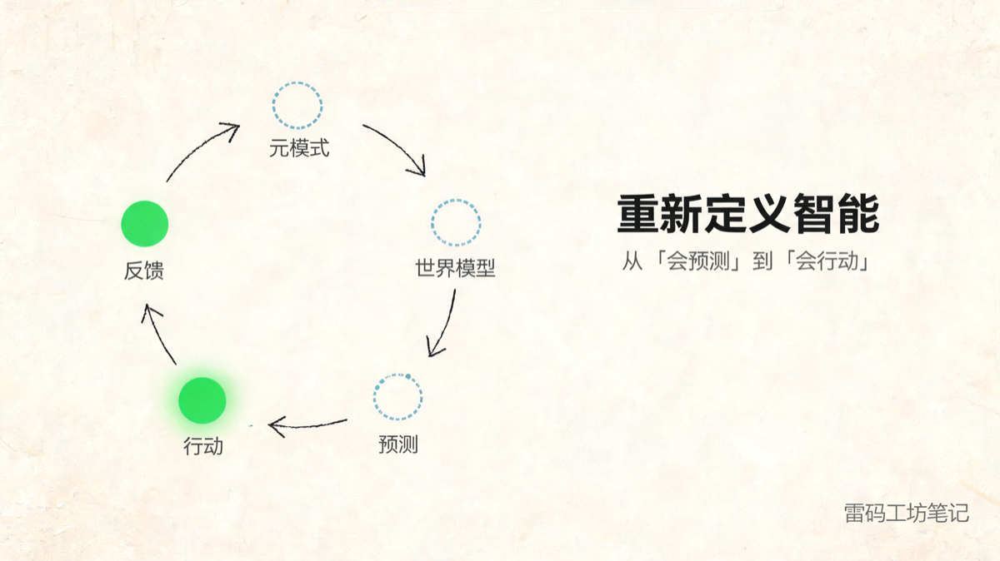
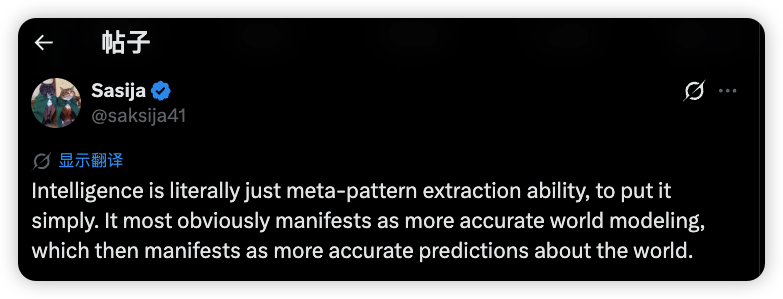
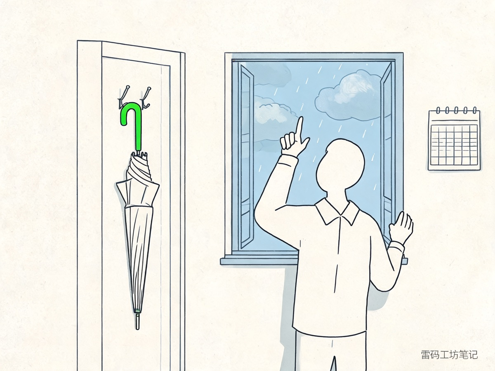
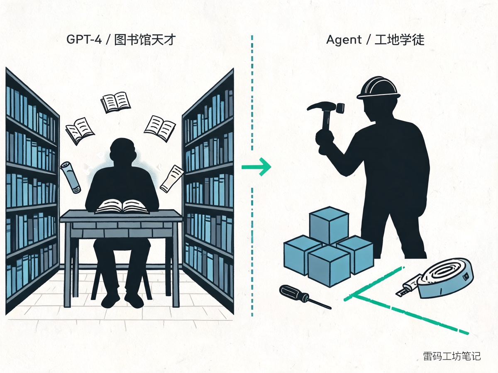
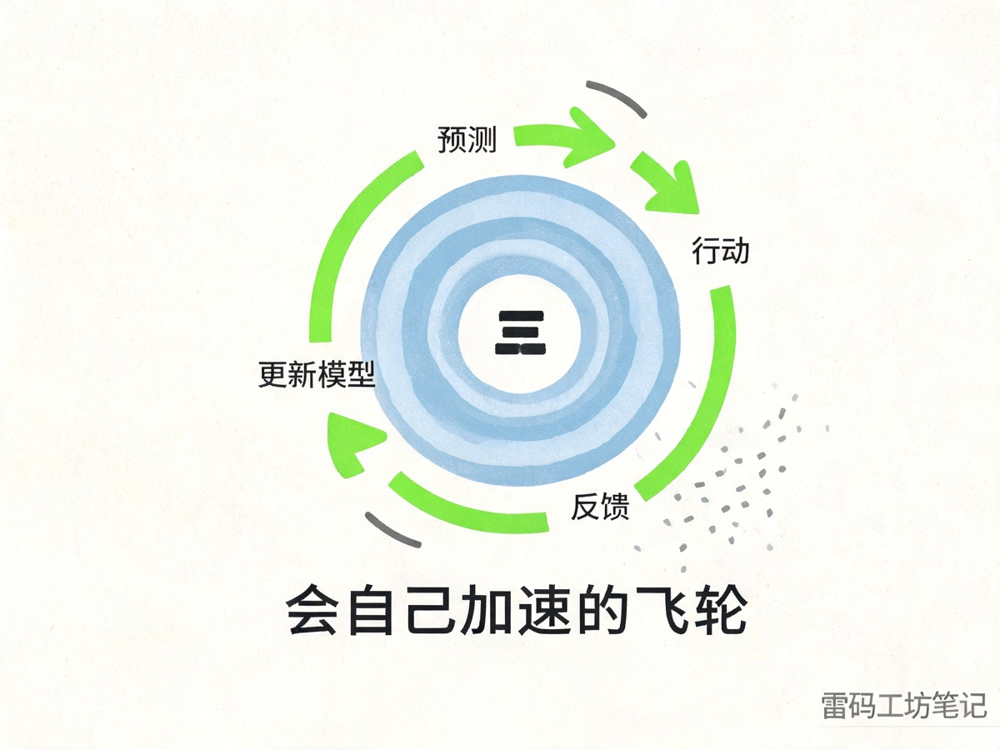
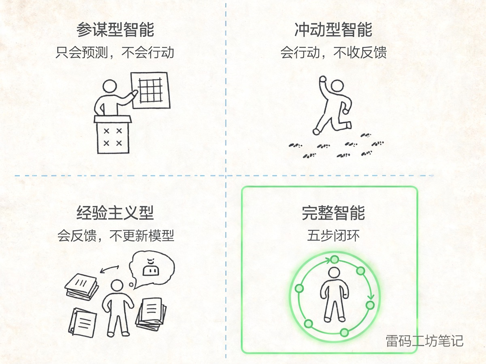

# 重新定义智能：从「会预测」到「会行动」



> 系列「什么是智能」第 1 篇 · 共 3 篇

前几天早上在 X 上刷到一条推文，被这句英文砸到：


<p align="center"><em>来源：X @saksija41</em></p>

> Intelligence is literally just meta-pattern extraction ability, to put it simply. It most obviously manifests as more accurate world modeling, which then manifests as more accurate predictions about the world.

翻成人话：智能说白了就是抽取「元模式」的能力，它最直接的表现是脑子里那个「世界的模型」更准，再往外就表现为对世界的预测更准。

这句话把神秘事物拆成机械零件，挺爽的。意识、灵感、灵魂这些虚词一脚踢开，只剩一条可测量的工程定义。

我顺手把它转给一个 AI 让它解读，拿到一份很工整的拆解。但读完之后总觉得差了点东西。

这句话漂亮，可它停早了一步。它停在了「预测」。

---

## 一、先把这句话拆开看

这句话里最关键的词是 **meta-pattern**，元模式，不是 pattern。

模式识别动物都会。巴甫洛夫的狗听到铃声就流口水，那是 pattern；麻雀看到稻草人会躲，那也是 pattern。

元模式是再上一层：你看到一道数列题、一道语法题、一道物理题，发现它们背后共享一种抽象结构，把一个领域学到的规律能迁移到另一个领域。这是人和动物拉开身位的地方，也是 LLM 让人眼前一亮的地方——它做的事情更深一层，抽出了语言、逻辑、概念的元结构。

抽出元模式之后，你脑子里会形成一个世界模型，一个内部模拟器：

- 物理学家的世界模型里有 F=ma
- 老销售的世界模型里有「客户说『我再考虑下』通常意味着什么」
- 婴儿的世界模型里只有「哭 → 有人来」

世界模型越准，你对世界下一秒会发生什么的预测就越准。

这套链条非常优雅：

```
元模式提取  →  世界模型  →  预测
   能力        内部表征      可观测输出
```

它把智能从「灵魂、意识、灵感」这种没法测的东西，压成了一个可以打分的指标：你的预测准不准？

这也是过去五年大模型评测的底层范式。所有 benchmark 本质上都是预测任务——给定上文，预测下文；给定题目，预测答案；给定图像，预测标签。

但是。

---

## 二、为什么我说它停早了一步

我跟你讲个画面。

一个气象学家，今天早上推开窗，看了一眼云，掏出他四十年训练出来的世界模型，告诉你下午三点四十分会下雨。预测做得漂亮，误差五分钟以内。

然后他出门，没带伞。

下午三点四十分，他被淋成了落汤鸡。


<p align="center"><em>预测做得漂亮，伞还挂在门后</em></p>

请问，这个人有没有智能？

按上面那个定义，他的「元模式 → 世界模型 → 预测」整条链路完美无缺。可是从结果上看，他和一个完全不懂气象的人，淋得一样湿。

这就是那句话漂亮在哪、也卡在哪。它把智能定义成了「知道」，但智能更要紧的部分是「做到」。

一个能写出完美商业计划却不会执行一步的 LLM，跟那个不带伞的气象学家是同一种人。

所以我想把那条链路往后再补两步：

```
元模式提取 → 世界模型 → 预测 → 行动 → 反馈
  (输入)     (表征)     (推演)  (干预)  (校正)
```

- **行动**：基于预测在真实世界里付出代价、做出干预
- **反馈**：用真实世界的回应反过来更新你的元模式池和世界模型

这两步加上去之后，智能从一条直线，变成一个闭环。

闭环和直线的差别巨大。直线是一次性的，闭环会自己越变越准。一个不会反馈的预测系统，再聪明也只有出厂那天的水平；一个会反馈的预测系统，每动一次手就更准一分。

---

## 三、这个闭环，正好对应着 AI 的三个时代

把这五步对着 AI 的发展史摆一摆，事情就清楚了。

**第一阶段：模式识别（2012 之前）**

ImageNet 之前的视觉算法、垃圾邮件分类器、推荐系统的协同过滤——做的事情都停留在 pattern 层。你给它海量打了标的样本，它学会在新的样本上贴正确的标。这一阶段的 AI 跟巴甫洛夫的狗在同一个台阶上，只不过样本量大了一万亿倍。

**第二阶段：世界模型 + 预测（2012 到 2024）**

深度学习起来之后，模型开始抽元模式。GPT 系列把这件事推到了让所有人睡不着觉的高度，它在文本这一种模态里，构建出了一个相当庞大的世界模型，并且能在你给它任何一段文字之后，预测出后面应该跟什么。

写文章、答问题、翻译、总结、写代码，这些都是预测任务。GPT-4 让人第一次切身感觉到「这玩意儿好像真有点理解力」，就是因为它的预测准到了人类水平。

但 GPT-4 是一个图书馆里的天才。知识量惊人，推理能力出众，可它被关在一个屋子里，只能动嘴。它不会订机票，不会调代码，不会跟真实世界打交道。它的智能停在了我刚才画的那条线的中间。


<p align="center"><em>图书馆里的天才 vs 工地上的学徒</em></p>

**第三阶段：闭环——Agent 和具身智能（2025 起）**

为什么 2025 年开始，所有大厂的注意力都从「模型多大」转向 Agent、Computer Use、机器人、世界模型、Sora 这些方向？

因为前三步（元模式、世界模型、预测）的边际收益已经在递减了。模型从 70B 涨到 700B，能力提升远不如从 7B 涨到 70B 那一跳。Scaling Law 没死，但它在喘。

增量在后两步。

让模型动起来，去真实世界里付出代价，去试错，去拿到反馈，去更新自己。这件事 LLM 自己干不了，但 Agent 可以，机器人可以，Computer Use 可以，Sora 这类世界模型也可以。它们做的是同一件事，把智能的闭环闭上。

---

## 四、为什么闭环这一步要紧到值得单独写

你可能会说：行动不就是把预测的结果输出一下吗，有什么大不了的？

没那么简单。行动一旦进入闭环，会带来一种 LLM 永远拿不到的东西，就是真实世界的反馈数据。

LLM 训练数据来自互联网，那是人类已经写出来的文本，本质上是「人类已经知道的东西」的总和。再大的模型也只能在这个边界内插值，没法走出去。

但一个会行动的 Agent，每次动手都会产生互联网上从来没有过的新数据：这个客户在这一刻、在这个语境下、面对这个报价，反应是什么。这是一手数据，是世界对你这一次干预的真实回应。

你拿这些数据回头更新世界模型，下一次的预测就会更准；预测更准，下一次的行动就会更有效；行动更有效，反馈数据就更丰富。

这是一个会自己加速的飞轮。


<p align="center"><em>行动 → 反馈 → 更新模型 → 更准的预测，飞轮越转越快</em></p>

人类文明就是这么干的。我们从来不只是「知道」世界怎么运作，我们伸手去改变它，看它怎么回应，再修正我们对它的理解。

写到这里想起 Ilya Sutskever 在 2023 年的一段访谈，他说 next token prediction 之所以能产生智能，是因为预测得足够准的时候，你已经在脑子里把整个世界重建了一遍。

这句话当时听着很有冲击力。但现在回头看，它只描述了智能的前半段。完整的版本可能是这样：预测得足够准的时候，你重建了世界；而当你基于预测去行动、并接受反馈的时候，世界开始反过来重建你。

---

## 五、所以智能是什么

把整件事压成一句话：

> 智能 = 从经验中抽出元模式，构建越来越准的世界模型，用它做出越来越准的预测，并基于预测采取越来越有效的行动，再用结果反过来更新模型。

五步：元模式提取 → 世界模型 → 预测 → 行动 → 反馈。

前三步是「知道」，后两步是「做到」。两者缺一不可。

这不是一个学院派定义，它是一把尺子。你可以拿它去量任何一个智能体：人、动物、组织、AI 模型、Agent，甚至一家公司。

- 一个只会预测不会行动的，是参谋型智能
- 一个会行动但不收反馈的，是冲动型智能
- 一个会反馈但不会更新模型的，是经验主义智能
- 五步都闭环的，才是完整意义上的智能


<p align="center"><em>四种智能体，五步闭环才是完整版</em></p>

---

## 六、这把尺子能干嘛

我打算用这把尺子接着写两件事。

**下一篇，用它去看 AI 产业。** OpenAI、Anthropic、Google 为什么不再比模型更大，而开始比 Agent 更能干？Computer Use、机器人、世界模型为什么变成了 2026 年最重要的三个方向？有人喊「LLM 路线撞墙」，我觉得更像是该上下一个台阶了。

**再下一篇，用它去看每个人的工作。** 把你日常做的事对着这五步摆一摆，你会发现一件相当扎心的事：越靠近「元模式、世界模型、预测」这三步的工作越危险，越靠近「行动、反馈」这两步的工作越安全。这能解释为什么资深操盘手永远稀缺，也能告诉你接下来该把自己往哪一步上挪。

---

智能这件事，被神秘化得太久了。

把它拆成五步，神秘感少了一半，可操作性多了十倍。

下一篇见。

---

> **老雷（Andy）**，明道云 & Nocoly CMO，SaaS 行业从业十余年。骨子里是个技术迷，乔布斯的信徒，相信好的产品能改变世界。深度关注 AI、商业与科技趋势，目前在深度使用和实践 Claude Code，专注探索 AI 如何重塑产品形态和商业逻辑。不聊概念，只聊真实发生的事。
